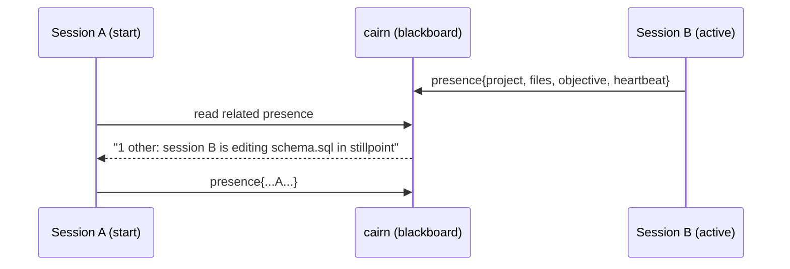

# Brainstorm: Automating cross-session collaboration between concurrent Claude sessions
*Generated: 2026-06-26 | Tracks: 3 | Options: 4 (+1 resolved) | AI-scoring: pending finalization pass*

## Glossary

- **Session** — one running Claude Code conversation (one tmux window / one project).
- **Drone / devcontainer** — a project's work happening inside an isolated Docker container. Its filesystem is
  walled off from other projects; it can still reach the network.
- **borg** — the host-side orchestrator: a project registry plus hooks that fire when sessions start/stop.
- **cairn** — a small database service (Postgres) reachable over the network at `localhost:8767`, used as shared
  memory across sessions.
- **Hook** — a script borg runs automatically at a session event (start, stop, notification).
- **Blackboard** — one shared store that many independent workers read from and write to, instead of messaging
  each other directly.
- **Presence** — a small "I am here and touching X right now" record a session publishes so others can see it.
- **Ambient signal** — information shown passively (a glanceable line) rather than an interrupting pop-up.

## Problem Definition

Noah runs many Claude sessions at once across ~18 projects. When two sessions are working on related things, neither
knows about the other — he has to manually copy context between them, re-explain, and watch for conflicting edits.
Success: when session A starts and session B is already touching related code, the relevant slice of B's work shows
up in A automatically, conflicts get flagged before they happen, and none of it requires manual setup per session.

### Constraints
- Keep working state in files, shared knowledge in cairn (don't move per-session scratch state into the service).
- Simplest mechanism wins; bound any loop; no multi-agent-debate machinery.
- **T1 (tension):** "automatic + zero-setup" pulls toward pushing everything; "low cognitive load + no notification
  spam + no context bloat" pulls toward pushing almost nothing.
- **T2 (tension):** the topology is peers (independent sessions), but borg already offers a tempting central hub.
- **T3 (tension):** host sessions can read project files; drone sessions cannot read other projects' files — they
  can only reach the network.
- Must degrade gracefully when cairn is down.

## Research Summary

### Track 1: Coordination patterns (fresh)
- A blackboard is effectively a structured tuple-space and is the lower-complexity choice over raw tuple plumbing
  for peers sharing distilled knowledge. — Source: muthu.co, "Collaborative Problem-Solving … Blackboard
  Architecture," https://notes.muthu.co/2025/10/…, 2026-06-26.
- CRDTs give eventual consistency without coordination, but last-write-wins silently drops a concurrent write — fine
  only for overwrite-safe state. — Source: Ian Duncan, "The CRDT Dictionary," https://www.iankduncan.com/…, 2026-06-26.
- Peer LLM agents can coordinate with no boss purely by observing a shared store and signalling intent through their
  edits. — Source: arXiv 2510.18893, "CodeCRDT," https://arxiv.org/pdf/2510.18893, 2026-06-26.
- `flock` advisory locks auto-release on crash (kernel closes the FD), avoiding stale-lock cleanup — but they're
  cooperative only. — Source: commandinline.com, "Linux File Locking," 2026-06-26.
- Brokered pub/sub and distributed locks add real failure modes (broker availability, split-brain) an append-only
  log or shared store avoids. — Source: IFIP DAIS 2012; architecture-weekly.com, "Distributed Locking," 2026-06-26.

### Track 2: Interruption & cognitive load (fresh)
- Returning to a task after an interruption takes ~23 minutes; every low-value ping carries a large hidden re-entry
  tax. — Source: rock.so, "The Cost of Context Switching," 2026-06-26.
- "Attention residue" means a yanked task leaves cognition partly stuck — signals should wait for a natural stopping
  point. — Source: get-alfred.ai, "Attention Residue (Leroy)," 2026-06-26.
- High false-positive alerting trains people to ignore even critical signals (response likelihood drops ~30% per
  reminder; 72–99% of clinical alarms are false). — Source: workato.com, "Alert Fatigue," 2026-06-26.
- Notifications timed to subtask breakpoints cut cognitive load 33–46% vs random timing. — Source: arXiv 1711.10171,
  "Intelligent Notification Systems," 2026-06-26.
- A three-tier model fits: interrupt only the rare critical item; pull on demand for most; use a glanceable ambient
  display as the default channel. — Source: Pielot, "Towards Ambient Notifications," 2026-06-26.

### Track 3: borg/cairn integration fit (reuse: internal code)
- The registry is a discovery index, not a presence store; volatile session state already lives in per-project
  `<project>/.borg/state.json` (active session id, dirty flag) — a one-key carrier already exists for host sessions.
  — Evidence: `lib/registry.zsh:5-9`, `hooks/borg-link-up.sh:149-156`.
- The hooks already capture the right signal at the right moment: SessionStart injects cross-project context via
  `additionalContext`; Stop publishes the checkpoint to the cairn-inbox. Surface-point and publish-point both exist.
  — Evidence: `hooks/borg-link-down.sh:88-132`, `borg-link-up.sh:186-211`.
- **cairn is the only carrier reachable by BOTH host and drones** (`http://cairn-api:8767` over the shared `devnet`
  network, `localhost` fallback on host). A small `presence`/`intents` table mirroring the existing `sessions` table
  is a natural blackboard. — Evidence: `bin/cairn:7-36`, `src/cairn/models_db.py:18-31`, `api.py:198-219`.
- Reachability confirmed: a drone mounts only its own project (+ the registry under the borg profile), NOT siblings'
  `.borg/state.json` — so a file mechanism can't cross the isolation boundary; only cairn can. — Evidence:
  `drone.zsh:1083-1131`.
- No prior brainstorm on cross-session presence exists; closest is the `2026-05-23-agent-teams` research. So this is
  unsolved. — Evidence: `docs/research/2026-05-23-agent-teams/`.

## Solution Options

### Option A: cairn presence-blackboard + SessionStart ambient injection
**What it is:** Each session publishes a tiny presence/intent record to a new cairn table; at SessionStart the
borg-link-down hook reads "who else is active and touching what related to me" and injects ONE distilled line.
**How it works:** SessionStart → write presence row `(session_id, project, branch, touched_paths/entities,
objective, heartbeat_ts)` + read related rows → inject a one-line digest. Stop → mark the row closed. "Related" =
same project, shared file paths, or shared entity (e.g. a schema both touch).
**Pros:** Reaches host AND drones (cairn). Zero per-session setup (hooks already fire). Ambient, at a natural
breakpoint (SessionStart), so near-zero interruption. Peer topology — no broker, no orchestrator-in-loop.
**Cons:** New cairn schema + endpoint. Stale rows if a session crashes (needs heartbeat/TTL). "Related" heuristic
must be precise or the line becomes noise.
**Key tradeoffs:** Concedes real-time mid-session awareness (you learn about B when A *starts*, not the instant B
changes) in exchange for zero interruption and zero context bloat.
**Feasibility:** High — mirrors the existing `sessions` table + the existing inject/publish hook points.
**Estimate:** ~1.5–2 sessions (migration + endpoint + two hook edits + TTL).
**Visual:**

*Smallest version that delivers the core value: the presence table + a SessionStart read that injects a one-line
"N other active sessions touching <shared thing>" digest, plus a Stop write.*

### Option B: file-based state.json awareness (host-only)
**What it is:** Extend the existing per-project `state.json` with a "touching" field; SessionStart scans siblings'
state.json and surfaces overlaps.
**How it works:** Reuse `borg_state_write`; no service needed.
**Pros:** Simplest possible; no new service surface; degrades trivially.
**Cons:** **Fails the drone reachability constraint (T3)** — a containerized session can't see siblings' files. Half
your sessions go blind.
**Key tradeoffs:** Buys simplicity by abandoning every devcontainer session.
**Feasibility:** High to build, but structurally incomplete.
**Estimate:** ~0.5 session.
*Smallest version: a `touching` key in state.json read at SessionStart — host sessions only.*

### Option C: orchestrator-mediated hub-and-spoke
**What it is:** The borg orchestrator session detects related active sessions and brokers context between them.
**How it works:** Orchestrator polls registry/cairn, pushes context into sessions.
**Pros:** Central policy point; can be smart about relevance.
**Cons:** Re-centralizes a peer problem (T2); requires the orchestrator session to be running; adds latency and a
single point of failure.
**Key tradeoffs:** Concedes peer independence and "always-on" for centralized intelligence Noah may not need.
**Feasibility:** Medium.
**Estimate:** ~3+ sessions.
*Smallest version: orchestrator prints a "related sessions" note in its overview — informational only.*

### Option D: explicit session-pair `/link` primitive
**What it is:** A command to pair two sessions into a shared channel on purpose.
**How it works:** `/borg-link <other>` opens a shared cairn-backed scratch the pair reads/writes.
**Pros:** Lowest magic; precise; no false positives.
**Cons:** Manual per pairing — directly violates the zero-bootstrap goal.
**Key tradeoffs:** Maximum control for maximum manual effort.
**Feasibility:** High.
**Estimate:** ~1 session.
*Smallest version: a command that writes/reads a shared note keyed by a pair id.*

## Contradiction Forge (Phase 4.5)

**Contradiction (T1):** automatic + zero-setup vs low-cognitive-load + no-spam + no-context-rot. Options A–D each
lean one way. The resolved option below holds both.

### Option A′: Boundary-gated, tiered presence *(resolved — this is Option A with the tiers made explicit)*
**Separation move:** time + condition (+ space for T2).
**Ideal Final Result:** the right cross-session context appears by itself, exactly when it helps and never when it
doesn't — at no manual cost.
**How it resolves both poles:**
- **Time separation** — awareness is surfaced ONLY at session boundaries (SessionStart = a natural breakpoint, which
  Track 2 shows cuts cognitive load 33–46% vs interrupting mid-flow). Automatic, but never a mid-thought yank.
- **What separation (anti-rot)** — only a single distilled line is injected (count + the one most-relevant overlap),
  never a context dump. Pull-on-demand (`borg who`/`borg link`) for the full picture.
- **Condition separation (precision)** — the rare INTERRUPT tier (a real Notification) fires only on a true conflict
  signal: another live session is touching the SAME file. High precision keeps Track 2's habituation at bay.
- **Space separation (T2)** — the shared state lives in cairn (peer blackboard); the read/write logic lives in each
  session's own hooks. No central broker, no orchestrator-in-loop — peers coordinate by observing the store
  (CodeCRDT pattern).
So: **ambient by default (SessionStart, one line), pull on demand (command), interrupt only on same-file conflict.**
Automatic awareness with near-zero interruption and no context bloat — the poles are separated by *when*, *what*, and
*where the logic lives*, not traded off.
**Feasibility:** High (same as A). **Estimate:** ~2 sessions for the tiered version; the MVP is the ambient tier alone.
**Probe:** NO PRIMARY EVIDENCE — no cheap decisive probe measures "cognitive load over weeks of real use"; the tier
design rests on Track 2's literature, not an in-system measurement. Treat the precision threshold as a tunable to
watch, not a proven setting.

## Council Review

**The Product Strategist:** The brief is "near-zero manual setup, low cognitive load." Option D fails the first test
(manual pairing); Option C fails the second-order test (requires the orchestrator to be live and re-centralizes).
A′ serves the actual ICP — a solo operator who context-switches constantly — by spending its one scarce resource
(attention) only at boundaries. It solves the right problem.

**The Technical Realist:** A′ requires exactly what already exists plus one table: SessionStart already injects
`additionalContext`, Stop already writes to cairn, the `sessions` table is a working template, and cairn is the only
thing a drone can reach. The real hidden complexity is stale presence rows on crash — answered by a heartbeat
timestamp + a TTL filter on read (ignore rows older than N minutes), which is a WHERE clause, not a daemon. Option B
is a trap: it's the cheapest to build and structurally can't see half the sessions.

**The User Advocate:** Track 2 is unambiguous — a noisy cross-session pinger self-destructs (people learn to ignore
it). A′'s ambient-by-default, one-line, boundary-timed delivery matches how an interrupt-sensitive user actually
behaves. My worry is the INTERRUPT tier: if "same file" is computed loosely it becomes the exact false-positive
channel that causes habituation. Ship the ambient tier first; earn the right to interrupt later.

**The Pragmatist:** 80/20 here is stark. The ambient tier alone — presence table + a SessionStart read that injects
one line + a Stop write — is ~1.5 sessions and delivers the core value (you stop starting cold next to related work).
The conflict-interrupt tier and the pull command are nice-to-haves. Build the MVP, run it for a week, tune precision
from real rows before adding tiers.

**The Recommender:** The recommendation is **Option A′ (boundary-gated tiered presence), shipped as its ambient-tier
MVP first**. It beats B (B can't reach drones — a structural kill), C (re-centralizes and needs the orchestrator
live), and D (manual). The strongest dissent — the User Advocate's warning that the interrupt tier could become a
habituating false-positive channel — does not change the call because it argues for *sequencing* (ship ambient
first, add the interrupt tier only after tuning precision on real data), which the MVP already does.

### Resolved-option verdict
Option A′ holds both poles: it does NOT smuggle the cost back in — awareness is automatic (hooks, zero setup) yet
costs almost no attention (boundary-timed, one line, pull-for-more). The one unmeasured risk is the precision of
"related"/"same-file"; stamped NO PRIMARY EVIDENCE and carried as a tuning risk, not a proven constant.

### Dissent *(non-empty by construction)*
The User Advocate formally dissents against shipping the **interrupt (same-file conflict) tier** in v1, on a
user-correctness basis (not effort): a loose conflict heuristic trains Noah to ignore the channel, poisoning even
true alerts. Logged risk: **gate the interrupt tier behind a precision bar measured on real presence data; until
then, conflicts surface only in the ambient line, never as a pop-up.**

## Recommendation

**Option A′ — boundary-gated, tiered presence, in cairn.** Ship the **ambient-tier MVP** first: a `presence` table
(mirroring `sessions` + a `heartbeat_ts`), a SessionStart read in `borg-link-down` that injects one distilled line
("N other active sessions; closest overlap: session X is touching `<file>` in `<project>`"), and a SessionStart/Stop
write that opens/closes the row. TTL on read handles crashes. No broker, no orchestrator dependency, reaches drones.

**Minimum viable ship:** presence table + SessionStart inject (one line) + SessionStart/Stop write. ~1.5 sessions.

**Logged dissent / risk:** the same-file INTERRUPT tier is deferred until "related"/"same-file" precision is tuned on
real data; v1 surfaces conflicts only in the ambient line.

## Next Steps

- [ ] If approved: run `/borg-plan` with this document as context to lock ACs for the ambient-tier MVP.
- [ ] Decide the "related" heuristic for v1 (same project + shared touched path is the simplest defensible start).
- [ ] Carry the dissent risk into planning: interrupt tier gated behind a measured precision bar.
- [ ] Finalize this doc to the Reading-Deliverable Standard (noah-voice + ai-scoring ≥75 + epub) before archiving.
