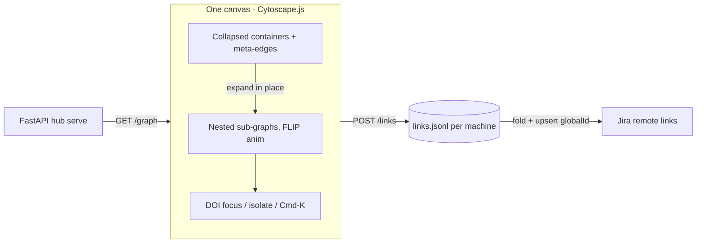
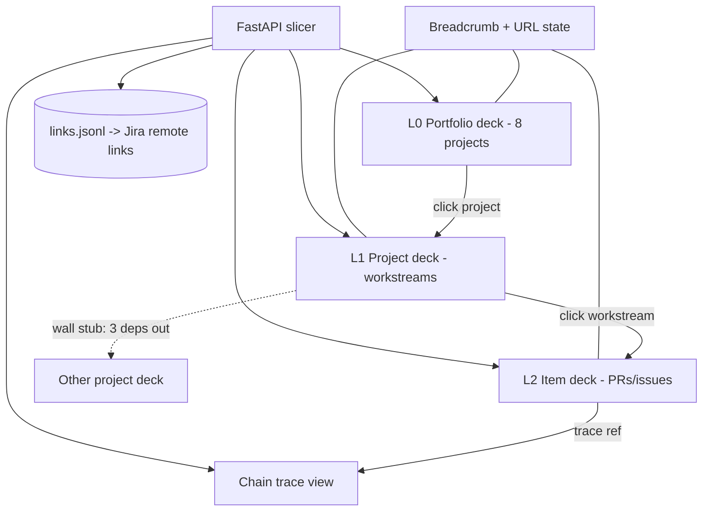
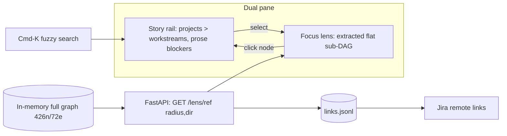
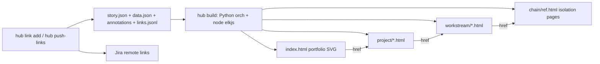
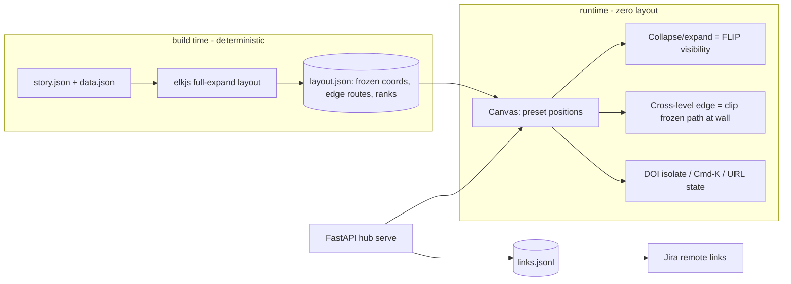

Generated: 2026-07-28

# Dependency Graph Tool: Recommendation

**Program:** borg-collective #97, PR control hub, dependency-graph v3
**Mode:** /research decision-design, D6 final deliverable
**Chosen option:** Option E (amended): Frozen Atlas, Living Lens, with a full-scale-first kill-test
**Blind-review verdict:** revise (objection accepted; answered by redesigning the phase gate, not swapping options)
**Inputs:** options.md, council.md, four track notes, quarantined prior-work catalog; the blind review's verdict
and objection are carried via the council's revision record.
**AI-scoring: 82/100**

## Glossary

Twelve terms, defined once here and again inline the first time each one carries weight.

- **DAG**: a chart of boxes and arrows where the arrows never loop back on themselves.
- **Compound DAG**: a DAG whose boxes can hold whole smaller DAGs inside them (projects hold workstreams,
  workstreams hold PRs and issues).
- **ELK / elkjs**: the layout engine, meaning the program that decides where every box and arrow sits on the
  page; elkjs is its JavaScript port, which this design runs offline at build time.
- **Cytoscape.js**: a browser graph library; it draws the boxes and arrows and handles clicking, panning, zooming.
- **Cross-level (piercing) edge**: an arrow whose two ends live at different depths, like B depending on F when
  F is nested inside a different container.
- **FLIP**: an animation trick (First, Last, Invert, Play): measure where things start and where they end, then
  glide them between the two instead of teleporting.
- **layout.json**: the frozen map. Every coordinate and edge route for the fully expanded graph, computed once
  at build time and never recomputed in the browser.
- **Legibility envelope**: the pass/fail numbers the full-scale layout must hit (build time, edge routing, zoom
  span, container readability) before Option E is allowed to live.
- **Perturbation drift**: how far the boxes that did NOT change move when you rebuild the map after a small data
  change (one new PR, one closed issue).
- **DOI (degree of interest)**: a score that decides what stays bright and full-size versus what fades when you
  focus on one node or chain.
- **JSONL**: a file with one JSON record per line; append-only, diffable, trivial to read and fold.
- **Jira remote link**: a link on a Jira issue pointing at any external URL; re-posting with the same globalId
  updates in place instead of duplicating, which makes publishing replay-safe.

## Recommendation

**Verdict.** The blind review returned **revise**, and its strongest objection lands square: the session-1
kill-test proved the wrong theorem. It tested collapse/expand mechanics and rebuild drift on a small scope, but
never tested the one thing Frozen Atlas cannot exist without: a legible, reasonably sized one-shot ELK layout of
the fully expanded ~426-item graph, which E's own architecture requires because every possible expansion state
must already have frozen coordinates. The objection is accepted and answered by redesigning the phase gate, not
by swapping options. Step 1 of the session-1 spike is now the one-shot layout of the FULL real dataset (8
projects / 34 workstreams / ~426 items, no subsetting), gated by a quantitative legibility envelope; the FLIP
and edge-clipping work (Step 2) and the perturbation-drift test (Step 3) now run ON that full-scale artifact;
and a graduated fallback ladder (District Variant E2, then Option C) bounds the failure. The reviewer's named
risk now fails earliest and cheapest, in the first hours of session 1, which is what restores the cheap
one-session-bet framing the objection had broken.

### The pick, explained like you're 10

Picture the tool as a city map you actually memorize. Two earlier attempts at this hub died in ways a real map
never would: v1 drew every street and alley at once (the flat hairball, a bowl of spaghetti with 426 noodles),
and v2 swapped the map for a stack of index cards (the kanban board), which is exactly how it lost the graph.
Option E refuses to split the picture and splits the work in time instead. At build time a surveyor walks the
whole estate: elkjs, the layout engine (the program that decides where every box and arrow sits), draws one
complete map of all 8 projects, 34 workstreams, and ~426 items fully expanded, then freezes it into layout.json.
At runtime the browser never redraws that map. It only changes what is lit. Collapsing a project folds the
district down to its name plate and leaves a dim footprint where its buildings stand; expanding glides the
buildings back to their frozen spots using FLIP (measure start and end, then animate between them). An arrow
that runs into a folded district gets clipped at the district wall and wears a small count badge, and when you
expand the district the arrow completes along the exact route it was always drawn on.

The whole bet is muscle memory. keypair-rollout sits at the same address in week four that it sat at in week
one, so a three-week absence costs seconds of re-orientation instead of an afternoon. Against a brief written by
two failed attempts and one ADHD brain, that is the requirement: never lose the graph, and never let the map
jump.

### Why the reviewer was right, and what changed

Frankly, the first gate deserved the rejection. We promised a frozen city map and then wrote a driving test that
never left the cul-de-sac: the spike validated FLIP mechanics and drift on a small scope while assuming the
substrate, the full one-shot layout, would just be there. Track 2 had already flagged the exact hole (no ELK
benchmarks near 500 nodes with deep compound nesting) and the old gate never wired it in. The amended gate makes
the full map the first artifact of session 1, judged against a legibility envelope where every criterion must
hold:

- Build terminates in under 60 seconds on Apple Silicon (an offline batch step, so generous; failure here means
  pathology, not slowness).
- All 72 typed edges route without ELK errors (the known kieler/elkjs#159 cross-hierarchy failure mode), and
  sampled piercing edges are visually traceable at mid zoom.
- The zoom factor between "entire canvas fits a 3200x1800 viewport" and "leaf labels render at 12px or larger"
  is at most 16x; beyond that the far view is dust no matter how correct the geometry is.
- At fit zoom, all 8 project containers are distinguishable, their headers readable, and the left-to-right
  story-spine order discernible.
- A screenshot and a recorded eyeball verdict go into the spike notes; the numbers are falsifiable proxies and
  the human look is the tiebreaker.

Failure has a ladder instead of a cliff. If the one-shot layout fails legibility but nothing else breaks, the
District Variant (E2) gets a timeboxed half-session look: run ELK per project (8 independent layouts, roughly 53
nodes each, comfortably legible scale), freeze each district, compose the districts on a deterministic L0 spine,
and route only the cross-project subset of the 72 edges at composition stage. E2 keeps the frozen-geometry
contract while capping ELK's problem size. If E2's composition routing reads ugly, or if the FLIP mechanics or
drift test fail outright, the program falls to pre-committed Option C, carrying the shared spine with it: the
build pipeline, FastAPI surface, JSONL link store, Cmd-K search, and the prose-first detail panel all survive
the fall. Worst case costs one session, not the program.

### Ship plan

**v0.1, the kill-test (session 1, strict order).** Three steps, no reordering. First, `hub build` runs the
one-shot ELK layout (`INCLUDE_CHILDREN`, `mergeHierarchyEdges`) over the full real story.json and data.json,
gated by the envelope above; if it fails, E is dead or demoted to E2 before any interaction code exists. Second,
FLIP collapse/expand plus one clipped cross-level edge with stub-and-count, built on the Step-1 artifact rather
than a toy graph. Third, perturbation drift at full scale: add a node, remove an edge, rename a ref, rebuild
with previous-layout anchoring (ELK interactive mode, layer order seeded from the prior layout.json, stable-ref
node ordering), and diff the geography; pass means at least 90% of unchanged nodes move less than one container
width and no project changes spine order.

**v0.2, the MVP (sessions 2 through roughly 5).** The build pipeline hardens (`hub build` emits layout.json
keyed by a data hash), FastAPI serves `GET /graph`, `GET /layout`, and `POST /links`, and the canvas renders
frozen geometry with collapse/expand on every container, clipped piercing edges with count badges, and a side
panel that leads with the curated `blocked_by` prose (the highest-trust data outranks every inferred edge, per
the trust hierarchy). What-unblocks-most ships as a ranked clickable list computed from transitive out-degree,
not as a visual layer. Cmd-K fuzzy search and URL-state restore (`expandedSet/focus/zoom` in the query string)
are in scope from the first usable build. Minimap and semantic label zoom are explicitly out.

**v1, the instrument (6-9 sessions total, unchanged).** Jira publish rides the settled Track-3 spine in one
session, in every world: fold the JSONL link store, push idempotent remote-link upserts keyed on
`globalId = "hub-link:<src>-><tgt>:<kind>"`, serialize writes per issue, back off on 429. Then the emphasis
layer (critical path and unblock-rank as a toggleable visual layer over the ranked list), the hash-mismatch
banner that flags a stale layout and names the rebuild, and polish. If E2 was adopted at the gate, its
composition-routing work (roughly half a session to one session) replaces one-shot glue it makes unnecessary, so
the total holds.

### What would make Noah say wow

The anticipation features, the ones the tool does before being asked:

- The three-week return: open the saved URL and land in the exact expansion, focus, and zoom you left, on a map
  where nothing has moved.
- Cmd-K teleport: type "keypair" and the camera glides across familiar geography to the hit, instead of cutting
  to an unfamiliar rearrangement.
- The stub that keeps its promise: the clipped arrow at a folded district wall says "3 deps inside", and
  expanding reveals the remainder of the same frozen route, so the hint and the answer share geometry.
- Unblock-this-first: a ranked list of what unblocks the most downstream work, precomputed at build; click rank
  one and its whole downstream chain lights up while everything else fades to a DOI tier.
- The rebuild banner: when data changed since the last build, the app says so and names the delta instead of
  silently rearranging your furniture.
- Two commands on either machine: `hub build && hub serve`, dark theme, all JS vendored, employer data never
  leaving the box.

## Options

All five candidate blocks from the D3 pass, near-verbatim, plus the post-review revision. Shared data reality
for every option: story.json (8 projects / 34 workstreams, curated prose blockers = highest-trust), data.json
(~426 items, 72 typed edges, 13 actions), and a machine-local annotations layer. Every option also shares the
settled Track-3 link spine: a durable hub-owned link store (append-only JSONL, `links.<machine>.jsonl`,
gitignored, natural key source_ref->target_ref:kind, last-write-wins fold), published to Jira as remote issue
links via `POST /rest/api/3/issue/{key}/remotelink` keyed on deterministic
`globalId = "hub-link:<src>-><tgt>:<kind>"` (idempotent upsert, replay-safe, full desired state every run, only
edges with at least one Jira end, per-issue serialized writes plus 429 backoff). The options differ in how the
GRAPH is architected, laid out, and interacted with, not in the link model.

### Option A: One-Canvas Compound Explorer

**What it is.** The research-consensus live app: one Cytoscape.js canvas holding the entire compound DAG
(projects as containers, workstreams as sub-containers, items as leaves), laid out by vendored elkjs (layered,
`hierarchyHandling: INCLUDE_CHILDREN`), with expand/collapse driven by the vendored iVis expand-collapse
extension. Everything lives in a single continuously re-laid-out canvas; a Degree-of-Interest styling layer
(Ilograph-style focus-fade) delivers search, chain isolation, and critical-path emphasis on top.

**How it works.**

- *L0:* all 8 project containers collapsed, laid out left-to-right by ELK as a layered spine. Edges between
  projects are meta-edges: auto-lifted aggregates of the child-level edges inside them. The story-spine chain
  A->B->C->D reads as a literal left-to-right rail. `meta.health` plus counts badge each container.
- *Drill-down:* click a container to expand in place; ELK re-lays the canvas (`mergeHierarchyEdges` on), and a
  FLIP-style animated transition moves surviving nodes to their new positions. Expand recursively to leaf PRs;
  a breadcrumb strip mirrors the expansion stack; leaf click opens a side panel with full item state (bucket,
  urgency, action_needed, actions, url).
- *Cross-level edges:* the extension's native meta-edge mechanic: B->F renders as B->E while E is collapsed,
  and restores to the true B->F endpoint on expand. This is the one surveyed combo that solves the literal
  brief case automatically (Track 1).
- *Chain isolation:* DOI function: selected node/chain members get DOI 1.0, everything else decays by graph
  distance and drops to low-opacity tiers; "isolate" pins DOI so only the chain stays full-size.
  What-unblocks-most = transitive out-degree ranking mapped to node size/edge width. Curated prose blockers
  render as the side panel's primary narrative text (trust hierarchy preserved).
- *Data + server:* FastAPI + uvicorn (`hub serve`); endpoints: `GET /graph` (story.json + data.json +
  annotations merged into one compound-graph document), `POST /links` (append to JSONL store),
  `POST /publish/jira` (fold store -> remote-link upserts). All JS vendored (cytoscape, elkjs, expand-collapse,
  cmdk-equivalent); no CDN.

**Pros.**

- Only architecture where every altitude is simultaneously visible on one canvas; piercing edges never lose
  their far endpoint (Track 4's core argument for expand-in-place).
- Meta-edge lift/restore is ready-made, purpose-built for exactly the B->F-inside-collapsed-E case.
- One graph model, one canvas, one mental space; no view-to-view mapping cost for the user.
- DOI focus-fade + Cmd-K + minimap all layer cleanly on Cytoscape's styling/extension system.

**Cons.**

- Every expand triggers a global ELK re-layout: deterministic per expansion state, but nodes JUMP between
  states; orientation depends entirely on FLIP animation quality.
- The expand-collapse extension is explicitly unmaintained; its successor isn't on npm. Vendor-and-own from day
  one, budget glue if it fights ELK-driven (not fcose-driven) layout (Track 2).
- Highest integration risk of any option: no case study anywhere combines ELK INCLUDE_CHILDREN + Cytoscape
  meta-edges in one pipeline (Track 1 and Track 2 both flag this gap; spike mandatory).
- Dense expansion states can still smell like the hairball anti-goal if DOI tiers are weakly tuned.

**Key tradeoffs (what you concede).** You concede positional stability between interaction states and accept
ownership of an unmaintained extension, in exchange for the richest single-surface model where nothing is ever
off-screen.

**Feasibility: Medium.** Every mechanism is individually documented (ELK hierarchyHandling docs, meta-edge
README), but Track 2's explicit verdict ("conclusions are inferred from documented feature primitives, not a
proven end-to-end reference implementation; recommend a throwaway spike") caps this below High.

**Estimate:** 6-8 sessions (1 spike, 2-3 graph core, 1-2 DOI/search/panel, 1 link store + Jira push, 1 polish).

**Visual.**

**Minimum viable version.** The smallest version that delivers the core value is: L0 collapsed spine plus one
level of expand-in-place with meta-edges and side-panel drill, ELK layout, no DOI/animation; prove the
piercing-edge lift/restore on real data.json first.

### Option B: Altitude Decks (semantic-zoom leveled views)

**What it is.** An IcePanel/C4-style altitude browser: three fixed altitudes rendered as SEPARATE, flat views;
L0 portfolio (8 projects), L1 project (its workstreams), L2 workstream (its items); each an independently
computed flat layered layout. Drilling means replacing the view and pushing a breadcrumb, never nesting.
Cross-level edges appear as "wall stubs": labeled arrows at the view boundary (`3 deps -> keypair-rollout`)
that jump to the far end when clicked.

**How it works.**

- *L0:* 8 project cards in a layered left-to-right DAG (Dagre-class single-level layout, no compound machinery
  needed). Inter-project edges are aggregated with counts; parallel_group renders as vertical stacking in the
  same layer. Health/state chips per card.
- *Drill-down:* click a project and the view is REPLACED by that project's workstream DAG; breadcrumb
  `Portfolio > keypair-rollout` appears; Esc/back pops. Click a workstream for the L2 item-level DAG (PRs, Jira
  keys); click an item for the full-state panel. URL encodes `altitude/node` so every view is deep-linkable.
- *Cross-level edges:* the original-work affordance Track 4 flags: an edge whose far end lives outside the
  current view terminates at the view's edge as a stub arrow with count and target name; clicking it jumps to
  the target's altitude with the shared edge highlighted. Nothing pierces visually because no two altitudes are
  ever on screen together; stubs carry the story across the cut.
- *Chain isolation:* "trace" mode: pick a node, the server walks the 72-edge graph to the full
  upstream/downstream closure and renders a dedicated flat chain view (a fourth, ad-hoc altitude), with curated
  prose blockers annotated on each hop.
- *Data + server:* FastAPI serves per-view graph slices (`GET /view/portfolio`, `GET /view/project/{id}`,
  `GET /trace/{ref}`); the server does the slicing, the client renders small flat graphs (Cytoscape or plain
  SVG + dagre, vendored). Same JSONL link store and Jira publish endpoints as Option A.

**Pros.**

- Each view is a small flat DAG; the entire compound-layout risk surface (INCLUDE_CHILDREN bugs, unmaintained
  extension, meta-edge glue) is deleted. Track 4: deterministic layered layout for flat graphs is "a solved
  constraint."
- Maximum legibility per screen: never more than ~35 nodes visible; the hairball anti-goal is structurally
  impossible.
- URL-per-view plus breadcrumbs give the strongest return-weeks-later memory of any option.
- Fastest path to something demo-able; every altitude ships independently.

**Cons.**

- Directly concedes the brief's "at a glance at EVERY altitude": you can never see A's internals and the B->F
  edge's far end simultaneously; stubs are a proxy, not the edge.
- The wall-stub affordance is original UI work with no shipped prior art in any surveyed tool (Track 4 explicit
  gap); its legibility IS the product bet.
- Three view types plus a trace view = more surfaces to keep consistent than one canvas.
- Closest in spirit to the failed kanban attempt's fragmentation risk if stubs under-deliver.

**Key tradeoffs (what you concede).** You concede simultaneous multi-altitude visibility (the literal piercing
edge) to buy per-view simplicity, deleted compound-layout risk, and guaranteed legibility.

**Feasibility: High.** Grounded in Track 4: expand-in-place and zoom-into-container are both named, documented
patterns, and IcePanel ships exactly this drill model as a product; flat Dagre/ELK single-level layouts are
deterministic by construction with no open compound bugs in play.

**Estimate:** 4-6 sessions (1 per altitude view, 1 stubs + trace mode, 1 link store + Jira push).

**Visual.**

**Minimum viable version.** The smallest version that delivers the core value is: L0 + L1 decks with
breadcrumbs and wall stubs (no L2, no trace); validate whether stubs carry the cross-level story before
building deeper.

### Option C: Story Rail + Focus Lens (never render the whole graph)

**What it is.** A story-first dual-pane app that inverts the usual graph tool: the durable, curated story.json
spine is the PRIMARY surface (a left narrative rail of projects/workstreams with prose blockers as first-class
text), and the graph pane on the right only ever renders small extracted subgraphs, the ego-network or blocking
chain of whatever the rail (or Cmd-K) has selected. The full 426-node graph is never drawn; it exists only in
memory as the extraction substrate.

**How it works.**

- *L0:* left rail lists 8 projects, each expandable to its 34 workstreams; state dot
  (ready/in-flight/blocked/pending/done), parallel_group lanes, and the curated `blocked_by` prose inline (the
  highest-trust data IS the top-level UI). Right pane shows the portfolio-level 8-node project DAG as the
  default lens.
- *Drill-down:* selecting any rail entry re-roots the lens: the server extracts that node's neighborhood
  (configurable radius) plus its full blocking closure from the 72 typed edges, lays it out flat with
  Dagre-class layout, renders in ~100ms. Depth = successive re-rooting; a breadcrumb records the lens history.
  Leaf selection shows the full single-PR state in the rail's detail slot.
- *Cross-level edges:* trivially legible by construction; every lens is a small FLAT graph, so a cross-level
  edge (B->F) simply appears as a normal edge whenever both ends are in the extracted set; containment is shown
  as node badges (`keypair-rollout / seeding`) instead of drawn boxes.
- *Chain isolation:* the default rendering mode, not a feature; every lens IS an isolated chain. "What unblocks
  most" = precomputed transitive out-degree table rendered as a ranked list in the rail; clicking a rank entry
  loads that node's downstream lens.
- *Data + server:* FastAPI does the graph algebra server-side in Python (networkx or hand-rolled closure walks
  over 72 edges, trivial scale): `GET /lens/{ref}?radius=n&direction=both`. Client is deliberately thin
  (vendored dagre + svg, or small Cytoscape). Same JSONL link store; the Jira publish runs as a
  `hub push-links` CLI plus a confirm-class action button in the rail.

**Pros.**

- Anti-hairball by construction: there is no state of the app that can display 426 nodes.
- Honors the trust hierarchy structurally: curated prose is the primary surface, inferred edges only ever
  decorate a lens (Track 4 MUST #3 made architectural).
- Cheapest and most deterministic rendering path: small flat graphs, zero compound machinery, standard DAG
  algorithms (Track 4: critical path is "a solved, decades-old algorithm").
- Plays to CLI-first sensibility: the lens endpoint doubles as a scriptable query API.

**Cons.**

- Weakest "whole map at a glance": there is no single picture of everything; the portfolio lens plus rail is
  the widest view you ever get.
- Recursive compound VISUAL (boxes-in-boxes) is dropped; containment is textual badges, which reads as a
  concession against the literal brief shape.
- Wow factor rides on speed plus narrative polish rather than a spectacular canvas; risks feeling like "a
  better list with graph snippets" (echoes of the kanban failure if the lens pane underwhelms).
- Radius/closure tuning is a real UX knob to get right (too small = fragmentary, too big = clutter).

**Key tradeoffs (what you concede).** You concede the single all-encompassing canvas and drawn containment
entirely, in exchange for guaranteed legibility, minimal moving parts, and making the owner-curated story the
literal interface.

**Feasibility: High.** Every ingredient is a solved problem per the tracks: flat deterministic layered layout
(Track 4 §6), standard DAG closure/critical-path algorithms computable offline from 72 edges (Track 4 §2),
mature Cmd-K pattern (Track 4 §5). No dependence on any flagged-risk component.

**Estimate:** 4-5 sessions (1 rail, 1-2 lens engine + layout, 1 search/breadcrumb/detail, 1 link store + Jira
push).

**Visual.**

**Minimum viable version.** The smallest version that delivers the core value is: story rail plus a one-click
blocking-chain lens for any workstream (fixed radius, no Cmd-K); the "show me why this is blocked, visually"
moment.

### Option D: Printed Atlas (build-time SVG site, zero runtime engine)

**What it is.** A static-site generator, not a live graph app: `hub build` runs elkjs offline (node subprocess)
over the compound graph and emits an interlinked set of pre-rendered SVG/HTML pages; one portfolio page, one
page per project, one per workstream, plus one pre-rendered isolation page per dependency chain. The browser
runs no graph library at all; a few KB of vanilla JS adds fuzzy search and hover-highlight. Maximum
determinism, minimum moving parts, CLI-native.

**How it works.**

- *L0:* `index.html`, the portfolio SVG: 8 project containers with aggregated inter-project edges, state
  coloring, health banner. Every node is an `<a>` linking to its drill page; the same SVG is byte-identical for
  identical data (layout happens once, at build).
- *Drill-down:* pure hyperlinks: the project page shows that project's workstream compound SVG (one level of
  drawn containment per page is fine at build time since ELK handles it offline); the workstream page shows
  items; an item anchor opens a detail block with full PR/issue state. Breadcrumbs are literal `<nav>` links;
  the browser back button is the history mechanism; every view is a URL by construction.
- *Cross-level edges:* rendered as build-time stub arrows at container walls with count labels (hyperlinked to
  the far end's page), and drawn fully on any page where both ends appear. The builder, not a runtime library,
  decides every edge's treatment, so legibility is a compile-time concern you can unit-test.
- *Chain isolation:* pre-rendered; the builder computes the blocking closure for every node (72 edges, trivial)
  and emits `chain/<ref>.html` pages; "isolate" is following a link. Critical-path and unblock-rank pages are
  just more build outputs.
- *Data + server:* build script (Python orchestrator + node/elkjs layout step) reads story.json + data.json +
  annotations + links JSONL; output is a plain directory served by anything (or opened as files). Jira push is
  a separate `hub push-links` CLI (Python, requests); no server process at all. The link store is edited via
  CLI (`hub link add <src> <tgt> <kind>`) which appends JSONL and triggers a rebuild.

**Pros.**

- Determinism is absolute and testable: same data -> byte-identical SVG. No runtime layout, no animation
  nondeterminism, nothing to drift between machines.
- Fewest moving parts of any option (Noah's definition of simple): no server, no vendored runtime graph engine,
  no npm surface in the browser; elkjs runs only at build.
- Immune to every flagged library risk (unmaintained extension, stale adapter, G6 combo bug).
- Pages are shareable/archivable artifacts; trivially themeable dark.

**Cons.**

- Concedes the live-interaction wow bar almost entirely: no animated expand/collapse, no DOI fade, no in-place
  re-layout; interaction is link-following plus hover/search highlighting.
- Combinatorial limits: can't pre-render arbitrary expansion COMBINATIONS (e.g., A and C expanded, B
  collapsed); only the curated page set exists, so ad-hoc exploration states don't.
- Rebuild step between data change and picture (seconds, but a step).
- Highest risk of failing the "impressed by anticipation" test; it's a beautiful atlas, not an instrument.

**Key tradeoffs (what you concede).** You concede runtime interactivity and free-form exploration states to buy
bulletproof determinism, zero runtime dependencies, and a build pipeline you can test in CI.

**Feasibility: High.** ELK layered is deterministic by construction with documented compound and
cross-hierarchy support (Tracks 1/2); running elkjs offline avoids every runtime-integration gap the tracks
flag; SVG emission and plain hyperlink pages carry no research risk at all.

**Estimate:** 3-4 sessions (1 builder + ELK pipeline, 1 page templates + stubs, 1 chain pages + search JS,
0.5-1 link CLI + Jira push).

**Visual.**

**Minimum viable version.** The smallest version that delivers the core value is: `hub build` emitting the
portfolio page plus per-project pages with working stub links; a browsable, deterministic atlas of the real
data in one session.

### Option E: Frozen Atlas, Living Lens (separation move: layout at build, interaction at runtime)

**Forge rationale.** The tension is real: "deterministic, orientation-preserving, simple" collides with "rich
animated expand/collapse," because in Option-A-style designs interactivity REQUIRES re-layout (nodes jump every
expand), while D-style frozen pictures forbid interaction. The separation move is temporal: compute ALL geometry
once at build time for the fully-expanded graph and freeze it; at runtime, do zero layout; every interaction
(collapse, expand, focus, isolate) is pure animated VISIBILITY over immutable coordinates. Both poles hold:
positions never change (deterministic, orientation-perfect) AND the surface is fully live (animated,
explorable).

**What it is.** A live browser app (like A) with a build step (like D). `hub build` runs elkjs once over the
fully-expanded compound graph (`INCLUDE_CHILDREN`, `mergeHierarchyEdges`) and writes `layout.json`: canonical
coordinates for every node, container, and edge route, keyed by a data hash. The runtime app (vendored
Cytoscape with preset layout, or hand-rolled SVG) renders that frozen geometry; collapse shrinks a container to
its header and fades children IN PLACE (FLIP over known coordinates), leaving a dimmed footprint where they
live; expand reverses it. Nothing else on screen ever moves.

**How it works.**

- *L0:* the full atlas at far zoom, all containers collapsed to headers sitting at their frozen positions; the
  layered left-to-right story spine is visible as geography. Because geometry is global-first, the shape of the
  whole estate is the SAME shape you see at every other state, just with more or less revealed.
- *Drill-down:* click to expand; children FLIP-animate from the container header to their frozen positions
  (grow plus fade in, ~200ms); siblings do not reflow because their coordinates were computed with the
  expansion already accounted for. Semantic zoom swaps label detail by zoom level. Breadcrumb plus URL-encoded
  `expandedSet/focus/zoom` restore any state exactly.
- *Cross-level edges:* B->F's true route is already in layout.json (ELK routed it through the hierarchy at
  build). While E is collapsed, the client geometrically truncates the frozen polyline at E's collapsed
  boundary and renders the stub with a count badge; on expand it animates the reveal of the remainder of the
  SAME path. Lift/restore becomes client-side path clipping; original work, but over known geometry, not a
  layout problem.
- *Chain isolation:* DOI-style; chain members hold full opacity, everything else drops to a faint tier
  (positions untouched, so the isolated chain reads against the familiar geography). Critical path /
  unblock-rank precomputed at build into the same layout.json and rendered as a toggleable emphasis layer.
  Cmd-K search pans/zooms the frozen camera to the hit.
- *Data + server:* `hub build` (elkjs offline) -> `layout.json`; FastAPI serves the app plus `GET /graph`,
  `GET /layout`, and hosts `POST /links` / `POST /publish/jira` over the same JSONL store. Data change ->
  rebuild layout (hash mismatch banner in the UI prompts it).

**Pros.**

- Only option that is simultaneously orientation-perfect (no node ever moves within a session or between
  sessions) AND fully live (animated expand/collapse, focus, isolate, search-to-node).
- Runtime is layout-free: no ELK-in-browser, no unmaintained expand-collapse extension, no re-layout jitter;
  the two biggest flagged risks of Option A move into a testable build step.
- The stable geography compounds over weeks of use: muscle memory for where projects live directly serves the
  return-weeks-later requirement.
- Determinism is as testable as Option D's (layout.json is a build artifact, diffable in CI).

**Cons.**

- Fully-expanded global layout means collapsed states leave dimmed whitespace footprints; the L0 picture is
  sparser and larger than a natively collapsed layout would be (canvas real estate is the tax for frozen
  coordinates).
- Client-side edge clipping at container walls is original engineering with no library precedent (Track 4's
  stub-affordance gap applies in full).
- Two-phase architecture (build + serve) is more moving parts than B or C; stale-layout states must be handled
  explicitly.
- If the estate grows severalfold, the fully-expanded build layout may need district-level partitioning to
  stay legible at far zoom.

**Key tradeoffs (what you concede).** You concede compact per-state layouts and any runtime re-layout
flexibility (every state shares one global geometry), in exchange for holding both poles of the tension:
absolute positional determinism AND rich animated interaction.

**Feasibility: Medium.** Grounded in tracks: React Flow's expand/collapse precedent already "keeps the full
graph in memory and toggles visibility rather than swapping views" (Track 4); this option is that pattern taken
to its logical extreme. FLIP is documented and cheap (Track 4); ELK offline determinism is Track 2's core
finding. Below High because the frozen-geometry edge clipping and collapsed-footprint aesthetics have no
end-to-end precedent; a 1-session spike on real data decides it.

**Estimate:** 6-9 sessions (1 spike: frozen-geometry collapse on real data; 1-2 build pipeline; 2-3 runtime
canvas + FLIP + clipping; 1 DOI/search/URL state; 1 link store + Jira push; 1 polish).

**Visual.**

**Minimum viable version (original, superseded by the revision below).** Build layout.json for the real data,
render it with preset positions, and make ONE container collapse/expand via FLIP visibility with a clipped
cross-level edge; that single interaction proves or kills the whole bet.

### Option comparison at a glance

| | A One-Canvas | B Altitude Decks | C Story Rail + Lens | D Printed Atlas | E Frozen Atlas (forge) |
|---|---|---|---|---|---|
| Multi-altitude at a glance | Best | Weak (stubs) | Weak (lens only) | Per-page | Best |
| Piercing edge drawn | Yes (meta-edge) | No (stub proxy) | Flat-lens only | Stub/per-page | Yes (clipped path) |
| Positional stability | Low (re-layout) | Per-view | Per-lens | Absolute | Absolute |
| Animated interaction | Rich | Page swaps | Lens swaps | None | Rich |
| Library risk | High | Low | Low | Minimal | Medium (original work) |
| Moving parts | Medium | Medium | Low | Lowest | Highest |
| Sessions | 6-8 | 4-6 | 4-5 | 3-4 | 6-9 |

All options share the identical Track-3 link spine (JSONL store -> idempotent Jira remote-link publish), so the
link-model decision is settled independently of which option is chosen.

### Revision, 2026-07-28 (blind-review pass, D3/D4 revisit)

**Objection under revision (blind reviewer, verdict "revise").** The phase-gate spike tests FLIP/clipping
mechanics and perturbation drift on a small scope, but never tests whether ELK's one-shot layout of the
fully-expanded ~426-item graph, required by Frozen Atlas's own architecture since every possible expansion
state must already have frozen coordinates, is itself legible or reasonably sized. That is a foundational
legibility risk that could still surface AFTER the gate is declared passed, breaking the Pragmatist's cheap
one-session-bet framing.

**Disposition: AMEND Option E. No swap, no new option.** The objection is accepted as stated. The
fully-expanded layout is not an edge case of E; it IS E's central artifact (layout.json), and the spike as
previously written could be passed on a toy subset while the real artifact turned out to be a wall of dust at
far zoom or a 40-screen canvas. Track 2 independently flagged the same hole (no performance benchmarks for ELK
Layered near 500 nodes with deep compound nesting; a local smoke test on the real ~426-item dataset shape was
recommended) and the prior gate failed to wire it in. The objection attacks the gate, not the architecture, so
the remedy is a redesigned gate.

**E (amended): Frozen Atlas, Living Lens, full-scale-first kill-test.** Three changes; everything else in the
option block above stands.

1. *Spike substrate = the full real dataset, run FIRST.* Step 1 (first hours): `hub build` one-shot ELK layout
   (`INCLUDE_CHILDREN`, `mergeHierarchyEdges`) over ALL 8 projects / 34 workstreams / ~426 items fully
   expanded; the real story.json plus data.json, no subsetting permitted. If this fails the envelope, E is dead
   (or demoted to E2) before any FLIP or clipping code is written. Step 2: FLIP collapse/expand plus one
   clipped cross-level edge with stub-and-count, executed ON the Step-1 full-scale artifact, not a toy graph.
   Step 3: perturbation drift at full scale; mutate the real data (add a node, remove an edge, rename a ref),
   rebuild with previous-layout anchoring (ELK interactive mode / layer order seeded from prior layout.json /
   stable-ref node ordering), diff geography drift.
2. *Quantitative legibility envelope (Step-1 pass criteria, ALL must hold).* Build terminates in under 60s on
   Apple Silicon. All 72 typed edges route without ELK errors (the known kieler/elkjs#159 cross-hierarchy
   failure mode); sampled piercing edges are visually traceable at mid zoom. The zoom factor between "entire
   canvas fits a 3200x1800 viewport" and "leaf labels render at 12px or larger" is at most 16x. At fit zoom,
   all 8 project containers are distinguishable, headers readable, story-spine order discernible. A recorded
   eyeball verdict with a screenshot goes into the spike notes; the envelope numbers are falsifiable proxies
   and the human verdict is the tiebreaker.
3. *Graduated fallback ladder (inside E, before falling to C).* Pass all three steps and E proceeds as specced.
   If Step 1 fails the legibility envelope but nothing else is broken: District Variant (E2). Run ELK
   full-expand per project (8 independent layouts, ~53 nodes average each, comfortably inside legible scale),
   freeze each district, compose the 8 frozen districts along a deterministic L0 spine, and route the
   cross-PROJECT subset of the 72 edges at composition stage (orthogonal channel routing between district
   ports). Cross-level edges WITHIN a project remain pure ELK output. E2 preserves the frozen-geometry contract
   while capping ELK's problem size; it is promoted from the option's "if the estate grows" con to a
   pre-planned variant. Timebox: 0.5 session to assess composition routing on the real cross-project edges; if
   it reads ugly, fall to C. If Step 2 or Step 3 fails (FLIP/clip unworkable, or drift unbounded even with
   anchoring): fall back to Option C directly, carrying the shared spine (build pipeline, FastAPI surface,
   JSONL link store, Cmd-K, prose-first detail panel).

**Revised estimate.** The spike stays 1 timeboxed session, plus up to 0.5 session for the E2 assessment only if
triggered. Program total unchanged at 6-9 sessions: if E2 is adopted, its composition-routing work (~0.5-1
session) replaces one-shot glue it makes unnecessary. Feasibility stays Medium; the full-scale risk is
legibility, not computation: 426 leaves plus 42 containers is well inside ELK's documented operating range, and
layout runs offline where performance tolerance is loose.

**Revised MVP line.** The smallest version that delivers the core value is: build layout.json for the FULL real
data and pass the legibility envelope, then make ONE container collapse/expand via FLIP visibility with a
clipped cross-level edge on that full-scale artifact. That sequence proves or kills the whole bet, with the
reviewer's named risk positioned to fail earliest and cheapest.

## Council + Dissent

Five personas debated the D3 options; two options were killed for non-effort reasons, one formal dissent was
logged, and the blind review then forced a gate redesign. The short version of each seat follows.

**Product Strategist (killed B).** The brief's shape is unusually literal because two prior attempts failed on
the two degenerate ends of the design space: the flat hairball (all altitude, no structure) and the kanban
board (all structure, no edges). The recursive compound DAG with piercing edges IS the product. B concedes that
core requirement outright and bets its whole legibility story on wall stubs, an affordance Track 4 confirms has
no shipped prior art anywhere; that is the kanban failure with prettier edges, fragmenting the graph into
disjoint views and hoping a hop affordance carries the story across the cut. B died on product fit despite High
feasibility and the 4-6-session estimate. Lean: E, with A as the fallback shape.

**Technical Realist (formal dissent against E).** A breaks first at the seam Track 2 flags twice: an
unmaintained expand-collapse extension fighting ELK-driven layout, a combination nobody has shipped end to end.
E deletes A's two worst risks by moving layout to build time, leaving bounded original work (polyline clipping
over known coordinates). The formal dissent, named and non-effort: E's headline promise of stable geography is
conditional on data stasis this hub violates by design. ELK layered is deterministic for identical input, but
layered algorithms are not stable under perturbation; add one node and crossing minimization can legally
reorder a layer. The estate churns daily, so "same data, same picture" would hold and mean almost nothing.
Unmitigated, E converges to A's orientation problem on a slower clock. Mitigation exists (ELK interactive
modes, seeding layer order from the previous layout.json, stable-key ordering) but no track validated
perturbation stability, only replay determinism; the spike must test drift under mutation or it proves the
wrong theorem.

**User Advocate (killed D).** D is the cheapest option and still dies, explicitly not on effort: it fails the
ratified wow bar by its own con list ("a beautiful atlas, not an instrument"), cannot represent arbitrary
expansion combinations, and its isolate feature is following a link, which anticipates nothing. It would be the
third failed attempt, failing in a third new way: technically flawless and emotionally inert. On cognitive
load, A's per-expand global re-layout is an ADHD tax; E is the only option where nothing ever moves, which is
exactly what a three-week absence needs. C earns real credit for making the curated prose blockers the literal
primary surface, so the Advocate's condition on E: C's rail lives inside it. The side panel leads with
`blocked_by` prose and what-unblocks-most ships as a clickable ranked list, not just node-size emphasis. And
whatever gate E gets must include the perturbation test.

**Pragmatist.** C is the efficiency king (4-5 sessions, zero flagged-risk dependencies) and is the floor of
this decision, not an alternative to it: if E goes sideways, the program lands on C anyway, keeping the shared
build spine, FastAPI endpoints, JSONL link store, Cmd-K, and detail panel. What makes E survivable at 6-9
sessions is that its uncertainty front-loads into a 1-session kill-test, amended per the Realist to mutate
data.json and diff drift. MVP knife, in cut order: minimap, semantic label zoom, animated edge-reveal
flourishes, the critical-path visual layer (ship the ranked list first). Do not cut URL-state restore, the
prose-first side panel, or the clipped-edge stub-with-count, because that last one is the whole reason to pick
E over C. Jira publish rides the settled Track-3 spine unchanged in every world.

**Recommender (choice: E).** B and D died in council for non-effort reasons the Recommender endorses. A
delivers the right picture on the wrong foundation: an unmaintained extension owned forever, a combination with
zero end-to-end precedent, and geometry that jumps on every click. C is excellent and remains the pre-committed
fallback, but it never draws the recursive compound picture at all, and against a brief whose literal shape is
boxes-in-boxes with piercing edges, choosing C first optimizes for safety against the one requirement Noah
ratified as the point. E is the only option scoring Best on multi-altitude visibility AND Absolute on
positional stability; it holds both poles of the central tension, which is what the forge option was for. The
Realist's dissent was engaged, not dismissed: the spike was redesigned to test drift directly, E's degraded
case still strictly dominates A on the same axis (geometry changes only at a named rebuild boundary, never
mid-session), and the fallback is pre-committed and cheap.

**Blind review, and how the council answered it.** The reviewer returned revise with one strongest objection:
the kill-test never tested the one thing Frozen Atlas cannot exist without, a legible one-shot layout of the
full ~426-item expansion, which is E's central artifact. The council accepted it without reservation (Track 2
had flagged the same evidence gap and the gate missed it) and answered with a redesigned gate rather than a
swap, because nothing in the review undermines why E beat A through D. The named risk now runs first against
the quantitative legibility envelope, the cheap-bet framing is restored because no post-gate state leaves
full-expansion legibility untested, and the E2 district ladder bounds the failure before C.

**Standing dissents, carried not erased.** The Realist's perturbation dissent merges into the full-scale gate
with a hard threshold: at least 90% of unchanged nodes move less than one container width and no project
changes spine order, with anchoring applied, or E dies on the Realist's evidence. Two residual dissents from
the review pass: the envelope numbers (16x zoom span, 12px leaf labels, 60s build) are judgment-calibrated
first-run guesses rather than research-derived constants, so the recorded eyeball verdict stays the tiebreaker;
and E2's composition-stage edge routing is original work with no shipped prior art, the same class of risk as
Option B's wall stubs, though on a far smaller surface (cross-project edges only, inside a timeboxed
assessment).

## Track Findings

### Track 1: Visualization paradigms for recursive compound DAGs

ELK layered (hierarchical mode) is the load-bearing engine: the only surveyed approach with a formal,
documented algorithm for nested containers plus edges that legitimately cross container boundaries
(`mergeHierarchyEdges`), deterministic by construction since no physics simulation is involved. Cytoscape.js
plus the iVis expand-collapse extension is the best-fit interaction layer because meta-edges solve the literal
B->F-inside-collapsed-E case: collapse E and B->F auto-lifts to B->E, expand and it restores. Ilograph's
focus-fade model is the strongest conceptual match for drill-to-a-single-PR but is a hosted product, so it
serves as a UX pattern to imitate, not a dependency. Flame/icicle plots are structurally fatal here (strict
trees cannot draw a second cross-cutting edge), Sankey and metro-map fail containment and cross-stage edges,
and C4/Structurizr/IcePanel are hand-curated documentation conventions rather than computed layouts. GitHub's
dependency graph and Graphite's stack view are narrow single-hierarchy tools, which is the evidence that this
problem is unsolved off the shelf. The flagged gap: no case study anywhere combines ELK INCLUDE_CHILDREN with
Cytoscape meta-edges in one pipeline, hence the mandatory spike.

Key sources:

- https://eclipse.dev/elk/reference/algorithms/org-eclipse-elk-layered.html
- https://eclipse.dev/elk/reference/options/org-eclipse-elk-layered-mergeHierarchyEdges.html
- https://github.com/iVis-at-Bilkent/cytoscape.js-expand-collapse
- https://www.ilograph.com/docs/getting-started/browsing-diagrams/
- https://www.polarsignals.com/blog/posts/2023/03/28/how-to-read-icicle-and-flame-graphs
- https://icepanel.io/c4-model
- https://github.com/eclipse-elk/elk/issues/754
- https://docs.github.com/en/code-security/supply-chain-security/understanding-your-software-supply-chain/about-the-dependency-graph

### Track 2: Tech stack for the local graph mini-app

Recommended stack: Cytoscape.js core plus elkjs for layout, vendored directly with a small custom glue layer
instead of the stale `cytoscape-elk` adapter (last npm release roughly two years old). fCoSE is the wrong
default (randomized force-directed; determinism is an acknowledged workaround), Sigma.js is disqualified (no
compound-node model), and AntV G6 is credible but carries an open bug where initially-collapsed combos overlap
on open. React Flow lands on elkjs anyway for subflows, confirming ELK as the ecosystem-wide answer. The
expand-collapse extension is explicitly unmaintained and its successor is not on npm, so vendor-and-own with
budgeted glue. Server side: FastAPI plus uvicorn for `hub serve`, matching the existing Python tooling and Jira
client precedent. The two gaps that shaped the final gate: no end-to-end reference implementation of the full
combination exists, and no ELK performance benchmarks were found near 500 nodes with deep compound nesting,
which is the exact hole the blind review caught the first gate ignoring.

Key sources:

- https://github.com/cytoscape/cytoscape.js
- https://eclipse.dev/elk/reference/options/org-eclipse-elk-hierarchyHandling.html
- https://github.com/kieler/elkjs/issues/159
- https://github.com/iVis-at-Bilkent/cytoscape.js-fcose/issues/36
- https://github.com/iVis-at-Bilkent/cytoscape.js-complexity-management
- https://github.com/antvis/G6/issues/6810
- https://github.com/xyflow/xyflow/discussions/3495
- https://www.deployhq.com/blog/python-application-servers-wsgi-vs-asgi-guide

### Track 3: Cross-source link model and Jira push-back

Jira's remote-link API (not issueLink) is the right push target: it links an issue to any external URL and is
natively idempotent on globalId, so re-posting the full desired state every run is replay-safe with no
delta-diffing. Only Jira-to-Jira blocks/relates edges could ever round-trip losslessly as real issue links;
everything crossing a source boundary is necessarily a lossy rendered artifact, which confirms the ratified
hybrid: the hub owns the typed edges, Jira gets a projection. Store shape: append-only JSONL, one file per
machine, gitignored, natural key source_ref->target_ref:kind with last-write-wins fold, matching the posture
the hub already uses for annotations.local.json; SQLite is the v2 upgrade path and cairn is over-built for an
edge ledger. Jira Cloud runs three independent rate limiters returning 429, so the publisher serializes writes
per issue and honors Retry-After with backoff. The MCP surface here is read-oriented, so the write path is the
raw REST API called directly.

Key sources:

- https://developer.atlassian.com/server/jira/platform/jira-rest-api-for-remote-issue-links/
- https://developer.atlassian.com/cloud/jira/platform/rest/v3/api-group-issue-remote-links/
- https://developer.atlassian.com/cloud/jira/platform/issue-linking-model/
- https://developer.atlassian.com/cloud/jira/platform/rate-limiting/
- https://support.atlassian.com/jira/kb/how-to-use-rest-api-to-add-remote-links-in-jira-issues/
- https://www.notion.com/help/relations-and-rollups
- https://ikuteam.com/blog/jira-github-integration

### Track 4: Drill-down storytelling UX

Progressive disclosure splits into expand-in-place, zoom-into-container, and breadcrumb patterns; for a brief
demanding chains at a glance at every altitude with piercing edges, expand-in-place wins because view
replacement hides the piercing edge's far end off-screen. React Flow's documented pattern (keep the full graph
in memory, toggle visibility) is the concrete precedent Option E takes to its extreme. Critical path and
what-unblocks-most are solved algorithms (topological passes, transitive out-degree) computable offline from
the 72 edges. The stub-arrow-at-container-wall affordance has no shipped prior art in any surveyed tool, so it
is original design work informed by hierarchical edge bundling. Mental-map research supports animated
transitions over instant re-layout, with FLIP as the cheap implementation. Cmd-K command palettes are mature
and vendorable, minimaps are near-free if the library ships one, and URL-encoded view state is borrowed from
SPA deep-link convention rather than graph-vis literature. The trust-hierarchy MUST: curated prose blockers
render as primary narrative text, and computed scores only ever decorate.

Key sources:

- https://reactflow.dev/learn/layouting/sub-flows
- https://reactflow.dev/examples/layout/expand-collapse
- https://docs.icepanel.io/core-features/diagramming
- https://oneuptime.com/blog/post/2026-01-30-critical-path-analysis/view
- https://blog.tomsawyer.com/dependency-graph-visualization
- https://www.cs.jhu.edu/~misha/ReadingSeminar/Papers/Holten06.pdf
- https://www.joshwcomeau.com/react/animating-the-unanimatable/
- https://ieeexplore.ieee.org/document/5473226/
- https://uxpatterns.dev/patterns/advanced/command-palette
- https://g6.antv.antgroup.com/en/manual/plugin/minimap

## Prior Work (quarantined appendix)

The five options above were generated from zero; this catalog was quarantined during option generation and used
only for the final cross-check. Compiled 2026-07-28 for borg-collective #97.

**Ratified decisions (constraints, not options).** Link SoT is hybrid: a hub-owned durable link store written
first, then pushed back into Jira as remote links; GitHub/Notion push-back deferred; sources stay authoritative
for their own state while the hub owns the EDGES. Delivery is a local mini-app (tiny local server plus
browser); the single-file HTML constraint is lifted and real graph engines are allowed. Audience is Noah only,
both machines: generic code lives in borg-collective (public repo), employer data stays machine-local and never
committed. The visual requirement, verbatim intent: recursive compound DAG storytelling, A->B->C->D where A
expands to its own sub-graph E->F->G and B depends on F cross-level; chains at a glance, drill to full PR
state, filter, isolate chains. Rejected: the flat hairball (v1) and the kanban/card board as top level (v2,
which "lost the graph"). Process demand: formal /research (decision-design) before building, with the output
landing in this directory.

**Prior built artifacts** (at /Users/noahgoodrich/.local/state/borg/merge-tree/, deliberately outside all
repos): data.json (235 KB, curated schema v2: meta / items[] / edges[] with kind in {stacked, apex, blocks} /
actions with readonly-vs-confirm classes); render.py (20 KB, data.json to index.html, no external deps, dark
mode, merges annotations.local.json); index.html (429 KB, the surviving v0 three-tier control hub, not a
graph); graph.html (248 KB, the rejected v2 CSS-grid card board with no graph engine); story.json (23 KB, the
{meta, projects} narrative model feeding the v2 board); annotations.local.json (effectively empty); and
research.md (35 KB, see below).

**Prior research (v0, partially superseded).** The 2026-07-27 merge-tree research (51 cited sources) found that
stacked-PR tools (Graphite, ghstack, Aviator, Sapling ISL, Gerrit) solve single-repo linear chains only, that
GitHub-native support is fragmented, that eng-intelligence SaaS is the wrong shape, and that Jira/Linear/Asana
dependency views don't cross tools. Its delivery-form recommendation (single self-contained static HTML) is now
superseded by the ratified local mini-app decision; the findings and sources remain valid.

**GitHub anchors and standing memory.** borg-collective#97 (open) is the apex issue
(https://github.com/noah-goodrich/borg-collective); PR #95 (merged) is the recon fan-out substrate that
populates data.json. Standing memory context: the merge-tree hub design notes (page=menu,
orchestrator=executor), the persistent-artifact-over-chat principle, the Jira=work / Notion=knowledge split,
and the one-pinned-apex-page-per-program rule that the hub's apex/stacked edges render.

**Cross-check result.** No chosen-option conflicts: E is not a hairball, not a kanban top level, not
single-file HTML; the hub owns cross-source edges with Jira receiving push-back copies; and the existing
data.json edge schema (stacked/apex/blocks plus is_entrypoint/blocked) is extended, not replaced, by the
Track-3 link store.
