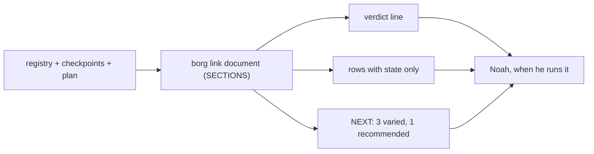
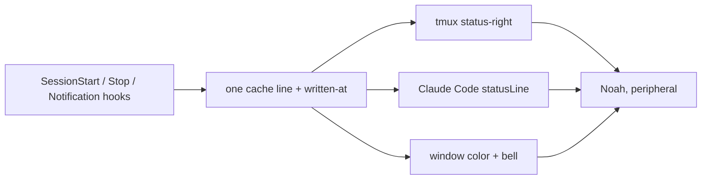
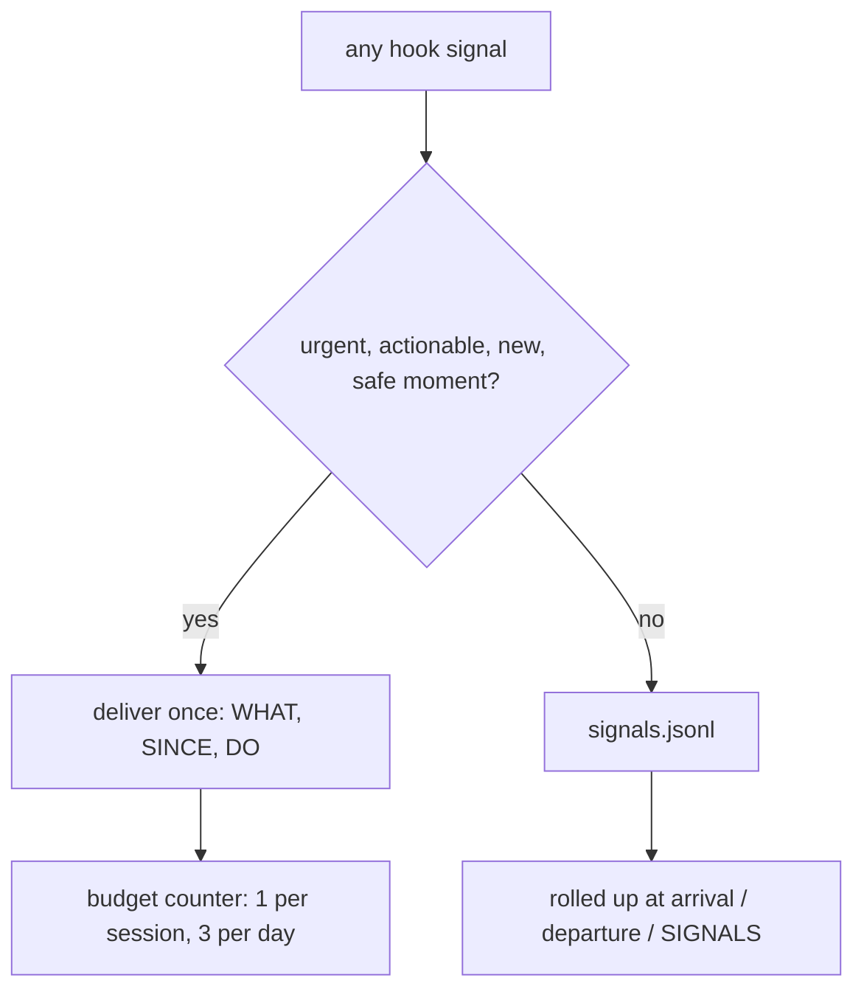
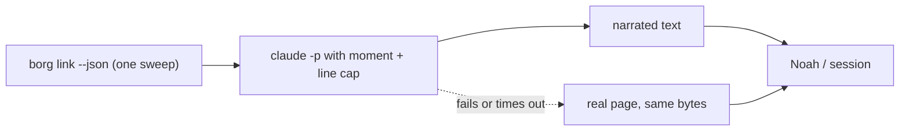
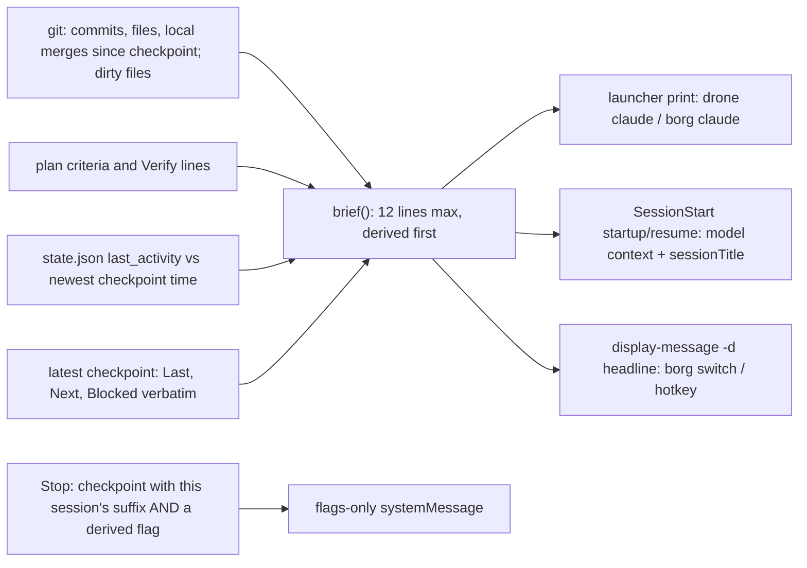

Generated: 2026-10-04

# D5 blind review packet (round 3)

## Problem statement

borg-collective is an orchestration framework (two CLIs, borg and drone, plus hooks and skills) for ONE developer with ADHD who works across about 20 projects and several parallel Claude Code sessions. The question: how should borg COMMUNICATE project information (status, priority, context, next moves) so that the right information arrives at the right time, in the right way and in the right amount? This is about how borg says things, not what it measures or enforces (a separate project decides that).

The six moments at which borg speaks: M1 glance (status at rest across the projects); M2 choosing the next move; M3 re-entering a project after time away; M4 switching between planning and doing; M5 ending or handing off a session; M6 something going wrong.

The surfaces that exist today: the borg link page (eight fixed sections, 159 lines in local mode, "(no summary)" on 19 of 20 repository rows, 30 queued directives printed); borg next (one ranked answer, no reason shown); a session-start hook that injects the git status, the last five commits and the latest checkpoint's sections 4 and 5 plus warnings (this reaches the model, not the human); a Stop hook whose three warnings reach the human through a systemMessage since 2026-10-04 (before that they reached no one); a PostToolUse check-in every 75 tool calls (reaches the model only); a checkpoint file with a tl;dr and five numbered sections; a tmux status line that shows only the date, a bell style, and a hotkey that runs borg next.

Facts about delivery, read from the repo, the hook docs and the tmux manual on 2026-10-04: the Claude Code hook docs list additionalContext (reaches the model, "before the first prompt") and sessionTitle (same effect as /rename) as SessionStart output fields, and describe systemMessage as a universal field shown to the user with no SessionStart-specific statement; SessionStart matchers are startup, resume, clear, compact and fork; the Stop hook fires after every assistant turn; SessionEnd fires once at termination and is observational only; borg-link-up.sh is registered as a Stop hook and writes last_activity to the project's state.json on every Stop; borg-link-down.sh (SessionStart) overwrites last_activity and has no matcher; switching into a tmux window whose Claude session is already running fires no SessionStart; the borg switch auto-brief is printed with echo to the pane where borg switch ran and is built from the registry summary field; the hotkey path calls tmux display-message with one line and tmux.conf does not set display-time (the tmux default is 750 ms); tmux 3.6a is installed and its manual says display-message takes -d delay (milliseconds) and -C (keep the pane updating), and that display-popup draws over the panes and "Panes are not updated while a popup is present"; drone claude (drone.zsh cmd_claude) finds or creates the project's tmux window and, if the left pane's foreground command is a shell, types claude into it with tmux send-keys; borg claude (borg.zsh cmd_claude) calls _borg_launch_in_tmux claude --continue, which runs the command directly inside tmux or through a generated launcher script otherwise; `borg checkpoint-name` prints YYYY-MM-DD-HHMMSS-<suffix> where the suffix is derived from CLAUDE_CODE_SESSION_ID and is empty in Cortex Code and in a bare terminal; borg next scores in jq (pinned +200, waiting +100, active +50, idle +10, no activity -50, a tmux window +5, then oldest activity first) while the borg link page orders rows with core.project_sort_key (pinned, status rank, oldest activity first), so there are two rankers; Stop systemMessage has not been watched rendering in a live session; a separate fix is landing that shows each Stop warning at most once per session.

Constraints: one user, no team and no coaching; terminal-first; host tmux plus devcontainers; the evidence base (analysis.md in the parent folder, 13 principles with strength labels) comes mostly from hospitals, shoppers, web readers and programmers in lab studies, not from a solo developer with many projects.

## Chosen option

Option E: Doorways, scoped to re-entry and handoff first. Its MVP, in three lines: (1) Arrive: a pure borg_core brief (an Activity line of commits and files touched since the checkpoint, local merge commits as the merged-PR proxy, dirty files, plan criteria, a derived Ended line from last_activity against the newest checkpoint time, a STALE line meaning HEAD moved or the tree was edited since the checkpoint, then the checkpoint's own words) PRINTED by drone claude and borg claude before claude starts, with a loud one-line fallback if borg_core is not importable; for hand-typed launches a SessionStart injection scoped to the startup and resume matchers (derived lines to the model, no restatement instruction) plus a one-line sessionTitle cue; for a running window a one-line derived headline through tmux display-message -d. (2) Depart: one Stop systemMessage, only on the turn a checkpoint whose filename ends in this session's suffix appears and only if a derived CARRIED or NOT DEPLOYED flag is non-empty; off when the suffix is empty; no SessionEnd hook. (3) Choose: a verdict line on borg link and a recommended move on borg next from one ranker, with the reason labelled a heuristic and whether it was followed logged. Build order starts with a one-hour spike on what is unverified (whether printed text survives Claude's start-up and whether the pane can run borg, where sessionTitle shows, Stop systemMessage rendering live, key handling during display-message).

## Option set (verbatim)

### Option A: One page, on a diet

- **What it is:** Every moment is carried by the one surface that already exists, `borg link`, and the work is subtraction and ordering inside its fixed `SECTIONS` spine. A verdict line goes first, dormant rows collapse to a count, and the empty `▸ NEXT` stops saying "nobody looked". No new surface, no new push.
- **How it works:** The moment-to-surface map is below. Hooks stay as they are; the page is the only thing that changes.

| Moment | Surface | What appears | Push or pull |
|--------|---------|--------------|--------------|
| M1 glance | `borg link` | One verdict line above everything ("1 needs you"), then only rows that have state | Pull |
| M2 next move | `▸ NEXT` and `borg next` | Up to three varied moves, each with its reason, the top one labelled "recommended" | Pull |
| M3 re-enter | `▸ IN FOCUS` | Latest checkpoint tl;dr and the first line of its Next Session | Pull |
| M4 plan to do | none | Not addressed (the page is not open mid-session) | none |
| M5 end | checkpoint file | Unchanged | none |
| M6 going wrong | `▸ SIGNALS` | Same section, deduplicated, one line per cause | Pull |

- **Removes or quiets:** The 9-line cube header (a decoration; Noah's call whether it stays). The `(no summary)` text on 19 of 20 rows. The 17 rows that say "never" or 26+ days (collapsed to one line: "17 dormant, oldest 123d"). The 30-line `▸ QUEUED` list (top 5 plus the count). The `▸ NEXT  nobody looked` stub, which becomes the last swept answer with its age.
- **Pros / Cons:**
  - Pros: cheapest, pure renderer so it is testable against fixtures, no new channel, the spine rule (sections never change, rows do) is kept.
  - Cons: leaves M4 and M5 untouched; everything depends on Noah opening a page; the evidence says a display alone does not change decisions.
- **Key tradeoffs:** You concede the two moments with the best evidence (M3 re-entry and M5 handoff) to a pull surface, and you accept that the page can only help a person who asked for it.
- **Feasibility:** High. `render.py` builds the page from a `SECTIONS` tuple with no branch on scope, `picture.py` is pure, and the rows are derived.
- **Estimate:** 2 to 3 sessions, most of it golden-file updates.
- **Visual:**

- **Minimum viable version:** *"The smallest version that delivers the core value is: a verdict line at the top of `borg link` and the dormant rows collapsed to one count line, with no other change."*

### Option B: Ambient periphery

- **What it is:** State lives at the edge of vision instead of on a page. A tmux status segment, window colors and Claude Code's own status line carry the glance, the next move and the warnings, driven by one small cache file that hooks keep fresh. The page becomes the drill-down.
- **How it works:** Hooks (SessionStart, Stop, Notification) already write per-project state; a cache writer rolls them into one line. `status-right` reads the cache (no fork of `gh` on a 15-second tick), and the Claude Code `statusLine` setting shows the project-local line inside a session.

| Moment | Surface | What appears | Push or pull |
|--------|---------|--------------|--------------|
| M1 glance | tmux `status-right` | `borg: 1 needs you, shopping-app 6h` or `borg: clear 08:40` | Ambient |
| M2 next move | `Ctrl+Space >` | One line in a tmux message: the target and its reason | Pull |
| M3 re-enter | Claude Code `statusLine` | `plan 5/6 · next: AC6 · 2 PRs since` | Ambient |
| M4 plan to do | `statusLine` | Segment flips from `PLAN` to `DO` with the done-when | Ambient |
| M5 end | `statusLine` | `unsaved: no checkpoint` until one is written | Ambient |
| M6 going wrong | `status-right` color, existing bell | Segment turns amber and names the cause | Ambient |

- **Removes or quiets:** The `⚠ CAPACITY WARNING` paragraph injected at session start (becomes `3/3 active` in the segment). The 75-call check-in text. The date-only `status-right`.
- **Pros / Cons:**
  - Pros: zero interruptions, always in view, matches the empty-state-as-blank idea (a clear segment), reuses the registry color helpers and the existing bell style.
  - Cons: 30 characters of `status-right-length` fits one item, not twenty projects; tmux exists on the host only (devcontainer panes and plain terminals get nothing); a cache that goes stale looks the same as "all clear".
- **Key tradeoffs:** You concede detail (one item at a time) and take on a cache that must be made to fail loudly, the same silent-blindness shape that bit `borg-usage-watch` three times.
- **Feasibility:** Medium. Segment and bell are easy; the risk is the cache's freshness mark and the `statusLine` setting, whose behavior this run did not verify.
- **Estimate:** 3 to 4 sessions.
- **Visual:**

- **Minimum viable version:** *"The smallest version that delivers the core value is: one `status-right` segment reading a cache file with a freshness mark, showing the count of projects that need Noah and the top one's name, and nothing else."*

### Option C: Quiet router with a budget

- **What it is:** Subtract first. Every message a hook sends to anyone passes one gate that asks four questions (urgent, actionable, first time this session, safe moment) and routes failures to a log that the page and the departure message roll up. The unit of design is the message, not the surface.
- **How it works:** A single executable (`borg-signal`, per the repo's rule that anything that MUST happen ships as an executable, not as prose) replaces the direct `jq` emitters in the hooks. Pass: delivered once, in the fixed shape WHAT, SINCE, DO. Fail: appended to `signals.jsonl` and shown as one rolled-up line at the next arrival or departure. A budget of one interrupt per session and three per day is counted from the same file.

| Moment | Surface | What appears | Push or pull |
|--------|---------|--------------|--------------|
| M1 glance | `▸ SIGNALS` | One line: `4 held back since Sat, 1 needs you` | Pull |
| M2 next move | unchanged | Not addressed | none |
| M3 re-enter | session start `additionalContext` | One line of held-back signals, no paragraph. Reaches the model only; the human sees it if the model repeats it. (A launcher print, as in Option E, could carry it to the human without a model; C does not include one) | Push to the model, once |
| M4 plan to do | breakpoints only | Nothing mid-edit; the one allowed message waits for a commit or green test | Push, gated |
| M5 end | Stop `systemMessage` | The three warnings coalesced into one 3-line message. Stop fires after every turn, so "once per session" means after the first turn in which a condition holds (for the no-checkpoint warning, turn one), not at the end. A real departure message needs the checkpoint-written gate from Option E. Channel unverified live (AC5) | Push, once per session |
| M6 going wrong | the gate | Urgent and actionable passes with its DO; the rest is logged | Push, gated |

- **Removes or quiets:** The 75-call check-in as a count-based push. Repeats of `pre-commit-remind`. The capacity paragraph (becomes a ledger line unless the limit is crossed). Three separate Stop warnings (one message).
- **Pros / Cons:**
  - Pros: directly applies the strongest interrupt evidence (each extra reminder per encounter cut acceptance by 30%, generic reminders did nothing in two adult-ADHD trials); the shape WHAT, SINCE, DO pairs a problem with its counter-move; the budget is measurable from one file.
  - Cons: says nothing about M1 or M2; a gate that suppresses is a gate that can hide a real failure; it touches six hooks and each needs a redeploy.
- **Key tradeoffs:** You concede the glance and the choice moments entirely, and you take on the risk that suppression is silent. The ledger has to show its own suppressions or the router becomes the next blind spot.
- **Feasibility:** Medium. The emit sites are known (six hooks), and the attention-routing directive of 2026-08-11 already specifies a session-scoped log.
- **Estimate:** 4 to 5 sessions.
- **Visual:**

- **Minimum viable version:** *"The smallest version that delivers the core value is: the three Stop warnings coalesced into one 3-line `systemMessage` in WHAT, SINCE, DO shape, plus a log line for the 75-call check-in instead of a push."*

### Option D: Narrator per moment

- **What it is:** Instead of fixed layouts, a model composes the right amount for the moment from the derived JSON that `borg link --json` already produces. One call per moment, a size cap per moment, and the deterministic page as the fallback. It extends the existing `--brief` idea to all six moments.
- **How it works:** `borg say <moment>` (or a skill) feeds the document JSON plus the moment name and a line cap to `claude -p`, returns prose, and falls back to the real page bytes when the call fails. SessionStart hands the narrated brief to the model; the same text is printed for the human.

| Moment | Surface | What appears | Push or pull |
|--------|---------|--------------|--------------|
| M1 glance | `borg link --brief` | 5-line prose verdict | Pull |
| M2 next move | `borg next` | Two sentences: the move, why, what it unblocks | Pull |
| M3 re-enter | session start `additionalContext`, or `borg say reenter` | A composed "where you stopped" from checkpoint, `git log` and diff. Reaches the model; the human sees it only if the model repeats it or he runs the command (a switch into a running window triggers no SessionStart). (A launcher print could carry the narrated text to the human before a prompt; D does not include one, and would pay a model call for it on every launch) | Push to the model, once |
| M4 plan to do | plan exit | Model restates done-when in one line, as ordinary assistant text (reaches the human; model discretion) | Push, once |
| M5 end | `/borg-link-up` | Model drafts the checkpoint (already true today) | Pull |
| M6 going wrong | on request | `borg say wrong` explains the last signal | Pull |

- **Removes or quiets:** The raw `(no summary)` rows (replaced by generated summaries, which is 20 model calls on a cold start). The verbatim checkpoint paste for the human.
- **Pros / Cons:**
  - Pros: amount adapts to context; reads like prose, which the usability evidence favors (concise and scannable text); no schema to maintain.
  - Cons: layout varies per call so a learned position never forms; summary provenance and the silent-fallback bug are already open directives against `--brief`; cost and latency on every moment; the narration is prose through a model, so compliance is a 70 to 90 percent band.
- **Key tradeoffs:** You concede determinism and learnability for adaptivity, and you pay model spend on the glance, the moment that has to be fastest.
- **Feasibility:** Low to Medium. The `--brief` path exists but its own directive says it has fallen back silently and collapsed fields.
- **Estimate:** 5 to 7 sessions plus ongoing spend.
- **Visual:**

- **Minimum viable version:** *"The smallest version that delivers the core value is: `borg say reenter` for one project, a 6-line narrated brief with the fallback page, used by hand for two weeks before any hook calls it."*

### Option E: Doorways

- **What it is:** Push is allowed only on a transition Noah makes, and only down a channel that reaches him without asking a model to do it. Everything between is pull or silent. The arrival brief is mostly facts the tool derives from the repo (what the last session did, what merged, what is dirty, whether the last session ended with a checkpoint), with the checkpoint's own words underneath, labelled as his. Forged in D3.5 (below) from the clash between "re-entry must be automatic" and "push is inert for this user".
- **How it works:** One pure function (`borg brief`) builds a brief of at most 12 lines: derived lines first (an `Activity` line of commits and files touched since the checkpoint, local merge commits as the merged-PR proxy, dirty files, plan criteria, a derived `Ended` line, and a STALE line meaning "HEAD moved or the tree was edited since the checkpoint", not an age), then the checkpoint's tl;dr, Next and Blocked verbatim. Delivery follows how the session starts. Launched through `drone claude` or `borg claude`: the launcher prints the brief into the pane before `claude` starts (plain stdout, no model, no hook). Started by hand, resumed, or in CoCo: a SessionStart hook scoped to the `startup` and `resume` matchers gives the model the derived lines and sets a one-line `sessionTitle`. Switching into a window whose session is already running: a one-line derived headline through a non-modal `tmux display-message -d`. On the way out: one Stop `systemMessage` that fires only on the turn a checkpoint whose filename ends in this session's suffix appears, and only if a derived CARRIED or NOT DEPLOYED flag is non-empty. There is no SessionEnd hook; "ended without a checkpoint" is derived at arrival from `last_activity` against the newest checkpoint time. If `borg_core` cannot be imported, every path says so in one line and the existing git blocks stay.
- **Separation move:** Condition. The automatic part is conditioned on the user's own act (launching a session, switching into a window, writing a checkpoint), never on a clock, a counter or a turn boundary, so the pull-only rule and the automatic-re-entry rule both hold.

| Moment | Surface and channel | What appears | Push or pull | Reaches the human how |
|--------|---------------------|--------------|--------------|------------------------|
| M1 glance | `borg link` verdict line | One line above everything: who needs you, how many dormant, whether it was swept | Pull | Directly |
| M2 next move | `borg next` | The recommended move from the same ranker `borg link` uses, with a reason labelled a heuristic (status-driven, not value); the project's own checkpoint line quoted and attributed; whether it was followed is logged | Pull | Directly |
| M3 re-enter, launched through borg | `drone claude` or `borg claude` prints before `claude` starts | The full brief (the orchestrator gets one cross-project verdict line) | Doorway | Directly, deterministic: stdout of the pane |
| M3 re-enter, hand-typed `claude`, `/resume`, CoCo | SessionStart `additionalContext` (matchers `startup`, `resume`) and `sessionTitle` | To the model: derived lines. To the human: a one-line title cue only | Doorway (model-side) | The title cue directly (unverified); the brief by pulling `borg brief` |
| M3 re-enter, running window | `borg switch` and `Ctrl+Space >` through `tmux display-message -d <ms> -C` | A one-line derived headline | Doorway | Directly; non-modal and auto-expiring |
| M4 plan to do | none in the MVP | Not addressed. The plan-exit doorway through `borg-plan-promote.sh` is dropped as fragile | none | none |
| M5 end, checkpoint written | Stop `systemMessage`, gated on a checkpoint filename ending in this session's suffix | Only derived CARRIED and NOT DEPLOYED flags, and only if non-empty; never a repeat of the Last and Next the skill just displayed. Empty suffix (CoCo, bare terminal): off | Doorway | Directly, if Stop `systemMessage` renders (unverified live) |
| M5 end, no checkpoint | nothing at the end | The next arrival's `Ended` line, derived from `last_activity` against the newest checkpoint time | Held to the next doorway | Through the next brief |
| M6 going wrong | nothing mid-session | Nothing new from borg; blocks (`bash-guard`) unchanged | none | none |

- **Removes or quiets:** The 75-call count-based check-in (deleted). The git status and last-five-commits blocks of the session-start injection, only when the brief was built (replaced by "since the checkpoint"; a failed build keeps them). The `_borg_do_switch` echo that prints a `summary`-based auto-brief to the pane the user just left. The model's restate-on-first-reply instruction (never sent). A second ranker. It does not touch the three existing Stop warnings; a separate fix limits each to once per session.
- **Pros / Cons:**
  - Pros: spends the budget where the evidence is best (an automated activity cue doubled task success, and the `Activity` line is that cue); the cold-start human path is a print, not a request; no unsolicited mid-session interrupt; no new hook (SessionEnd deleted); each fact travels on one human-facing channel per transition; the explicit STALE and `Ended` lines mean an old or uncovered handoff reads as such; the arrival print and the title cue come from one function so they cannot drift.
  - Cons: the deterministic print covers only launches through the two borg launchers, and a hand-typed `claude` gets the title cue and a pull; whether the printed text survives Claude's start-up, and whether the pane can run `borg` inside a devcontainer, are unverified; `sessionTitle` and the Stop `systemMessage` are unverified live; switching to one ranker changes what `borg next` answers; the fixed-fields evidence is a bundle (mnemonic, training, faculty observation, sustainability campaign) and none of that exists here; M1 and M2 get only A's two smallest changes.
- **Key tradeoffs:** You concede the middle of the session (no push at all), the pre-prompt moment on a hand-typed launch, and a modal popup that would show the full brief on a switch; in return the main cold-start path needs no model and no new hook.
- **Feasibility:** Medium. The pure brief function is High. The launcher print is Medium: two known call sites, an unverified TUI interaction and an unverified pane environment. The model-side hook is High (a documented channel; no restate to measure). The Stop flags are Medium (documented but unwatched channel; the suffix gate reuses `borg checkpoint-name`'s own suffix). The ranker unification is Medium (it changes an answer and its goldens).
- **Estimate:** MVP about 3 sessions (brief and launcher call sites about 1.5, matcher-scoped hook and title about 0.5, Stop flags about 0.5, ranker, verdict and follow log about 0.5); full build 5 to 6.
- **Visual:**

- **Minimum viable version:** *"The smallest version that delivers the core value is: `borg_core/brief` producing the derived-first 12-line arrival brief (an `Activity` line, local merges, a STALE line meaning the repo changed, a derived `Ended` line, then the checkpoint's words), printed by `drone claude` and `borg claude` before `claude` starts with a loud fallback if `borg_core` is missing, plus a matcher-scoped SessionStart injection for hand-typed launches; no SessionEnd hook, no popup, no restatement instruction, no new model-written fields."*
