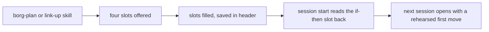

Generated: 2026-10-03

# D5 blind review packet

## Problem statement

borg-collective is an AI orchestration framework (two CLIs, borg and drone, plus hooks and skills) for ONE developer
with ADHD who juggles about 20 projects. He found six one-page psychoeducation sheets unusually effective for himself:
a feelings wheel, a DBT wise-mind Venn diagram, an IFS internal-system map, an NVC fill-in script ("When __, I feel
__, because I need __. Would you be able to __?"), a window-of-tolerance chart, and the Gottman Four Horsemen with
antidotes. Question: how should borg apply the same design principles to project and workflow management?

The evidence base (11 design principles with strength labels) is in analysis.md section 3 of the parent folder: one
message in about four chunks; recognition at the point of performance; every name routes to a next move; problem and
counter-move as contrast; a small closed vocabulary from the user's own failures; rehearsed if-then scripts; sparse
distinctive cues; pull by default, push rarely and measured; a handout is a first step; do not duplicate, mandate or
grow; diagrams are heuristics. No study tests a one-page aid on adults with ADHD or on developers.

## Chosen option

Option B-card: Situation and next-move card

## Option set (verbatim)

### Option A: Workload state map

- **What it is:** A three-zone map of how loaded the work is (overloaded, in range, drifting) with a "you are here"
  marker, a plain description of each zone, and one move out of it. The zone comes from counts borg already holds:
  live sessions against the limit, how long the longest-open thread has sat, and hours since the last checkpoint. It
  borrows the shape of a window-of-tolerance chart, not its trauma claims.
- **How it works:** `borg link` computes the zone from the `capacity` block it already builds and prints the map as
  rows inside the existing `▸ SIGNALS` section (no new section, so the page spine is untouched). Noah glances, sees
  the marker, reads the one move under it. The session-start injection carries the zone name instead of the
  capacity paragraph.
- **Pros / Cons:**
  - Pro: one picture, one glance, a format Noah already responds to.
  - Pro: replaces two capacity texts with one artifact.
  - Con: thresholds are guesses; the inverted-U curve this shape resembles is called folklore, and the
    window-of-tolerance source frames it as a trauma hypothesis.
  - Con: says "overloaded" but not which thread to drop.
  - Con: the "drifting" zone (too little live work) has no detector today.
- **Key tradeoffs:** You give up specificity (a zone, not a culprit) and accept thresholds that are heuristics with
  no validation, which the printed map must say out loud.
- **Cards:** `c3-pa-dhs-window-of-tolerance-tip-sheet.md` (zone, symptoms, actions on one page),
  `c3-corbett-2015-yerkes-dodson-folklore.md` and `c3-corrigan-2011-window-of-tolerance.md` (heuristic status),
  `c1-nngroup-recognition-vs-recall.md`.
- **Feasibility:** High. The `capacity` block (active, limit, over_limit) already feeds `_signals_section` in
  `borg_core/link/render.py`.
- **Estimate:** MVP 1 session; full three zones with checkpoint-age signal 3 sessions.
- **STOPS doing:** the bare "N sessions need attention (limit: N)" line in `▸ SIGNALS`, and the free-text
  `CAPACITY WARNING` paragraph in the session-start injection.
- **Visual:**

```
▸ SIGNALS
  LOAD     OVERLOADED           IN RANGE             DRIFTING
           more live than       1 to 3 live,         nothing live,
           the limit            something moving     20 idle
                                     ^ you are here (3 of 3 live)
  Move:    finish or park one: /borg-link-up in the oldest window
  (heuristic: the limit is a setting, not a measurement)
```

- **Minimum viable version:** *"The smallest version that delivers the core value is: two zones (over limit, in
  range) with the you-are-here marker and one move each, rendered in `▸ SIGNALS` from the existing capacity block,
  with no new detectors."*

### Option B-card: Situation and next-move card

- **What it is:** A static one-page card of three named situations, each paired with an if-then next move. It is a
  plain markdown file Noah owns and edits (`~/.config/borg/card.md`); borg never regenerates it and `borg link` does
  not render it. The names come from a one-pass tally of the 40 most recent checkpoints (see Mining result below) and
  describe the state of a piece of work, not a fault of the person. A fourth name must retire one. WAITING ON (8
  checkpoints) is not on the card: the three examples spot-checked record it under "No blockers", as a wait for
  the other machine's review stamp that an existing protocol covers, and its 2-day threshold had no source.
- **How it works:** Two delivery paths, both measured. (1) Human: `borg card` prints the card and appends an open
  event to `STATE/card-log.jsonl`; `borg card --report` prints the ledger. (2) Sessions: a per-machine skill
  extension (`~/.config/borg/extensions/skill-extensions/borg-link-up/02-output.md`) asks `/borg-link-up` to add the
  `mine:` line of any pair whose cue applied, tagged `[card:<NAME>]`, under `## 5. Next Session`; `borg-link-down.sh`
  injects section 5 at the next SessionStart. That is prose, so compliance is model-discretionary and the tag makes
  misses countable. Nothing fires from the card itself; no new push is added. A pair becomes a live row in `▸ SIGNALS`
  only by the promotion rule below, and none is live at the start.
  (`STATE` is the state root, `${XDG_STATE_HOME:-~/.local/state}/borg` via `_borg_state_root`; per State Hygiene
  AC4 operational logs never go in the config dir.)
- **Rehearsal step (self-formation):** the file ships with placeholder wording and an empty `mine:` line per pair.
  Noah rewrites each then-clause once, in his own words, and says it aloud once when he does. `borg card --report`
  prints "rehearsed: k of 3" and delivery uses the `mine:` line when it exists. The if-then evidence is for
  self-formed, rehearsed plans (larger effects when rehearsed and motivated, no reliable effect on vaccination or
  voting); a pre-written, unrehearsed pair is outside it.
- **Instrumentation this needs (none exists today):**
  - `borg card` arm in `borg.zsh` and `borg_core/card/` (open, report), through `_borg_py`; source tree, live on
    save.
  - One append line in `hooks/tool-count-nudge.sh` (in the 75-call branch; today it keeps only a per-session counter
    and resets it) and one in `hooks/borg-link-up.sh` (beside the no-checkpoint stderr line; today it logs nothing),
    to `STATE/nudge-log.jsonl`, written with a brace-grouped redirect per the repo's redirect rule. Hooks are
    copied, so a `borg setup` redeploy is required.
  - Follow signal from an artifact: a new file in the project's `.borg/checkpoints/` within 60 minutes. Following
    `/borg-review` leaves no artifact and is not measured. No skill-invocation logging is added.
- **Ledger semantics (fail closed):** each source reports `no data` (absent or empty), `stale` (newest event older
  than 7 days while newer checkpoints exist), `insufficient (n=k)` (under 10 events) or `ok` with the rate. A rate, and
  never 0%, is printed only for `ok`. Tests go through the real `borg card --report` path with `XDG_CONFIG_HOME`
  redirected (log path derived, not supplied), cover absent, empty, stale and short logs, and include a positive
  control with a known count. The repo has a documented history of a ledger reading zero from a dead source; this is
  the guard.
- **Mining result (LOCAL MEASUREMENT, not literature):** keyword tally over §4 "Blockers" of the last 40 files in
  `.borg/checkpoints/` (38 had a §4; 2026-08-24 to 2026-10-03). Counts are checkpoints affected, not distinct
  incidents, because consecutive checkpoints re-record the same open item; the regexes are loose, so treat each count as
  an upper bound.

  | Situation | Checkpoints | Example files |
  |-----------|-------------|---------------|
  | CARRIED (same open item, unchanged, re-listed) | 19 | `2026-08-31-2211`, `2026-09-04-1022`, `2026-09-13-0927` |
  | UNCHECKED (gate or verdict that measures nothing) | 14 | `2026-08-27-2147`, `2026-09-02-1309`, `2026-09-05-2112` |
  | NOT DEPLOYED (built, not shipped or synced) | 10 | `2026-08-25-1738`, `2026-08-27-0216`, `2026-09-04-1253` |
  | Dropped: WAITING ON (protocol wait on another machine's stamp) | 8 | `2026-09-03-0955`, `2026-09-22-1322` |
  | Reserve: stale claim in prose (hand-read ~5 of 13 keyword hits) | ~5 | `2026-08-31-0759`, `2026-09-04-1022` |
  | Reserve: self-inflicted slip | 6 | `2026-08-27-0401`, `2026-09-16-1715` |
  | Reserve: flaky or environment | 5 | `2026-08-31-2156`, `2026-09-18-1238` |

  The draft's original names did not survive contact with the record: SPRAWL (capacity or over-limit) appears in 1 of 38
  (`2026-10-03-222446-beb3b1`), DRIFT in 1 of 38 (`2026-10-02-145508-fb0d8f`), directive staleness in 0 of 38. Only
  UNVERIFIED survives, renamed UNCHECKED. Caveat: checkpoints are written by sessions with Noah, so they show what
  got recorded as a blocker, not what he felt.
- **The card (draft wording, placeholder until Noah rewrites it):**

```
 SITUATION       IF ...                                      THEN ...
 NOT DEPLOYED    I touched a hook, skill or lib file         run borg setup before closing, or write
                                                             "not deployed: <file>" on line 1 of Next
 CARRIED         a blocker or next item I am writing is      do it, file a directive, borg sever it,
                 already in the checkpoint I was handed      or write "held on purpose: <why>"
 UNCHECKED       a check just went green                     break it once on purpose, or confirm it ran
                                                             one case, before writing "done"
 mine: ______    (one line per pair, in your words)
 (names describe the work, not you; this card is yours to edit)
```

  CARRIED's cue is something a writer can perceive without a detector: the latest checkpoint is injected into the
  session at start, so "this item is already in what I was handed" is visible at write time. The "held on purpose"
  exit is there because some holds are designed (`2026-09-13-0927` records a deliberate hold); "decide it now" must
  not contradict them.
- **Promotion rule (any future live row):** a pair earns a row in `▸ SIGNALS` only when all four hold. (1) A real
  detector reads a stored fact and is tested through the real invocation path, not a fixture that supplies the value,
  including a case where the fact is broken and the row must say so; the same broken-source test applies to the ledger.
  (2) A shadow run, logging only and showing nothing, has measured its firing rate over at least 14 days of `borg link`
  runs and it is true on fewer than about 20% of days; above that it is a permanent row, so it stays on the card.
  (3) The ledger reports status `ok` (not `no data`, `stale` or `insufficient`) for the relevant source after three
  weeks, and the card or nudge it would replace has an acted-on rate below a threshold Noah writes in the directive
  before reading the data. Missing data fails this gate; it never passes it. (4) The change is net-negative in page
  lines. A pair with no detector prints nothing anywhere, and no line ever reads "nothing to report" for it; the card
  says "not detected by borg".
- **Pros / Cons:**
  - Pro: the card costs one session and can be judged by use before any detector exists.
  - Pro: the next moves are phrased as if-then, the best-supported of the ingredients considered (bias-corrected d
    between 0.15 and 0.35, ADHD evidence from children on a lab task), and the rehearsal step moves it toward the
    self-formed plans that evidence covers.
  - Pro: the vocabulary is measured from this repo's own record, so no label is invented.
  - Pro: it has a measured route to being seen, and a ledger that says `no data` instead of 0%.
  - Con: the contrast-pair mechanism is Moderate and the one-page format is Weak; Alfieri tested classroom concept
    learning and Keith and Frese tested training, not a pinned card.
  - Con: the vocabulary-from-own-failures precedent (Ford and Parnin) is descriptive, with no outcome test.
  - Con: the session path is a prose extension in the 70 to 90% band, and `borg card` logs only opens through that
    command, not a `cat` or an editor open. The human path still relies on Noah remembering; this repo's
    voluntary-use surfaces have a poor record.
  - Con: NOT DEPLOYED duplicates an existing memory note and is better fixed by a `borg doctor` drift check.
- **Key tradeoffs:** You concede automatic reach and any live signal at the start, and accept that the card's value is
  unmeasured except through a proxy ledger that can be fooled by coincidence, on about 20 new checkpoints over three
  weeks.
- **Cards:** `c3-implementation-intentions-642-tests.md` and `c3-gawrilow-adhd-implementation-intentions.md` (if-then
  phrasing, rehearsal), `c3-alfieri-2013-case-comparisons.md` and `c3-keith-frese-2008-error-management-training.md`
  (contrast pairs, mechanism only), `c2-ford-parnin-2015-frustration-categories.md` (own-failure vocabulary,
  descriptive), `c4-gani-alert-fatigue-primary-care.md` (why no new push).
- **Feasibility:** High for the card; Medium for the ledger, because its sources do not exist yet and three small
  items must land first (card log, two nudge logs). No log of these exists today. Live
  rows are gated by the promotion rule and may never ship.
- **Estimate:** Card 1 session; instrumentation and ledger with tests 2 sessions; one shadow detector about 1 session
  each, only for a pair Noah wants promoted.
- **STOPS doing:** nothing at first. Only the ledger can retire an existing nudge, by the same action-rate rule as
  Option E, and that retirement is a removal, not a claim that the card replaces it.
- **Sequence note:** instrumentation (so the ledger has sources), card with Noah's rewrite, extension for delivery,
  then shadow detectors, then at most one live row, only through the promotion rule.
- **Visual:** the card above.
- **Minimum viable version:** *"The smallest version that delivers the core value is: the three-pair card in Noah's
  own words, `borg card` logging opens, the two nudge firing logs, and a fail-closed report, with no live rows and no
  nudge retired."*

### Option C: Stuck router

- **What it is:** A small closed vocabulary of ways Noah gets stuck (five names), reached by one command, where
  choosing a name immediately prints its single next move. It is the project-work analog of picking a word from a
  feelings list, except the word and the action sit on the same screen. The five names are mined from his own
  checkpoints and memory notes before anything ships.
- **How it works:** `borg stuck` (or `/borg-stuck`) shows the five-row menu; Noah picks a row by number; borg prints
  the move and, where the move is a command, offers to run it. Nothing fires by itself.
- **Pros / Cons:**
  - Pro: pure pull, so it cannot add alert fatigue.
  - Pro: the name and the action arrive together, which is the pairing the labeling studies favor.
  - Pro: it targets the moment of being stuck, which no current surface does.
  - Con: it only helps if Noah remembers to run it while stuck, the exact moment recall is weakest.
  - Con: the vocabulary is only as good as the mining; two descriptive studies are the only precedent.
- **Key tradeoffs:** You concede automatic reach (it waits to be asked) and accept that a menu is a lookup, not a
  glance; one source describes a wheel-like list as a step-by-step lookup for some users.
- **Cards:** `c2-kalokerinos-2019-differentiate-to-regulate.md` and `c2-nook-2021-naming-impedes.md` (name and action
  together), `c2-ko-myers-aung-2004-learning-barriers.md`, `c2-ford-parnin-2015-frustration-categories.md` (only
  precedents, descriptive), `c2-matt-2024-emotion-word-training.md` (teaching words alone did not lower distress),
  `c4-barkley-point-of-performance.md` (why on-demand recall is the weak spot).
- **Feasibility:** Medium. The command and menu are trivial; deriving the five names from 300-plus checkpoints is the
  real work and has to come first.
- **Estimate:** Vocabulary mining 1 session; command and menu 1 session; routing to skills 1 session.
- **STOPS doing:** the 75-tool-call check-in nudge, whose job (offer a way out when work stalls) the menu takes over
  on demand.
- **Visual:**

```
$ borg stuck
  What kind of stuck?
  1  Can't start     cold, no first step      read the latest checkpoint tl;dr, do its Next line
  2  Can't choose    too many open threads    borg next, then close every other window
  3  Can't finish    scope keeps growing      reread Done-when, defer the rest in one line
  4  Can't trust     "done" with no check     /borg-verify before saying shipped
  5  Lost the thread session went cold        borg link <project>, read the checkpoint
  pick 1-5:
```

- **Minimum viable version:** *"The smallest version that delivers the core value is: a printed five-row menu with
  a number-to-command table, no interactivity, built from a one-session pass over the last 30 checkpoints."*

### Option D: Fill-in scripts

- **What it is:** Short fixed-slot templates, in the spirit of a four-slot "when, I feel, because, would you"
  sentence, for the artifacts Noah writes most: a directive, a checkpoint handoff, and a nanoprobe brief. Each has at
  most four slots, and one slot is a rehearsed if-then ("If I open this cold, then I read ___ first, then run ___").
- **How it works:** `borg-plan`, `borg-link-up` and the brief builder present the slots, Noah or the model fills
  them, and the result lands in the artifact header. The session-start injection reads the if-then slot back at the
  next cold start, so the plan is rehearsed by use. Old free-form artifacts stay valid (expand, then migrate, then
  contract).
- **Pros / Cons:**
  - Pro: if-then planning is the best-supported ingredient in the research, and it was tested in children with ADHD.
  - Pro: fixed slots cap length, which helps the reader on a cold start.
  - Con: `borg-plan` already demands "Done when" criteria with a Verify line, so the overlap is large.
  - Con: bias-corrected effects are a third of the headline, and the ADHD evidence is children on a lab task.
  - Con: a script only works if it is rehearsed; nothing here makes rehearsal happen.
- **Key tradeoffs:** You concede flexibility (four slots will not fit every directive) and add a template to keep in
  sync across three skills and the validators.
- **Cards:** `c3-implementation-intentions-642-tests.md` (bias-corrected d between 0.15 and 0.35),
  `c3-gawrilow-adhd-implementation-intentions.md` (children, lab task), `c3-brighter-coach-action-planning-adhd.md`,
  `c3-nvc-korean-nursing-rct-2025.md`, `c3-donker-2009-psychoeducation-meta-analysis.md` (handout alone d = 0.20),
  `c1-fourcade-2012-checklist-barriers.md` (duplication as top barrier).
- **Feasibility:** Medium. Skills are prose, so the template is cheap, but anything that must be enforced needs a
  validator, and prose templates sit in the model-discretionary compliance band.
- **Estimate:** 2 sessions for directive and handoff templates; 3 more for validators and a rehearsal read-back.
- **STOPS doing:** free-form "Next:" prose in checkpoints and the open-ended directive preamble, replaced by the slots.
- **Visual:**



- **Minimum viable version:** *"The smallest version that delivers the core value is: one four-slot checkpoint
  handoff, where the last slot is an if-then for the next cold start, with the old format still accepted."*

### Option E: Quiet page

- **What it is:** A subtraction-first option. Measure which current prompts Noah acts on, retire the ones he does
  not, and cap the `borg link` page so its default read is a few chunks instead of eight sections of rows. Nothing
  new is named or taught. The aid is the absence of noise.
- **How it works:** A ledger joins existing logs (the hook counters, checkpoint timestamps, command history) to
  record whether each nudge was followed by the suggested action within the hour. After three weeks, nudges below a
  set action rate are removed. On the page, row caps apply inside sections (the section list stays identical, as the
  one-renderer rule requires): QUEUED shows the count and the three oldest, never-active idle repositories collapse
  to a count.
- **Pros / Cons:**
  - Pro: removing clutter is among the better-supported layout moves in the research (Moderate).
  - Pro: it shrinks the surface instead of growing it, and it measures before it decides.
  - Pro: nothing to learn.
  - Con: adds no new capability, so Noah's request for sheet-like aids goes unanswered.
  - Con: an action-rate ledger can be fooled by correlation (he ran the command anyway).
  - Con: capping rows hides things; a buried directive stops existing.
- **Key tradeoffs:** You concede the aid-as-artifact idea entirely and accept that removed prompts may have been
  catching real lapses at a rate the ledger cannot see.
- **Cards:** `c1-mayer-metaanalysis-2025.md` (removing seductive detail had the largest effect),
  `c1-cowan-2001-magical-number-4.md`, `c1-thomassen-2010-help-or-hurdle.md` (checklist fatigue),
  `c4-nordby-sms-reminders-adhd-rct.md` and `c4-focus-adhd-app-rct.md` (generic prompts null),
  `c1-urbach-2014-ontario-checklist-null.md` (mandates).
- **Feasibility:** High. Counters and timestamps exist; row caps are a render-layer change.
- **Estimate:** Ledger 1 session; three weeks of waiting; cap and retire 1 session.
- **STOPS doing:** the 75-call nudge and the no-checkpoint stderr nudge (each unless the ledger saves it), the full
  29-row QUEUED dump, and 5 never-active repository rows.
- **Visual:**

```
▸ REPOSITORIES  20 repositories, 1 needs attention
  ingle   [C]  waiting <<<   27m ago
  borg-collective [C] idle   just now
  ... 5 never active, 10 idle over 30 days (counts only)
▸ QUEUED  29 directives, 3 oldest shown (docs/plans/directives/ for the rest)
```

- **Minimum viable version:** *"The smallest version that delivers the core value is: the ledger alone, with no
  removals, run for three weeks, so the first cut is decided by numbers."*

### D3.5: Contradiction check

Two constraints pull against each other. The research says to put the cue at the point of performance (Option
A-style state, visible where the work happens), and also says generic pushes fail and alerts fatigue (pull by
default). Borg's own history says an aid that waits to be used is not used (four voluntary-write surfaces yielded one
real row in five months), and Noah's standing preference is that automation beats discipline. A pure pull aid and a
pure push aid each concede one pole.

**Ideal Final Result:** Noah sees his load and the next move at the place he works, without any prompt firing and
without opening anything.

### Option F: Ambient status strip (resolved option)

- **Separation move:** Separation in space (the cue lives in the always-visible status line, not in the interrupt
  channel) combined with separation on condition (it draws only when the state is out of range).
- **What it is:** A short segment in the tmux status line, empty when everything is in range, showing one state and
  one antidote when it is not. It is not a banner, a notification or a dismissable prompt. No event fires, nothing
  asks for acknowledgement, and the text is constant between changes.
- **How it works:** The session-start and stop hooks already compute capacity; they also write one line to a
  cache file. The tmux segment only reads that file (it never recomputes and never runs the network sweep). Out of
  range, it shows for example `LOAD 5/3  > /borg-link-up`. In range it shows nothing.
- **Pros / Cons:**
  - Pro: always at the point of work, with no interrupt, which is the stated ideal.
  - Pro: reuses computations that already run, so no new poll.
  - Con: untested for habituation; a permanent out-of-range strip can become wallpaper.
  - Con: the cache file is a new store, and this repo has a documented history of stores nothing reads; the only
    reader is the tmux segment, so a dead segment hides a stale cache.
  - Con: colour change at the edge of vision is a mild attention capture, closer to a push than the label admits.
- **Key tradeoffs:** You concede the richness of a page (one state, one move) and accept an unproven habituation
  profile in exchange for zero interruption.
- **Cards:** `c4-barkley-point-of-performance.md` and `c1-nngroup-recognition-vs-recall.md` (where),
  `c4-nahum-shani-jitai-framework.md` and `c4-vangenugten-jitai-mental-health-2025.md` (when is unsupported),
  `c4-gani-alert-fatigue-primary-care.md`.
- **Feasibility:** Medium. tmux integration and colour helpers exist, but a status segment must never fork per
  refresh (the `--local` hot-loop rule), so it must read a cache the hooks write.
- **Estimate:** MVP 2 sessions; with two states 3 sessions.
- **STOPS doing:** the capacity paragraph in the session-start injection, and the no-checkpoint stderr nudge.
- **Visual:**

```
[borg-collective]  1:shell  2:claude  3:tests                   LOAD 5/3  >  /borg-link-up
(in range, the right side is empty)
```

- **NO PRIMARY EVIDENCE:** No decisive cheap probe exists. The poles are "seen without looking" and "no
  interruption"; the nearest measurement (antidote command run within an hour of the strip turning on) cannot
  separate habituation from agreement over a single user's few weeks, so it measures a proxy.
- **Minimum viable version:** *"The smallest version that delivers the core value is: one state (over the live-session
  limit) written by the existing stop hook to a one-line cache file and read by a tmux segment that is empty
  otherwise."*

### Option set at a glance

| Option | Approach | Pull or push | Adds | Stops |
|--------|----------|--------------|------|-------|
| A | Zone map with you-are-here | Pull (on the page) | 1 picture | Capacity sentence, capacity paragraph |
| B-card | Three if-then pairs | Pull (file, command, Next line) | 1 card, 1 ledger, 3 logs | Nothing at first |
| C | Five-name stuck menu | Pull (command) | 1 command | The 75-call nudge |
| D | Four-slot fill-in scripts | Pull (at write time) | 3 templates | Free-form Next prose |
| E | Measure, remove, cap | Subtractive | 1 ledger | Nudges, 29-row dump, 5 idle rows |
| F | Status-line strip (forged) | Ambient | 1 segment, 1 cache | Capacity paragraph, one nudge |
