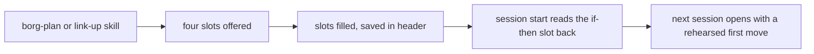

Generated: 2026-10-03

# Cheat-sheet principles for borg: which project-management aid to build

*Decision-design run, hybrid mode. Evidence half: [analysis.md](analysis.md).
AI-scoring: 80/100 (round 1 draft; rounds 2 and 3 revisions not re-scored, scorer not available in this run)*

## Glossary

- **ADHD** (attention-deficit/hyperactivity disorder): a condition where attention, impulse control and holding
  several things in mind work less reliably than usual.
- **borg**: the command-line tool in this repo that tracks about 20 projects and the Claude Code sessions working in
  them. **`borg link`** is its status page.
- **Directive**: a written backlog item in `docs/plans/directives/`. **Checkpoint**: a note Noah or a session saves at
  the end of work so the next session can pick up cold.
- **Hook**: a small script that runs automatically at a fixed moment (session start, session stop, after a tool call).
- **Nudge**: an automatic message that interrupts to suggest something. Also called a **push**. A **pull** aid sits
  still until you look at it.
- **WIP** (work in progress): how many things are open at once. The **limit** here is `BORG_MAX_ACTIVE`, default 3.
- **Window of tolerance**: a chart of three zones (too wound up, in range, too shut down) used in trauma therapy. Here
  it is only a shape to borrow.
- **Closed vocabulary**: a short fixed list of names that does not grow without something else leaving.
- **Heuristic**: a rule of thumb that is useful but not measured or proven.
- **Ledger**: a log that records whether a prompt was followed by the action it suggested.
- **Separation move**: a design step that lets two demands that look opposed each hold, by splitting them in space,
  time, condition or scale.
- **Council**: five roles (strategist, realist, advocate, pragmatist, recommender) that argue the options in turn.

## ELI10

A trail marker works because the hiker is tired and has two seconds. One arrow and one word get her down the right
branch; a paragraph of local history gets her lost. The question was whether borg could put the same kind of
markers on the trail of project work that six one-page psychoeducation sheets put on a different trail (a feelings
wheel, a wise-mind Venn diagram, a parts map, a fill-in speaking script, a window-of-tolerance chart, and a list of
relationship traps with fixes).

The evidence run found that the sheets themselves are unproven, but the design rules underneath them are decent:
one message, few groups, a next move beside every name, problems shown next to their fixes, and cues that are visible
where you work and silent otherwise. It also found that interruptions are the weak link for adults with ADHD. This
document turns those rules into six options for borg, argues them, and recommends one. It has not yet been checked
by an outside reviewer.

## Recommendation

NOT design-reviewed — three blind-review rounds each returned **revise** (none overturned); the run hit its 3-round
ceiling and stops here for Noah's decision. The round-3 verdict and objection are under §Council + Dissent.

**Recommended: Option B-card, "Situation and next-move card", revised in round 3.** Two blind reviews returned
revise (see Council and Dissent). Round 2's objection was that the card had no route to being seen and that its ledger
read logs that do not exist. This version fixes both, and it is smaller: three pairs, not four. Ship in this order and
stop at any gate:

1. **The card, three pairs, in Noah's words.** A markdown file Noah owns (`~/.config/borg/card.md`). The names come
   from a tally of the last 40 checkpoints (local measurement, upper-bound keyword counts): CARRIED (19 checkpoints),
   UNCHECKED (14), NOT DEPLOYED (10). A fourth name, WAITING ON (8), is dropped: the three checkpoints I spot-checked
   record it under "No blockers", as a wait for the other machine's review stamp that an existing protocol already
   covers, so it is not a self-failure, and its 2-day threshold had no source. Three is enough; a fifth name must
   retire one. **Rehearsal step:** the file ships with placeholder wording and an empty `mine:` line per pair. Noah
   rewrites each then-clause once in his own words. Until he does, the report prints "rehearsed: 0 of 3" and the
   evidence for if-then plans does not apply (it is for self-formed, rehearsed plans; see What is not known).
2. **Delivery, two paths, both measured.** Human: `borg card` prints the card and logs the open. Sessions (agents):
   a per-machine skill extension, `~/.config/borg/extensions/skill-extensions/borg-link-up/02-output.md`, tells
   `/borg-link-up` to add the `mine:` line of any pair whose cue applied to the session under `## 5. Next Session`,
   tagged `[card:NOT DEPLOYED]` and so on. `borg-link-down.sh` already injects section 5 verbatim at the next
   SessionStart (verified in the hook), so the line reaches the next session as text it was handed. That is a prose
   extension, so it is model-discretionary (the repo's own estimate is 70 to 90% compliance); the tag makes the miss
   countable. Reach into nanoprobes (subagents) is not verified and not claimed. Without this path the card is
   human-only.
3. **Instrumentation first, small, with the place each lives.** (a) `borg card` arm plus `borg_core/card/` (open and
   report), logging to `STATE/card-log.jsonl`; source tree, live on save. (b) One append line in
   `hooks/tool-count-nudge.sh` (inside the 75-call branch) and one in `hooks/borg-link-up.sh` (beside the
   no-checkpoint stderr line), to `STATE/nudge-log.jsonl`; hooks are copied, so these need a `borg setup`
   redeploy. Today neither hook logs anything (the first keeps only a per-session counter and resets it; the second
   prints to stderr). (c) The follow signal is read from an artifact, not volunteered: a new file in the project's
   `.borg/checkpoints/` within 60 minutes of the nudge. Following `/borg-review` leaves no artifact, so it is not
   measured and the report says so. No skill-invocation logging is added.
  (`STATE` is the state root, `${XDG_STATE_HOME:-~/.local/state}/borg` via `_borg_state_root`; per State Hygiene
  AC4 operational logs never go in the config dir.)
4. **Ledger semantics fail closed.** `borg card --report` prints one status per source: `no data` (log absent or
   empty), `stale` (newest event older than 7 days while newer checkpoints exist), `insufficient (n=k)` (under 10
   events), or `ok` with the rate. It never prints a rate, and never 0%, for anything but `ok`. Tests run through the
   real `borg card --report` path with a sandbox that redirects `XDG_CONFIG_HOME` (so the log path is derived, not
   supplied), cover absent, empty, stale and short logs, and include a positive control with a known event count.
5. **Live rows only by the promotion rule** (Option B-card below), whose third gate now fails closed: no data, stale or
   insufficient blocks promotion, it never licenses it.
6. **Kill criteria, written now.** At the end of week 3: if `card-log.jsonl` shows zero opens in weeks 2 and 3 and no
   new checkpoint carries a `[card:` tag, drop the card (it was never reached). If it was reached, re-run the same
   tally over the new checkpoints; if none of the three names falls from its baseline (50%, 37%, 26% of checkpoints),
   drop it; if any falls, keep it three more weeks and claim nothing (about 20 new checkpoints, so this is
   descriptive, not a test). If any source reads `no data` in week 3, the card is unevaluated, not passed: extend once,
   then drop.

This stops nothing at first. Retiring a nudge is a separate, ledger-decided removal (Option E's rule).

**Why this one.** It is the only option that answers the question asked, a named, paired, glanceable artifact like
the one-page sheets, and it now carries the instrumentation to find out whether it was ever seen. Options C and D ask
him to remember to use something at the moment recall is weakest, A names a zone but not the culprit, F is the least
evidenced. The evidence is mixed and the wording follows it: the contrast-pair mechanism is Moderate and the one-page
format is Weak (case comparison in classroom concept learning, `c3-alfieri-2013-case-comparisons.md`;
error-management training, `c3-keith-frese-2008-error-management-training.md`). If-then phrasing is the
best-supported of the ingredients considered, not strongly supported: bias-corrected d 0.15 to 0.35, larger when plans
are rehearsed and the person is motivated, no reliable effect on vaccination or voting
(`c3-implementation-intentions-642-tests.md`), and ADHD evidence only from children on a lab task
(`c3-gawrilow-adhd-implementation-intentions.md`). Deriving the vocabulary from the user's own record has only
descriptive precedent (`c2-ford-parnin-2015-frustration-categories.md`).

**NOT DEPLOYED is the weakest pair, and it duplicates a memory note.** The auto-memory note
`project_borg_deploy_topology` (last written 2026-06-06) already says hooks, the bash lib and skills are copied and
need a redeploy. The failure still recurs in 10 of the last 40 checkpoints (2026-08-24 onward). So knowing it does
not prevent it, which argues for a mechanical fix: a `borg doctor` check that diffs the source tree's hooks, lib and
skills against `~/.claude`. `borg doctor` has no such check today (a read of `cmd_doctor` found none). The pair
stays on the card as the cheap human-side cue; if that doctor check is ever built, retire the pair in its favour.

**Strongest dissent, and the answer.** Round 3 council: the Technical Realist argues the delivery path is a prose
extension in the 70 to 90% band, so the card may reach agents only some of the time, and that "pre-written" if-then
lines are not what the evidence covers. The recommendation keeps both because each is now measured (the `[card:` tag
count, the "rehearsed: k of 3" line) and each has a written kill rule; the answer is not that the objection is wrong
but that the failure is now visible. The earlier objection that a pull card changes nothing unless opened (R2, R6)
stands, and the opens log exists to measure exactly that. Full argument under Council and Dissent.

**What is not known.** No study tests a one-page aid on adults with ADHD or on developers, and none was run here
(`analysis.md` §2). The if-then evidence is for self-formed, rehearsed plans, which is why the rehearsal step exists;
a plan Noah never rewrote is outside it. There is no direct outcome signal for the sheets themselves. The mining is
one author's tally of what sessions recorded as blockers, not a survey of what developers felt. The three-week ledger is
how this gets tested on the person it is for, and it is a proxy that coincidence can fool.

## Options

Prior work catalogued and quarantined; options below were generated from zero. The catalog is in the Prior Work
appendix at the end; the options were derived from the evidence principles, not from that list. Fan-out cap for this
run: the evidence half used
four tracks; the decision half added no new tracks and fed `analysis.md` in as the load-bearing finding. Options are
presented neutrally and in no order of preference. Every option names what it stops doing, because the research says
a sheet that only grows fails.

### Option A: Workload state map

- **What it is:** A three-zone map of how loaded the work is (overloaded, in range, drifting) with a "you are here"
  marker, a plain description of each zone, and one move out of it. The zone comes from counts borg already holds:
  live sessions against the limit, how long the longest-open thread has sat, and hours since the last checkpoint. It
  borrows the shape of a window-of-tolerance chart, not its trauma claims.
- **How it works:** `borg link` computes the zone from the `capacity` block it already builds and prints the map as
  rows inside the existing `▸ SIGNALS` section (no new section, so the page spine is untouched). Noah glances, sees
  the marker, reads the one move under it. The session-start injection carries the zone name instead of the
  capacity paragraph.
- **Pros / Cons:**
  - Pro: one picture, one glance, a familiar one-page format.
  - Pro: replaces two capacity texts with one artifact.
  - Con: thresholds are guesses; the inverted-U curve this shape resembles is called folklore, and the
    window-of-tolerance source frames it as a trauma hypothesis.
  - Con: says "overloaded" but not which thread to drop.
  - Con: the "drifting" zone (too little live work) has no detector today.
- **Key tradeoffs:** You give up specificity (a zone, not a culprit) and accept thresholds that are heuristics with
  no validation, which the printed map must say out loud.
- **Cards:** `c3-pa-dhs-window-of-tolerance-tip-sheet.md` (zone, symptoms, actions on one page),
  `c3-corbett-2015-yerkes-dodson-folklore.md` and `c3-corrigan-2011-window-of-tolerance.md` (heuristic status),
  `c1-nngroup-recognition-vs-recall.md`.
- **Feasibility:** High. The `capacity` block (active, limit, over_limit) already feeds `_signals_section` in
  `borg_core/link/render.py`.
- **Estimate:** MVP 1 session; full three zones with checkpoint-age signal 3 sessions.
- **STOPS doing:** the bare "N sessions need attention (limit: N)" line in `▸ SIGNALS`, and the free-text
  `CAPACITY WARNING` paragraph in the session-start injection.
- **Visual:**

```
▸ SIGNALS
  LOAD     OVERLOADED           IN RANGE             DRIFTING
           more live than       1 to 3 live,         nothing live,
           the limit            something moving     20 idle
                                     ^ you are here (3 of 3 live)
  Move:    finish or park one: /borg-link-up in the oldest window
  (heuristic: the limit is a setting, not a measurement)
```

- **Minimum viable version:** *"The smallest version that delivers the core value is: two zones (over limit, in
  range) with the you-are-here marker and one move each, rendered in `▸ SIGNALS` from the existing capacity block,
  with no new detectors."*

### Option B-card: Situation and next-move card

- **What it is:** A static one-page card of three named situations, each paired with an if-then next move. It is a
  plain markdown file Noah owns and edits (`~/.config/borg/card.md`); borg never regenerates it and `borg link` does
  not render it. The names come from a one-pass tally of the 40 most recent checkpoints (see Mining result below) and
  describe the state of a piece of work, not a fault of the person. A fourth name must retire one. WAITING ON (8
  checkpoints) was dropped in round 3: the three examples spot-checked record it under "No blockers", as a wait for
  the other machine's review stamp that an existing protocol covers, and its 2-day threshold had no source.
- **How it works:** Two delivery paths, both measured. (1) Human: `borg card` prints the card and appends an open
  event to `STATE/card-log.jsonl`; `borg card --report` prints the ledger. (2) Sessions: a per-machine skill
  extension (`~/.config/borg/extensions/skill-extensions/borg-link-up/02-output.md`) asks `/borg-link-up` to add the
  `mine:` line of any pair whose cue applied, tagged `[card:<NAME>]`, under `## 5. Next Session`; `borg-link-down.sh`
  injects section 5 at the next SessionStart. That is prose, so compliance is model-discretionary and the tag makes
  misses countable. Nothing fires from the card itself; no new push is added. A pair becomes a live row in `▸ SIGNALS`
  only by the promotion rule below, and none is live at the start.
- **Rehearsal step (self-formation):** the file ships with placeholder wording and an empty `mine:` line per pair.
  Noah rewrites each then-clause once, in his own words, and says it aloud once when he does. `borg card --report`
  prints "rehearsed: k of 3" and delivery uses the `mine:` line when it exists. The if-then evidence is for
  self-formed, rehearsed plans (larger effects when rehearsed and motivated, no reliable effect on vaccination or
  voting); a pre-written, unrehearsed pair is outside it.
- **Instrumentation this needs (none exists today):**
  - `borg card` arm in `borg.zsh` and `borg_core/card/` (open, report), through `_borg_py`; source tree, live on
    save.
  - One append line in `hooks/tool-count-nudge.sh` (in the 75-call branch; today it keeps only a per-session counter
    and resets it) and one in `hooks/borg-link-up.sh` (beside the no-checkpoint stderr line; today it logs nothing),
    to `STATE/nudge-log.jsonl`, written with a brace-grouped redirect per the repo's redirect rule. Hooks are
    copied, so a `borg setup` redeploy is required.
  - Follow signal from an artifact: a new file in the project's `.borg/checkpoints/` within 60 minutes. Following
    `/borg-review` leaves no artifact and is not measured. No skill-invocation logging is added.
- **Ledger semantics (fail closed):** each source reports `no data` (absent or empty), `stale` (newest event older
  than 7 days while newer checkpoints exist), `insufficient (n=k)` (under 10 events) or `ok` with the rate. A rate, and
  never 0%, is printed only for `ok`. Tests go through the real `borg card --report` path with `XDG_CONFIG_HOME`
  redirected (log path derived, not supplied), cover absent, empty, stale and short logs, and include a positive
  control with a known count. This is the repo's usage-watch lesson applied to the ledger itself.
- **Mining result (LOCAL MEASUREMENT, not literature):** keyword tally over §4 "Blockers" of the last 40 files in
  `.borg/checkpoints/` (38 had a §4; 2026-08-24 to 2026-10-03). Counts are checkpoints affected, not distinct
  incidents, because consecutive checkpoints re-record the same open item; the regexes are loose, so treat each count as
  an upper bound.

  | Situation | Checkpoints | Example files |
  |-----------|-------------|---------------|
  | CARRIED (same open item, unchanged, re-listed) | 19 | `2026-08-31-2211`, `2026-09-04-1022`, `2026-09-13-0927` |
  | UNCHECKED (gate or verdict that measures nothing) | 14 | `2026-08-27-2147`, `2026-09-02-1309`, `2026-09-05-2112` |
  | NOT DEPLOYED (built, not shipped or synced) | 10 | `2026-08-25-1738`, `2026-08-27-0216`, `2026-09-04-1253` |
  | Dropped: WAITING ON (protocol wait on another machine's stamp) | 8 | `2026-09-03-0955`, `2026-09-22-1322` |
  | Reserve: stale claim in prose (hand-read ~5 of 13 keyword hits) | ~5 | `2026-08-31-0759`, `2026-09-04-1022` |
  | Reserve: self-inflicted slip | 6 | `2026-08-27-0401`, `2026-09-16-1715` |
  | Reserve: flaky or environment | 5 | `2026-08-31-2156`, `2026-09-18-1238` |

  The draft's original names did not survive contact with the record: SPRAWL (capacity or over-limit) appears in 1 of 38
  (`2026-10-03-222446-beb3b1`), DRIFT in 1 of 38 (`2026-10-02-145508-fb0d8f`), directive staleness in 0 of 38. Only
  UNVERIFIED survives, renamed UNCHECKED. Caveat: checkpoints are written by sessions with Noah, so they show what
  got recorded as a blocker, not what he felt.
- **The card (draft wording, placeholder until Noah rewrites it):**

```
 SITUATION       IF ...                                      THEN ...
 NOT DEPLOYED    I touched a hook, skill or lib file         run borg setup before closing, or write
                                                             "not deployed: <file>" on line 1 of Next
 CARRIED         a blocker or next item I am writing is      do it, file a directive, borg sever it,
                 already in the checkpoint I was handed      or write "held on purpose: <why>"
 UNCHECKED       a check just went green                     break it once on purpose, or confirm it ran
                                                             one case, before writing "done"
 mine: ______    (one line per pair, in your words)
 (names describe the work, not you; this card is yours to edit)
```

  CARRIED's cue is something a writer can perceive without a detector: the latest checkpoint is injected into the
  session at start, so "this item is already in what I was handed" is visible at write time. The "held on purpose"
  exit is there because some holds are designed (`2026-09-13-0927` records a deliberate hold); "decide it now" must
  not contradict them.
- **Promotion rule (any future live row):** a pair earns a row in `▸ SIGNALS` only when all four hold. (1) A real
  detector reads a stored fact and is tested through the real invocation path, not a fixture that supplies the value,
  including a case where the fact is broken and the row must say so; the same broken-source test applies to the ledger.
  (2) A shadow run, logging only and showing nothing, has measured its firing rate over at least 14 days of `borg link`
  runs and it is true on fewer than about 20% of days; above that it is a permanent row, so it stays on the card.
  (3) The ledger reports status `ok` (not `no data`, `stale` or `insufficient`) for the relevant source after three
  weeks, and the card or nudge it would replace has an acted-on rate below a threshold Noah writes in the directive
  before reading the data. Missing data fails this gate; it never passes it. (4) The change is net-negative in page
  lines. A pair with no detector prints nothing anywhere, and no line ever reads "nothing to report" for it; the card
  says "not detected by borg".
- **Pros / Cons:**
  - Pro: the card costs one session and can be judged by use before any detector exists.
  - Pro: the next moves are phrased as if-then, the best-supported of the ingredients considered (bias-corrected d
    between 0.15 and 0.35, ADHD evidence from children on a lab task), and the rehearsal step moves it toward the
    self-formed plans that evidence covers.
  - Pro: the vocabulary is measured from this repo's own record, so no label is invented.
  - Pro: it has a measured route to being seen, and a ledger that says `no data` instead of 0%.
  - Con: the contrast-pair mechanism is Moderate and the one-page format is Weak; Alfieri tested classroom concept
    learning and Keith and Frese tested training, not a pinned card.
  - Con: the vocabulary-from-own-failures precedent (Ford and Parnin) is descriptive, with no outcome test.
  - Con: the session path is a prose extension in the 70 to 90% band, and `borg card` logs only opens through that
    command, not a `cat` or an editor open. The human path still relies on Noah remembering; this repo's
    voluntary-use surfaces have a poor record.
  - Con: NOT DEPLOYED duplicates an existing memory note and is better fixed by a `borg doctor` drift check.
- **Key tradeoffs:** You concede automatic reach and any live signal at the start, and accept that the card's value is
  unmeasured except through a proxy ledger that can be fooled by coincidence, on about 20 new checkpoints over three
  weeks.
- **Cards:** `c3-implementation-intentions-642-tests.md` and `c3-gawrilow-adhd-implementation-intentions.md` (if-then
  phrasing, rehearsal), `c3-alfieri-2013-case-comparisons.md` and `c3-keith-frese-2008-error-management-training.md`
  (contrast pairs, mechanism only), `c2-ford-parnin-2015-frustration-categories.md` (own-failure vocabulary,
  descriptive), `c4-gani-alert-fatigue-primary-care.md` (why no new push).
- **Feasibility:** High for the card; Medium for the ledger, because its sources do not exist yet and three small
  items must land first (card log, two nudge logs). The earlier "counters over existing logs" rating was wrong. Live
  rows are gated by the promotion rule and may never ship.
- **Estimate:** Card 1 session; instrumentation and ledger with tests 2 sessions; one shadow detector about 1 session
  each, only for a pair Noah wants promoted.
- **STOPS doing:** nothing at first. Only the ledger can retire an existing nudge, by the same action-rate rule as
  Option E, and that retirement is a removal, not a claim that the card replaces it.
- **Sequence note:** instrumentation (so the ledger has sources), card with Noah's rewrite, extension for delivery,
  then shadow detectors, then at most one live row, only through the promotion rule.
- **Visual:** the card above.
- **Minimum viable version:** *"The smallest version that delivers the core value is: the three-pair card in Noah's
  own words, `borg card` logging opens, the two nudge firing logs, and a fail-closed report, with no live rows and no
  nudge retired."*

### Option C: Stuck router

- **What it is:** A small closed vocabulary of ways Noah gets stuck (five names), reached by one command, where
  choosing a name immediately prints its single next move. It is the project-work analog of picking a word from a
  feelings list, except the word and the action sit on the same screen. The five names are mined from his own
  checkpoints and memory notes before anything ships.
- **How it works:** `borg stuck` (or `/borg-stuck`) shows the five-row menu; Noah picks a row by number; borg prints
  the move and, where the move is a command, offers to run it. Nothing fires by itself.
- **Pros / Cons:**
  - Pro: pure pull, so it cannot add alert fatigue.
  - Pro: the name and the action arrive together, which is the pairing the labeling studies favor.
  - Pro: it targets the moment of being stuck, which no current surface does.
  - Con: it only helps if Noah remembers to run it while stuck, the exact moment recall is weakest.
  - Con: the vocabulary is only as good as the mining; two descriptive studies are the only precedent.
- **Key tradeoffs:** You concede automatic reach (it waits to be asked) and accept that a menu is a lookup, not a
  glance; one source describes a wheel-like list as a step-by-step lookup for some users.
- **Cards:** `c2-kalokerinos-2019-differentiate-to-regulate.md` and `c2-nook-2021-naming-impedes.md` (name and action
  together), `c2-ko-myers-aung-2004-learning-barriers.md`, `c2-ford-parnin-2015-frustration-categories.md` (only
  precedents, descriptive), `c2-matt-2024-emotion-word-training.md` (teaching words alone did not lower distress),
  `c4-barkley-point-of-performance.md` (why on-demand recall is the weak spot).
- **Feasibility:** Medium. The command and menu are trivial; deriving the five names from 300-plus checkpoints is the
  real work and has to come first.
- **Estimate:** Vocabulary mining 1 session; command and menu 1 session; routing to skills 1 session.
- **STOPS doing:** the 75-tool-call check-in nudge, whose job (offer a way out when work stalls) the menu takes over
  on demand.
- **Visual:**

```
$ borg stuck
  What kind of stuck?
  1  Can't start     cold, no first step      read the latest checkpoint tl;dr, do its Next line
  2  Can't choose    too many open threads    borg next, then close every other window
  3  Can't finish    scope keeps growing      reread Done-when, defer the rest in one line
  4  Can't trust     "done" with no check     /borg-verify before saying shipped
  5  Lost the thread session went cold        borg link <project>, read the checkpoint
  pick 1-5:
```

- **Minimum viable version:** *"The smallest version that delivers the core value is: a printed five-row menu with
  a number-to-command table, no interactivity, built from a one-session pass over the last 30 checkpoints."*

### Option D: Fill-in scripts

- **What it is:** Short fixed-slot templates, in the spirit of a four-slot "when, I feel, because, would you"
  sentence, for the artifacts Noah writes most: a directive, a checkpoint handoff, and a nanoprobe brief. Each has at
  most four slots, and one slot is a rehearsed if-then ("If I open this cold, then I read ___ first, then run ___").
- **How it works:** `borg-plan`, `borg-link-up` and the brief builder present the slots, Noah or the model fills
  them, and the result lands in the artifact header. The session-start injection reads the if-then slot back at the
  next cold start, so the plan is rehearsed by use. Old free-form artifacts stay valid (expand, then migrate, then
  contract).
- **Pros / Cons:**
  - Pro: if-then planning is the best-supported ingredient in the research, and it was tested in children with ADHD.
  - Pro: fixed slots cap length, which helps the reader on a cold start.
  - Con: `borg-plan` already demands "Done when" criteria with a Verify line, so the overlap is large.
  - Con: bias-corrected effects are a third of the headline, and the ADHD evidence is children on a lab task.
  - Con: a script only works if it is rehearsed; nothing here makes rehearsal happen.
- **Key tradeoffs:** You concede flexibility (four slots will not fit every directive) and add a template to keep in
  sync across three skills and the validators.
- **Cards:** `c3-implementation-intentions-642-tests.md` (bias-corrected d between 0.15 and 0.35),
  `c3-gawrilow-adhd-implementation-intentions.md` (children, lab task), `c3-brighter-coach-action-planning-adhd.md`,
  `c3-nvc-korean-nursing-rct-2025.md`, `c3-donker-2009-psychoeducation-meta-analysis.md` (handout alone d = 0.20),
  `c1-fourcade-2012-checklist-barriers.md` (duplication as top barrier).
- **Feasibility:** Medium. Skills are prose, so the template is cheap, but anything that must be enforced needs a
  validator, and prose templates sit in the model-discretionary compliance band.
- **Estimate:** 2 sessions for directive and handoff templates; 3 more for validators and a rehearsal read-back.
- **STOPS doing:** free-form "Next:" prose in checkpoints and the open-ended directive preamble, replaced by the slots.
- **Visual:**



- **Minimum viable version:** *"The smallest version that delivers the core value is: one four-slot checkpoint
  handoff, where the last slot is an if-then for the next cold start, with the old format still accepted."*

### Option E: Quiet page

- **What it is:** A subtraction-first option. Measure which current prompts Noah acts on, retire the ones he does
  not, and cap the `borg link` page so its default read is a few chunks instead of eight sections of rows. Nothing
  new is named or taught. The aid is the absence of noise.
- **How it works:** A ledger joins existing logs (the hook counters, checkpoint timestamps, command history) to
  record whether each nudge was followed by the suggested action within the hour. After three weeks, nudges below a
  set action rate are removed. On the page, row caps apply inside sections (the section list stays identical, as the
  one-renderer rule requires): QUEUED shows the count and the three oldest, never-active idle repositories collapse
  to a count.
- **Pros / Cons:**
  - Pro: removing clutter is among the better-supported layout moves in the research (Moderate).
  - Pro: it shrinks the surface instead of growing it, and it measures before it decides.
  - Pro: nothing to learn.
  - Con: adds no new capability, so Noah's request for sheet-like aids goes unanswered.
  - Con: an action-rate ledger can be fooled by correlation (he ran the command anyway).
  - Con: capping rows hides things; a buried directive stops existing.
- **Key tradeoffs:** You concede the aid-as-artifact idea entirely and accept that removed prompts may have been
  catching real lapses at a rate the ledger cannot see.
- **Cards:** `c1-mayer-metaanalysis-2025.md` (removing seductive detail had the largest effect),
  `c1-cowan-2001-magical-number-4.md`, `c1-thomassen-2010-help-or-hurdle.md` (checklist fatigue),
  `c4-nordby-sms-reminders-adhd-rct.md` and `c4-focus-adhd-app-rct.md` (generic prompts null),
  `c1-urbach-2014-ontario-checklist-null.md` (mandates).
- **Feasibility:** High. Counters and timestamps exist; row caps are a render-layer change.
- **Estimate:** Ledger 1 session; three weeks of waiting; cap and retire 1 session.
- **STOPS doing:** the 75-call nudge and the no-checkpoint stderr nudge (each unless the ledger saves it), the full
  29-row QUEUED dump, and 5 never-active repository rows.
- **Visual:**

```
▸ REPOSITORIES  20 repositories, 1 needs attention
  shopping-app [C]  waiting <<<   27m ago
  borg-collective [C] idle   just now
  ... 5 never active, 10 idle over 30 days (counts only)
▸ QUEUED  29 directives, 3 oldest shown (docs/plans/directives/ for the rest)
```

- **Minimum viable version:** *"The smallest version that delivers the core value is: the ledger alone, with no
  removals, run for three weeks, so the first cut is decided by numbers."*

### D3.5: Contradiction check

Two constraints pull against each other. The research says to put the cue at the point of performance (Option
A-style state, visible where the work happens), and also says generic pushes fail and alerts fatigue (pull by
default). Borg's own history says an aid that waits to be used is not used (four voluntary-write surfaces yielded one
real row in five months), and Noah's standing preference is that automation beats discipline. A pure pull aid and a
pure push aid each concede one pole.

**Ideal Final Result:** Noah sees his load and the next move at the place he works, without any prompt firing and
without opening anything.

### Option F: Ambient status strip (resolved option)

- **Separation move:** Separation in space (the cue lives in the always-visible status line, not in the interrupt
  channel) combined with separation on condition (it draws only when the state is out of range).
- **What it is:** A short segment in the tmux status line, empty when everything is in range, showing one state and
  one antidote when it is not. It is not a banner, a notification or a dismissable prompt. No event fires, nothing
  asks for acknowledgement, and the text is constant between changes.
- **How it works:** The session-start and stop hooks already compute capacity; they also write one line to a
  cache file. The tmux segment only reads that file (it never recomputes and never runs the network sweep). Out of
  range, it shows for example `LOAD 5/3  > /borg-link-up`. In range it shows nothing.
- **Pros / Cons:**
  - Pro: always at the point of work, with no interrupt, which is the stated ideal.
  - Pro: reuses computations that already run, so no new poll.
  - Con: untested for habituation; a permanent out-of-range strip can become wallpaper.
  - Con: the cache file is a new store, and this repo has a documented history of stores nothing reads; the only
    reader is the tmux segment, so a dead segment hides a stale cache.
  - Con: colour change at the edge of vision is a mild attention capture, closer to a push than the label admits.
- **Key tradeoffs:** You concede the richness of a page (one state, one move) and accept an unproven habituation
  profile in exchange for zero interruption.
- **Cards:** `c4-barkley-point-of-performance.md` and `c1-nngroup-recognition-vs-recall.md` (where),
  `c4-nahum-shani-jitai-framework.md` and `c4-vangenugten-jitai-mental-health-2025.md` (when is unsupported),
  `c4-gani-alert-fatigue-primary-care.md`.
- **Feasibility:** Medium. tmux integration and colour helpers exist, but a status segment must never fork per
  refresh (the `--local` hot-loop rule), so it must read a cache the hooks write.
- **Estimate:** MVP 2 sessions; with two states 3 sessions.
- **STOPS doing:** the capacity paragraph in the session-start injection, and the no-checkpoint stderr nudge.
- **Visual:**

```
[borg-collective]  1:shell  2:claude  3:tests                   LOAD 5/3  >  /borg-link-up
(in range, the right side is empty)
```

- **NO PRIMARY EVIDENCE:** No decisive cheap probe exists. The poles are "seen without looking" and "no
  interruption"; the nearest measurement (antidote command run within an hour of the strip turning on) cannot
  separate habituation from agreement over a single user's few weeks, so it measures a proxy.
- **Minimum viable version:** *"The smallest version that delivers the core value is: one state (over the live-session
  limit) written by the existing stop hook to a one-line cache file and read by a tmux segment that is empty
  otherwise."*

### Option set at a glance

| Option | Approach | Pull or push | Adds | Stops |
|--------|----------|--------------|------|-------|
| A | Zone map with you-are-here | Pull (on the page) | 1 picture | Capacity sentence, capacity paragraph |
| B-card | Three if-then pairs | Pull (file, command, Next line) | 1 card, 1 ledger, 3 logs | Nothing at first |
| C | Five-name stuck menu | Pull (command) | 1 command | The 75-call nudge |
| D | Four-slot fill-in scripts | Pull (at write time) | 3 templates | Free-form Next prose |
| E | Measure, remove, cap | Subtractive | 1 ledger | Nudges, 29-row dump, 5 idle rows |
| F | Status-line strip (forged) | Ambient | 1 segment, 1 cache | Capacity paragraph, one nudge |

## Council and Dissent

Round 1 council (on Option B as first drafted; kept as the record). Card names are in `sources/` of this folder
(`c1-` to `c4-`); `pm:` names are in
`docs/research/2026-10-03-project-management-pillars/sources/`. Each persona speaks once.

**Product Strategist.** The right problem is "make project state recognizable in two seconds", and Options A, B and C
all aim at it. What none of them touches is the economics the sibling research found missing: borg ranks by session
status, sets no appetite and has no circuit breaker (`pm:` README, pillars P1, P2, P6). Option B is the only one that
can grow into that, because an antidote like "this bet overran, stop it" is just another pair, where a zone map has no
slot for it. I kill Option D for a reason other than effort: `borg-plan` already requires a Done-when with a Verify
line, so fill-in scripts mostly restate what exists, and duplication of an existing checklist was the top barrier in
16 of 18 cancer centers (`c1-fourcade-2012-checklist-barriers.md`). I favor B over A.

**Technical Realist.** Three things break first. First, Option B's live rows are detectors, and a detector is where
borg's own history says silent failure lives: the same exit-0-and-log-something-reassuring bug shipped three times in
the usage-watch work, and green tests never caught it. Second, the link page has one renderer and a pinned section
list; E's default/full toggle would add a branch on mode, which that rule forbids, so only row caps inside sections
are safe. Third, F adds a cache with exactly one reader, and the repo's own rule is that a store nothing reads is the
failure it exists to prevent; a dead tmux segment would hide a stale cache. A's thresholds are guesses, and the
inverted-U curve behind such charts is called folklore (`c3-corbett-2015-yerkes-dodson-folklore.md`). Feasible:
A, B (two detectors), E. Fragile: F.

**User Advocate.** I formally DISAGREE with Option B as phrased. A list headed STALE and UNVERIFIED, printed on the
page Noah opens first every morning, is a list of what he did wrong. The one-page sheets name a state and hand over a
move; none of them says "you failed". Emotional symptoms are common and persistent in ADHD
(`c4-faraone-2019-emotional-dysregulation.md`), and the adhd-guardrails skill already bans shame language, so a
detector that prints 23 stale items in warning colour breaks borg's own rule. I would accept B only if every row names
a situation and a move, never a verdict, and if the page says nothing when all is well. I KILL Option F for a reason
other than effort: the habituation profile of a permanent status-line cue is untested, and a cue Noah learns to ignore
is worse than none, since it eats the position the next real signal needs. This is named risk R1.

**Pragmatist.** The page is 158 lines in eight sections, 19 of 20 repository rows read "(no summary)", and 5 never ran.
A one-page aid dropped onto that is a trail marker nailed to a signpost forest. The research's better-supported layout
move is subtraction (Moderate, `c1-mayer-metaanalysis-2025.md`), the push evidence is null
(`c4-nordby-sms-reminders-adhd-rct.md`, `c4-focus-adhd-app-rct.md`), and every option except E adds surface.
Effort-to-impact says build E, read the ledger, and add nothing until the numbers justify it. I DISAGREE with the
emerging choice of B on growth grounds. This is named risk R2. I would at least require B to be net-negative in lines.

**Recommender.** Option B, constrained as in the Recommendation. Strongest dissent is the Pragmatist's (R2), because
it is the only one that could make the whole direction wrong: if added rows lower attention to the rest of the page,
the "fix" worsens the problem. I take its sequencing and its budget in full: the ledger starts first, the change is
net-negative in page lines, and anything unacted after three weeks is removed. I decline its conclusion that E alone
suffices, for three reasons. Subtraction without a replacement deletes a signal Noah chose to have (his standing
preference is that borg actions do something, not just show information), E cannot tell a useless nudge from a quiet
one that works, and E answers none of the original question, which was how to apply the sheets' principles. I take the
Advocate's wording conditions as binding (R1) and I accept the Advocate's kill of F, with the note that F is only worth
revisiting
if the ledger first shows the page rows are read. The Realist's detector warning (R3) is met by using only numbers
borg already holds, by building the static card first, and by testing each detector through the real invocation path
instead of a fixture that supplies the value. I decline D for the Strategist's reason and C for the reason the
Pragmatist implied: it relies on recall at the moment recall fails (`c4-barkley-point-of-performance.md`,
`c4-arnsten-stress-prefrontal.md`).

### D5 blind review — round 1

**Verdict:** revise

**Strongest objection (verbatim):** "Option B's live half is mostly not new and mostly cannot work. SPRAWL is the
existing `capacity.over_limit` line in `_signals_section` with an antidote string appended. STALE, at "23 of 28 older
than 30d", would be true about 82% of the time, so it is a permanent row, which is wallpaper, not a signal. UNVERIFIED
and DRIFT have no detector at all, and the visual prints "(UNVERIFIED, DRIFT: nothing to report)" for them. That is the
exit-0-and-print-something-reassuring pattern that CLAUDE.md and the usage-watch memory record as shipping three times.
B's "STOPS doing" list is also unsupported. It claims to retire the 75-tool-call nudge and the per-project "no
checkpoint in the last hour" stderr nudge, but neither SPRAWL nor STALE detects those conditions. The nudges would be
deleted and nothing would replace them. What is left is the static card, which is a fine, cheap idea, but it is not
what was sold as "pairs computed from live facts"."

**Other points raised:** the evidence-strength wording overclaimed ("best-supported mechanism" where `analysis.md` §4.3
names if-then planning; principle 4 is Moderate for the mechanism and Weak for the format; Alfieri is classroom concept
learning, Keith and Frese is training, Ford and Parnin is descriptive with no outcome test); principle 5 says derive
the vocabulary from the user's own failures but B never mined them; four failure labels on a morning page read as an
accusation; and "23 of 28" disagreed with "29" elsewhere.

**What would change the verdict (reviewer):** re-scope to a "B-card": the static four-pair card plus the antidote-run
ledger, no live rows and no STOPS claims; derive the four names from a one-session pass over checkpoints; promote a pair
to a live row only after it has a real detector and a measured non-trivial firing rate; drop UNVERIFIED and DRIFT from
any "nothing to report" line until a detector exists.

**What was done in response.** All five of the reviewer's conditions were taken. (1) Option B was replaced by Option
B-card. (2) The mining was run, as local measurement: SPRAWL appears in 1 of 38 checkpoint blocker sections, DRIFT in 1,
directive staleness in 0; the four names are now CARRIED (19), UNCHECKED (14), NOT DEPLOYED (10), WAITING ON (8), and
only UNVERIFIED (renamed UNCHECKED) survived from the draft. (3) Live rows are gated by an explicit promotion rule with
a firing-rate ceiling of about 20% of days. (4) The STOPS claim is removed. (5) The evidence wording was corrected here
and in the Pros of the option, the Pragmatist's line, and the first Track Findings bullet. On the count conflict: the
"23 of 28" came from the sibling research's first reading; re-counted on 2026-10-03 by filename date, 29 directive
files exist and 23 are older than 30 days (79%, so the reviewer's objection to a "30 days" STALE row holds). That
count is by the date in the filename, not last-touched.

### Round 2 council (on Option B-card)

Each persona speaks once. Round 1 above is the record of the first pass; this is the re-engagement.

**Product Strategist.** B-card is a smaller bet than the draft, and that is its virtue. It still answers "make project
state recognizable in two seconds" for a morning reader, and the mined names are the repo's own, so it does not import
a taxonomy. Its limit is that it cannot grow into the economics the sibling research found missing (appetite, circuit
breaker), because no live row exists. I accept that: a card slot for "this bet overran" can be added the day a detector
exists. I prefer B-card to A and to E alone, because E answers none of the question asked.

**Technical Realist.** The reviewer's point lands: the live half had no detector for two of four pairs and printed
reassurance for them. B-card removes that by construction: nothing is computed, so nothing can be quietly wrong. Two
things can still go wrong. First, the ledger, which joins logs and can report a rate from a log that stopped
writing. So the ledger's own acceptance test must include a deliberately empty log, and the report must say
"no data", not zero. I name that R5. Second, a pull card is only as good as the habit of opening it, and this
repo's own record (four voluntary-write surfaces, one real row in five months) says that habit is the weak point.
I name that R6.
Feasible: B-card. Fragile: F.

**User Advocate.** I DISAGREE less, but still formally. The names are better: they describe a piece of work (NOT
DEPLOYED, CARRIED) and not a person's failing, and the file is Noah's to edit, which matters because emotional
symptoms are common and persistent in ADHD (`c4-faraone-2019-emotional-dysregulation.md`). My condition stays binding:
no warning colour, no verdict wording, and "CARRIED" must not be rendered anywhere borg shows it as a count of things
left undone on the morning page. A card he opens by choice is safe; the same four words on `borg link` are not. This is
R1. I still kill F, for the habituation reason.

**Pragmatist.** The page is 158 lines in eight sections, and B-card adds zero to it. I withdraw the growth objection to
B and keep a weaker one (R2): a card nobody opens is a file, and the ledger's three-week window is the whole test. My
condition is that the kill date is written down now, with a number: if the four next-move commands are run no more
often in weeks 2 to 3 than in a baseline week, drop it. Subtraction is among the better-supported layout moves
(Moderate), not the only one.

**Recommender.** Option B-card, as in the Recommendation. Strongest dissent is the Pragmatist's R2 combined with the
Realist's point that nothing but memory makes a pull card matter: if the card is not opened it changes nothing, which
is exactly the finding on this repo's voluntary surfaces. I keep the pick because it is nearly free to test and cannot
fail silently, the two properties the round-1 verdict said B lacked. I do not take the Strategist's wish to keep a
path to live rows open as a reason to build detectors now; the promotion rule is that path. Decline D (restates
`borg-plan`'s Done-when, `c1-fourcade-2012-checklist-barriers.md`), C (needs recall at the moment recall fails,
`c4-barkley-point-of-performance.md`), F (habituation, new cache).

**New dissent (one line):** a pull card changes nothing unless it is opened, and this repo's own record says voluntary
surfaces are not, so B-card may be a cheap file that tests nothing but Noah's habit (R2, R6).

### D5 blind review — round 2

**Verdict:** revise

**Strongest objection (verbatim):** "B-card's value rests on two things that do not exist in the record. First, a route
to being seen: the card is a file in ~/.config/borg that `borg link` does not render, nothing fires, and nothing logs
whether it is ever opened. The packet's own Con admits this, and analysis.md §2 names "log opens" as the cheapest
decisive test, yet the option omits it. Second, a ledger "over existing logs": none exists. I read
/Users/noah/dev/borg-collective/hooks/tool-count-nudge.sh. It writes only a per-session counter, resets it to 0, and
logs nothing. The no-checkpoint nudge in borg-link-up.sh prints to stderr and logs nothing. A grep of hooks/ shows logs
only for memory reads, prefer-tool bypasses, agents and usage samples. No hook logs skill invocations. "Logs whether
the suggested action followed within the hour" therefore needs new firing instrumentation first. The packet's
"markdown file plus counters over existing logs" feasibility rating is wrong. This is the repo's documented
usage-watch failure shape: a ledger that reads zero from a dead source. Here the failure direction is also biased.
Promotion gate (3) asks whether the nudge or card "is not already acted on". An empty log reads as "never acted on",
which licenses promotion. Gate (1) requires a broken-fact test for detectors but not for the ledger itself."

**Reviewer's conditions to uphold:** (1) a `borg card` wrapper (or equivalent) that logs opens; (2) a firing log added
to the two existing nudges; (3) the ledger has a broken-source test, missing log gives output "no data", never 0%;
(4) promotion gate 3 fails closed on missing data; (5) drop WAITING ON, or replace its 2-day threshold with a sourced
one (reviewer found it is mostly an existing cross-machine review protocol, not a self-failure); (6) state how the
card reaches agent sessions, or concede it is human-only.

**Reviewer's Ideator:** deliver each pair's if-then line via the checkpoint template's Next section, which
borg-link-down already injects at session start (reaches agents, which are the actors in NOT DEPLOYED and UNCHECKED);
NOT DEPLOYED is mechanically checkable (repo vs ~/.claude copy diff / `borg doctor`); NOT DEPLOYED duplicates the
existing auto-memory note `project_borg_deploy_topology`, so address it. Also: the CARRIED cue ("third checkpoint
unchanged") is not perceivable without a detector; "decide it now" can contradict designed holds (2026-09-13-0927);
the if-then evidence is for SELF-FORMED, REHEARSED plans (Sheeran card: larger effects when rehearsed and motivated; no
reliable effect on vaccination/voting), so pre-written plans need a rehearsal step or the claim must be weakened.

**What was done in response (round 3, the last allowed).** I checked the reviewer's facts first, and they hold:
`tool-count-nudge.sh` keeps only a per-session counter and resets it at 75; `borg-link-up.sh` prints the
no-checkpoint line to stderr; neither logs. Then each condition: (1) `borg card` logs opens. (2) One append line in
each of the two nudge hooks, to `nudge-log.jsonl`. (3) and (4) The ledger prints `no data`, `stale`, `insufficient` or
`ok`, a rate only for `ok`; gate 3 now fails on anything but `ok`, and gate 1's broken-source test extends to the
ledger. (5) WAITING ON is dropped; I spot-checked its three example checkpoints, and two say "No blockers" and
cite the protocol (do not touch the head after the stamp; file nits), the third is a ten-day wait for a reply. (6) A
Next-section path plus a measured tag; reach into nanoprobes is not claimed. Also taken: the CARRIED cue is now
"already in the checkpoint I was handed" (perceivable, because that checkpoint is injected), with a "held on
purpose" exit; a rehearsal step (Noah rewrites each then-clause once, in his words) and a weaker claim until he does;
the NOT DEPLOYED duplication is addressed in the Recommendation (the memory note dates from 2026-06-06 and the failure
recurred 10 times in 40 checkpoints, so it argues for a mechanical `borg doctor` diff, which does not exist yet). One
finding I could not close: the "log skill invocations" item stays out, because it needs a new hook; follow-through
for `/borg-review` is therefore declared unmeasured.

### Round 3 council (on revised Option B-card)

Each persona speaks once; mandatory dissent is kept.

**Product Strategist.** Smaller is better here: three pairs is the closed vocabulary the research asked for, and
dropping WAITING ON removes the one name that was a protocol, not a pattern. The Next-section path is the strongest
change, since it puts the line where the next session already looks. I still note the cost: the card cannot carry the
appetite or circuit-breaker economics the sibling research found missing. I accept that.

**Technical Realist.** The instrumentation is four small items, each with a home, and the ledger now fails toward
"no data". Two real risks remain. The extension is prose, so it will sometimes not fire; the `[card:` tag is how I
will know, and I name that R7. Second, standing lines copied into every Next section would themselves be CARRIED
text, so the extension is told to add a line only when the cue applied to that session. A model deciding that is
judgment again, which is acceptable only because it is counted. Also, the hooks need a `borg setup` redeploy; forget
it and the nudge log stays empty, which now reads `no data`, the right failure.

**User Advocate.** The names stay state-of-work, the file stays Noah's, and writing his own wording is the first
change in this run that treats him as the author, not the audience. I DISAGREE on one point: the "held on purpose"
exit must not become a way to hide a carried item, so the report should count how often it is used. I leave it as a
named risk (R8), not a gate. No warning colour anywhere.

**Pragmatist.** Cost is now honest: 2 sessions for instrumentation plus ledger, 1 for the card, three weeks of waiting
for about 20 checkpoints. That is too few to show an effect, and I say so; the kill rule is written down with numbers,
which is what I asked for in round 2. I would still ship the logs alone first, since they are useful to Option E too.
That is already the sequence.

**Recommender.** Option B-card, revised. The strongest dissent is R7 combined with R2: the card may reach agents in
only some sessions and humans in none, in which case the three-week result is a null that says nothing about the
idea. I keep the pick because the null is now distinguishable from a dead source (`no data` is not a pass; extend once,
then drop). Declined again: E alone (answers none of the question asked), C and D (recall at the moment recall fails,
duplication of Done-when), F (habituation, new cache). I do not claim the card cannot fail silently; I claim its
ledger reports its own blindness.

**New dissent (one line):** the session path is a prose extension in the 70 to 90% compliance band, so a three-week
null may only mean the model skipped the line, and about 20 checkpoints cannot tell the difference without the tag
count (R7, R2).

### D5 blind review — round 3 (final; ceiling reached)

Verdict: revise. The reviewer explicitly declined to overturn: "the option is cheap, fails closed, and the
alternatives are not clearly better".

Strongest objection (verbatim):

> The ledger's central source is not what the packet says it is, and the card's delivery path has no defined
> compliance measure. (a) The "no-checkpoint nudge" in hooks/borg-link-up.sh is a Stop hook that writes to stderr and
> exits 0. Per the Claude Code hooks reference (code.claude.com/docs/en/hooks), Stop fires every turn, and
> stdout/stderr on exit 0 go to the debug log only. Neither Noah nor Claude sees the nudge. The proposed log would
> therefore count per-turn events of a nudge nobody received, and the "followed within 60 minutes" rate would only
> measure when a checkpoint happens to be written. That feeds promotion gate 3 and the "retire a nudge" rule with a
> number that has no connection to exposure. The 75-call nudge does reach Claude, via PostToolUse additionalContext,
> but not Noah. (b) The packet says "the tag makes misses countable". It does not. A missing `[card:NAME]` tag looks
> the same as "cue did not apply", and the packet itself says no detector exists for any pair. Only hits are
> countable, so the compliance denominator is unknown. (c) The session path re-injects text through the very channel
> (link-down injects §4 and §5 verbatim) whose failure CARRIED records: 19 of 38 checkpoints re-listed an item that
> session start had already handed over. The packet never says how the card improves on a channel its own data shows
> failing.

Reviewer's conditions (NOT applied — ceiling reached):
1. Stop using the Stop-hook stderr nudge as a ledger source; log delivered exposure (the additionalContext nudge) and
   dedupe per session.
2. Delete "the tag makes misses countable"; pre-register the outcome metric — re-run the mining tally on the next ~20
   checkpoints against 19/14/10 of 38.
3. Name the actor for each pair (model or Noah) and confine the rehearsal and ADHD-evidence claims to the human path;
   optionally move CARRIED and NOT DEPLOYED to mechanical checks (overlap of §4/§5 across the last two checkpoints; a
   `borg doctor` deploy-drift check), per CLAUDE.md's "anything that MUST happen ships as an executable adapter".

Orchestrator note: across all three rounds the reviewers converged on one direction. The pairs that actually recur
(CARRIED, NOT DEPLOYED, UNCHECKED) are agent-process failures, so the stronger design is mechanical detection where a
detector is cheap, plus a human card only where Noah is the actor. That is Noah's call and is not recorded as a verdict.

### Named risks (mandatory dissent log)

| ID | Risk | Raised by | Mitigation in the recommendation |
|----|------|-----------|-----------------------------------|
| R1 | Accusation board | User Advocate | State-of-work names, Noah-edited file, not on `borg link` |
| R2 | Added rows bloat the page | Pragmatist | B-card adds no page lines; written kill number |
| R3 | Detectors hide silent failure | Technical Realist | No live rows at start; promotion rule |
| R5 | Ledger reads a dead log as zero | Realist, D5 r2 | Fail-closed report; broken-source tests; gate 3 |
| R6 | Pull card unopened | Realist, Pragmatist | `borg card` logs opens; kill rule written with numbers |
| R7 | Prose extension skipped, null misread | Technical Realist | `[card:` tag count; no data is not a pass |
| R8 | "Held on purpose" hides carried items | User Advocate | Report counts its use; named, not gated |
| R4 | Transfer unproven (no ADHD or developer study) | All | Three-week ledger is the test; card is free to drop |

## Track Findings

The full evidence deliverable is [analysis.md](analysis.md): 59 sources evaluated across four tracks, 54 kept, an
independent verifier checked 18 cards with 0 failures. Verification detail is in
[verification-report-v1-59cards.md](../verification-report-v1-59cards.md). The findings that carry weight in this
document:

- **One message, few groups, no decoration is among the better-supported layout moves.** Moderate strength: Mayer's
  meta-analysis found g = 0.37 overall, largest for removing seductive detail (`c1-mayer-metaanalysis-2025.md`); working
  memory holds about four chunks (`c1-cowan-2001-magical-number-4.md`). This is why subtraction (Option E, and B's line
  budget) matters.
- **Recognition beats recall at the point of performance.** Moderate for the mechanism, theory-only for adult ADHD
  (`c1-nngroup-recognition-vs-recall.md`, `c4-barkley-point-of-performance.md`,
  `c1-kofler-2020-adhd-working-memory.md`).
- **Every name needs a next move.** Naming helps by improving how a strategy is used, not by choosing it
  (`c2-kalokerinos-2019-differentiate-to-regulate.md`); naming before reappraisal made people feel worse in two
  experiments and a 2026 replication (`c2-nook-2021-naming-impedes.md`, `c2-ariely-2026-replication.md`).
- **Contrast pairs have a moderate mechanism and a weak format test.** Case comparison d = 0.50
  (`c3-alfieri-2013-case-comparisons.md`), error-management training d = 0.44
  (`c3-keith-frese-2008-error-management-training.md`); the Horsemen-style prediction half failed to replicate
  (`c3-kim-capaldi-crosby-2007-gottman-replication.md`) and the antidote half is untested.
- **Vocabulary from the user's own failures is the only sourcing method with precedent, and it is only descriptive**
  (`c2-ford-parnin-2015-frustration-categories.md`, `c2-ko-myers-aung-2004-learning-barriers.md`).
- **If-then scripts help, shrinking to d between 0.15 and 0.35 after bias correction**
  (`c3-implementation-intentions-642-tests.md`); the ADHD test was children on a lab task
  (`c3-gawrilow-adhd-implementation-intentions.md`).
- **Push is the weak link.** Generic reminders and a well-liked app were both null in adults with ADHD
  (`c4-nordby-sms-reminders-adhd-rct.md`, `c4-focus-adhd-app-rct.md`); alert fatigue is documented
  (`c4-gani-alert-fatigue-primary-care.md`).
- **A handout is a first step and sheets should not grow, duplicate or be mandated.** Passive psychoeducation d = 0.20
  (`c3-donker-2009-psychoeducation-meta-analysis.md`); duplication topped the barriers
  (`c1-fourcade-2012-checklist-barriers.md`); mandated rollout showed no change
  (`c1-urbach-2014-ontario-checklist-null.md`).
- **Diagrams are heuristics.** The window-of-tolerance and inverted-U shapes carry no validated thresholds
  (`c3-corrigan-2011-window-of-tolerance.md`, `c3-corbett-2015-yerkes-dodson-folklore.md`).

From the sibling project-management research (read for its findings only; its analysis was still in progress):

- borg ranks by session status, sets no appetite or circuit breaker, computes no work-item age, and its WIP limit is a
  printed warning, not a gate (`pm:` README, pillars P1, P3, P6). 28 open directives, 23 older than 30 days at that
  first reading (`pm:` README, P1). Re-counted 2026-10-03 by filename date: 29 files, 23 older than 30 days (79%).
- Shape Up names runaway and stuck projects as the central failure mode and uses a circuit breaker with no default
  extension (`pm:t1-shape-up.md`). Kanban defines work-item age as the one flow measure for in-flight work
  (`pm:t3-kanban-guide-2020.md`). Neither source gives outcome evidence for these practices.
- A solo developer's top-voted practice is a lightweight list, with the main risk being delayed feedback, not tracking
  (`pm:t1-hn-solo-devs-plan-2019.md`; self-selected thread, not prevalence).
- People with ADHD in software externalize through lists, notes and reminders
  (`pm:t5-liebel-adhd-software-engineers.md`;
  self-selected participants).

## Prior Work

Catalogued and quarantined. The options above were derived from the evidence principles and do not depend on this list.
Entries are what exists, where it lives, what it gets right and what it gets wrong, read from the repo on 2026-10-03.

1. **`borg link` page.** `borg_core/link/render.py`, eight sections from `SECTIONS`. Right: one spine for every
   scope, facts derived rather than typed. Wrong: 158 lines in `--local` mode; 29 queued directives; 19 of 20
   repository rows say "(no summary)"; far more than four chunks.
2. **Capacity warning.** `borg.zsh` (`BORG_MAX_ACTIVE`, default 3), a sentence in `▸ SIGNALS`, and a
   `CAPACITY WARNING` paragraph in `hooks/borg-link-down.sh`. Right: reaper-aware count, derived from state files.
   Wrong: advisory text with no next move on the page; the injection reaches Claude, not necessarily Noah.
3. **adhd-guardrails skill.** `skills/adhd-guardrails/SKILL.md`, always active. Right: shame-free wording, Done-when,
   plan cross-reference, break suggestions. Wrong: prose through the model (the repo's own account puts that in a
   70 to 90 percent compliance band), and Noah never sees it as an artifact.
4. **Tool-count nudge.** `hooks/tool-count-nudge.sh`, a check-in every 75 tool calls. Right: cheap, silent when it
   fails, never blocks. Wrong: tool count is a weak proxy for needing a break, and nothing measures whether it is acted
   on.
5. **Checkpoint nudge.** `hooks/borg-link-up.sh`, a stderr line when no checkpoint exists from the last hour. Right:
   tied to a real artifact. Wrong: a push, unmeasured.
6. **Link-down injection.** `hooks/borg-link-down.sh`, at session start: latest checkpoint sections, capacity,
   uncommitted-changes reminder, clock-skew warning. Right: gets a cold session oriented. Wrong: grows by accretion and
   goes to the model.
7. **`borg next`.** Ranks pinned, then status (waiting, active, idle, archived), then last activity. Right: one answer.
   Wrong: ranks attention, not value or cost of delay (`pm:` README, P1).
8. **The obvious default.** A Kanban-style board with WIP limits and a daily summary, or a `todo.txt` (the most common
   solo practice, `pm:t1-hn-solo-devs-plan-2019.md`). Right: familiar. Wrong: duplicates a tracker he already has, and
   borg's own viz rulings retired its board.
