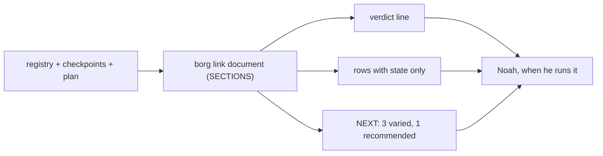
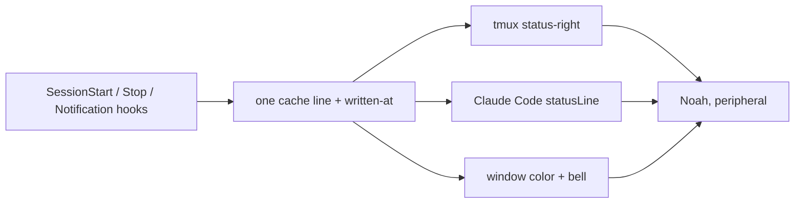
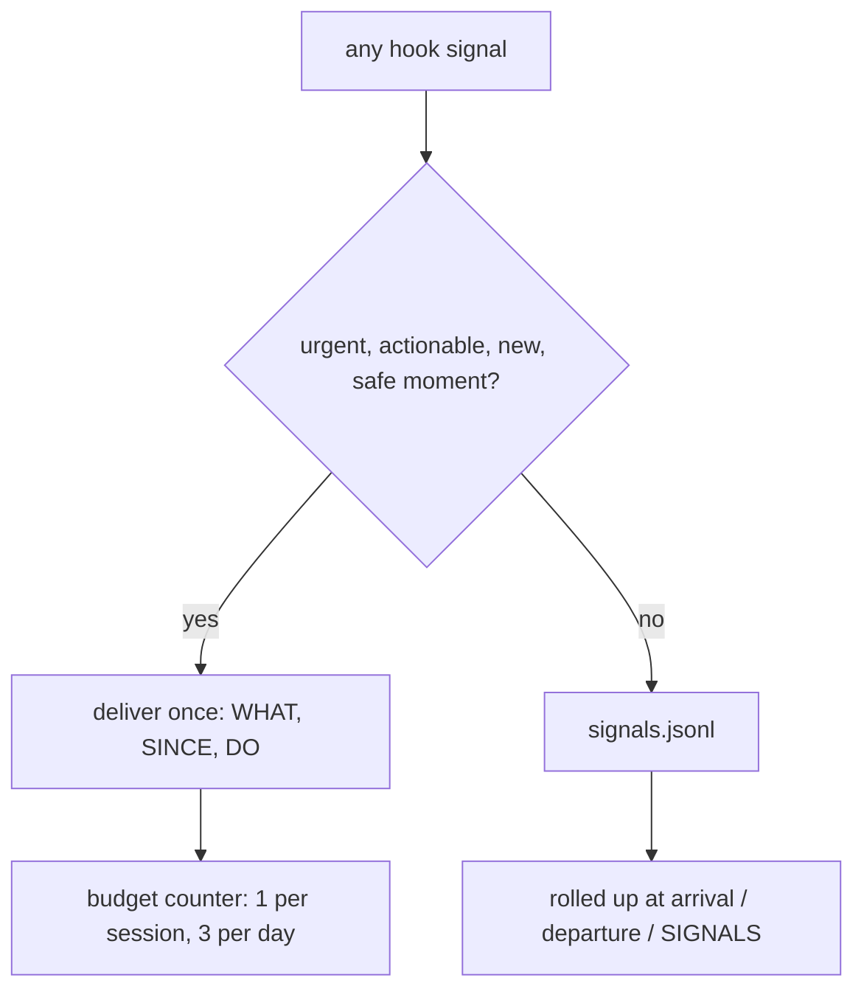
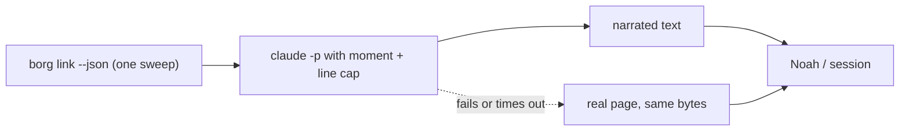
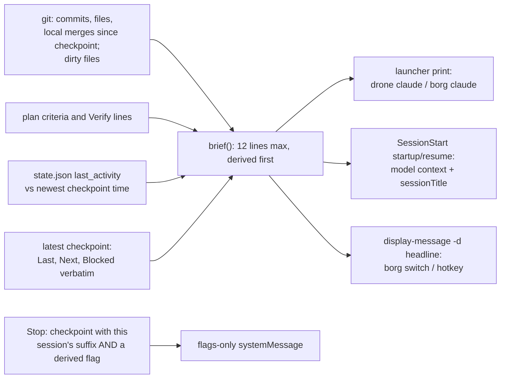

Generated: 2026-10-04

# How borg should say things: a communication layer across six moments

*Decision-design run (D1, D3, D3.5, D4, D6; D5 rounds 1, 2 and 3 each returned revise; round 3 was the final and hit the ceiling). Evidence half: [analysis.md](analysis.md) (v2, gate-passed). Scope: how borg communicates project information, not what it measures or enforces (that is #262). AI-scoring: 80/100 (self-scored in article mode on the ELI10 and Recommendation prose; no independent rater was available in this run). The v1 design of this folder is archived in [drafts/v1/](drafts/v1/).*

*Updated 2026-10-07, checked against main at `b34e7e0`: the launch-site count (six, not two) and the "choosing next" moment (M2, shipped by #274 and #275) are corrected below, each with a dated note. The options are not chosen between here, and the NOT design-reviewed status stands.*

## Glossary

- **borg**: the command-line tool in this repo that tracks about 20 projects and the Claude Code sessions working in them. **`borg link`** is its status page; **`borg next`** answers "what needs me"; **`borg switch`** jumps to a project's tmux window.
- **The six moments**: **M1 glance** (status at rest), **M2 choosing the next move**, **M3 re-entering a project**, **M4 switching between planning and doing**, **M5 ending or handing off a session**, **M6 something going wrong**. They are defined in analysis.md section 3.
- **Checkpoint**: a markdown note saved at the end of a session (`.borg/checkpoints/<timestamp>.md`) so the next session can start cold. **Handoff**: passing a job and its context to someone else, or to yourself later.
- **Hook**: a small script Claude Code runs at a fixed event (session start, after a tool call, session stop).
- **Channel**: where a hook's text lands. **`additionalContext`** reaches the model. **`systemMessage`** is shown to the user. They are different audiences, and for months borg's Stop warnings reached neither (directive `2026-10-04-stop-hook-warnings-are-invisible`).
- **Push and pull**: a push interrupts you; a pull waits until you look. **Doorway** (this document's term): a push that fires only on a transition the user made (launching or resuming a session, switching into a window, writing a checkpoint) and is sent down a channel that reaches the audience without asking a model to do it. A Stop hook is not a doorway: it fires after every assistant turn. **SessionEnd**: a hook that fires once when a session terminates; it is observational (the hooks reference lists exit code 2 as showing stderr to the user only, so "cannot display anything" was too strong; this pick does not use it). **Launcher** and **launch site**: a place where drone or borg itself starts Claude for the user. Earlier drafts said "the two commands" (`drone claude`, `borg claude`); on main at `b34e7e0` there are six, re-checked 2026-10-07 and listed under "Launch sites" below. A print placed at a launch site reaches the human before Claude exists.
- **Breakpoint**: a natural pause in work (a commit, a green test run, a turn end), as opposed to mid-edit.
- **Spine**: the fixed list of sections `borg link` always prints (`SECTIONS` in `render.py`). Scope changes which rows appear, never which sections exist.
- **Ledger**: a log that records whether a message was delivered and whether the suggested action followed.
- **Separation move**: a design step that lets two opposed demands both hold by splitting them in time, space, condition or scale.
- **Council**: five roles (Product Strategist, Technical Realist, User Advocate, Pragmatist, Recommender) that argue the options in turn. **D1 to D6**: the steps of the decision-design method.
- **ELI10**: "explain it like I am ten".

## ELI10

A trail marker works because the hiker is tired and has two seconds at the fork. borg has plenty of markers already, and when I walked the trail I found three problems with them. The biggest marker, the `borg link` page, is 159 lines long (that is the `--local` page, which skips the network sweep, so `▸ NEXT` has nothing resolved to show) with the same "(no summary)" stamped on 19 of its 20 rows. Several markers are nailed up where the guide (Claude) reads them but the hiker (Noah) never sees them; the Stop-hook warnings sat in a debug log and reached no one at all until PR #258 landed on 2026-10-04. And one marker, the 75-tool-call check-in, goes off on a counter, whether or not Noah is anywhere near a fork.

The research behind this says that most of the famous advice (fewer options always helps, willpower runs out like a battery, a dashboard makes people decide better) is weaker than it sounds. What holds up is plainer: put the conclusion first, interrupt rarely and only for what can be acted on, hand the person their own last context back when they return, and hand work off in a few fixed fields. Re-entry and handoff have the best evidence for people like Noah, and the glance has the thinnest.

So I compared five ways to build borg's voice, and I recommend one: borg speaks up at the doorways, when Noah launches or switches into a project and when he writes a checkpoint on the way out, and stays quiet in between. Two outside reviews sent it back. The first found the doorways were not delivered on channels that reach him. The second found the cold-start brief was only a request to the model, arriving after he had typed his first prompt. So the brief is now printed at the places drone and borg start Claude, just before Claude starts, leads with facts borg reads from the repo (what the last session did, what merged, what is dirty, whether it ended without a checkpoint, and a plain line saying when the repo has changed since the checkpoint), and each fact is said once. A third review sent it back too, at the 3-round ceiling: Claude Code may run in a fullscreen display that hides anything printed before it starts, so the first job is a one-hour experiment, not more building.

## Recommendation

NOT design-reviewed — three blind-review rounds each returned **revise** (none overturned); the run hit its 3-round ceiling and stops here for Noah's decision. The round-3 verdict and conditions are under §Council + Dissent.

**Pick Option E, "Doorways", revised after D5 rounds 1 and 2 and scoped to re-entry and handoff first.** A doorway is a push that is both caused by a transition Noah made and sent down a channel that reaches the audience it is meant for without asking a model to do it. Round 1 showed two of the three original doorways were not user-caused. Round 2 showed the cold-start doorway was a request to the model, not a gate (the brief arrived as SessionStart `additionalContext`, which the model can only act on after Noah has typed a prompt). The pick now puts the human-facing brief in front of Noah by printing it from the launcher, which needs no model, and keeps the model-side injection as a separate, quieter job.

- **Arrive, launched through borg**
  - The user's own act: Launches through drone or borg: `drone up`, `drone claude`, `drone feature`, `borg init` or `borg claude` (six launch sites)
  - What fires: the pane command is `borg brief <project>; claude`, so the arrival brief prints in the target pane and then `claude` starts. For `borg init` and `borg claude` (the orchestrator) it prints one cross-project verdict line instead
  - Channel, and who it reaches: Plain stdout of the pane's shell, before Claude exists: the human, deterministic, no hook and no model
  - Status of the channel: Today `drone up` passes `claude` as the pane command (`drone.zsh:482`, `:561`, typed into the pane by the `send-keys` at `:413`), `drone claude` and `drone feature` type it with `send-keys` (`:735`, `:817`), and `_borg_launch_in_tmux` in `borg.zsh` runs `"$@"` directly or through a launcher script (`:1634`, `:1640`). All six are places a print can go. Answered from the code on 2026-10-07: the panes are host shells (`drone.zsh:559`, "both panes are host shells at $project_dir"), so `borg` is reachable in them. Unverified: whether Claude's start-up leaves the printed text on screen (spike a); if `borg brief` fails, the print fails loud (see "Failure is loud")
- **Arrive, hand-typed `claude`, `/resume`, CoCo**
  - The user's own act: Starts a session without the launcher
  - What fires: SessionStart hook, matcher-scoped to `startup` and `resume` only (never `compact` or `clear`): derived lines to the model as `additionalContext`, plus a one-line `sessionTitle` cue
  - Channel, and who it reaches: `additionalContext` reaches the model; `sessionTitle` is documented as having the same effect as `/rename`, so it shows wherever session names show (unverified: where, its length limit, whether it overwrites a title on `resume`)
  - Status of the channel: A concession: no pre-prompt print on this path. No restate-on-first-reply instruction is sent (see "Why the restatement is dropped"). The human pulls the full brief with `borg brief`
- **Arrive, switch into a window that is already running**
  - The user's own act: `borg switch` or `Ctrl+Space >`
  - What fires: A one-line derived headline
  - Channel, and who it reaches: `tmux display-message -d <ms> -C`: non-modal, auto-expiring, the pane keeps updating. SessionStart never fires in a running session
  - Status of the channel: Verified in the tmux 3.6a manual on this machine: `-d` sets the delay in milliseconds and `-C` keeps the pane updating. Unverified: whether a key typed while it shows is swallowed (spike d)
- **Depart, a checkpoint was written**
  - The user's own act: Runs `/borg-link-up`
  - What fires: A Stop `systemMessage` only if a derived CARRIED or NOT DEPLOYED flag is non-empty; otherwise nothing
  - Channel, and who it reaches: Stop `systemMessage`, gated on a checkpoint file whose name ends in this session's suffix
  - Status of the channel: Documented, never watched rendering live (directive `2026-10-04-stop-hook-warnings-are-invisible`, AC5). The spike watches it
- **Depart, no checkpoint**
  - The user's own act: Ends the session
  - What fires: Nothing is shown and no record is written. The next arrival derives it from `state.json`
  - Channel, and who it reaches: Read at arrival: `last_activity` against the newest checkpoint time
  - Status of the channel: No new hook. The SessionEnd hook is deleted

**What changed from the first pick, in one line each.** Stop is no longer "departure": it fires after every assistant turn, so it is used only behind a gate. Plan exit is no longer a doorway (build step 7). Model-written fields no longer lead: derived facts lead. Round 3 adds: the human's cold-start brief is printed by the launcher instead of asked of the model; the SessionEnd hook is gone; the read-back no longer repeats what the skill just displayed; STALE is defined by what changed, not by age; `borg next` and `borg link` share one ranker (superseded 2026-10-07, see "Choosing, with one ranker").

**Why the launcher print, and why not the popup from a hook.** The reviewer named two deterministic alternatives and both reach the human before any prompt. I take the first (print from the launcher) and decline the second (a SessionStart hook calling `tmux display-popup -t $TMUX_PANE`). Reasons, all from the tmux manual on this machine (tmux 3.6a) and the repo: a popup "is a rectangular box drawn over the top of any panes" and "panes are not updated while a popup is present", so a hook-fired popup freezes the pane and takes keys from whatever the user is typing, including when the session that started was a background one in another window; a hook runs inside whichever environment Claude runs in, and in a devcontainer there may be no tmux client to address; and a print needs none of that. A plain print is the smaller answer to the reviewer's closing question.

**Why the restatement is dropped.** With a human-facing print, the model-side brief has one job: let the model answer "where was I" accurately. Asking it to also open its first reply with the brief repeats the same content on a second channel, collides with the multi-step WORKFLOW REQUIREMENT block that SessionStart already injects, and is a request, not a gate (the repo's own rule: "a prose file asked to guarantee something is a request, not a gate"). The model still receives the derived lines and the verbatim sections 4 and 5; it is free to use them. Restatement rate is no longer a gate.

**Why E over the cheaper A.** A is cheaper at its minimum (one session against about three), but it is all pull, and the evidence is clearest that pull alone fails at the moments that matter most. Programmers took 10 to 15 minutes to resume editing and only 10 percent resumed within a minute, and an automated activity cue beat their own notes at twice the success rate (analysis.md P9; cards S2-06, S2-07). The glance, by contrast, is the moment with the thinnest evidence, and standalone dashboards showed null or conflicting effects across 11 trials (P8; S1-11). So E spends the first sessions where the evidence is. What E does not claim is that fixed handoff fields carry the result: they raised key-element inclusion in 14 of 14 comparisons, but as one bundle of mnemonic, training, faculty observation and a sustainability campaign (P10; S2-09), and none of that exists here.

**The evidence maps to the derived half, and that is why the activity line is in.** Parnin and DeLine's result (S2-07) is that an automated cue built from the programmer's own activity beat note-taking at twice the success. The checkpoint is a note. The part of the brief that corresponds to the winning arm is the `Activity` line (what the last session did, read from git: commits and files touched), so it is kept as its own line and never dropped to fit 12 lines. The checkpoint's words come underneath, labelled as written by Noah on a date. The model-written fields (`If X then Y`, `Confirm first`) are voluntary capture, the pattern the cairn decommission measured at one real row in five months, so they are optional and last (build step 6).

**The brief, derived first.** At most 12 lines. Derived lines first, then the checkpoint's own words. Example, as it would print on 2026-10-07 (daggers mark values advanced from 2026-10-04):

```
borg-collective · main · checkpoint Sat 22:24 (3d† ago) ·
  STALE: HEAD moved (4 commits) since it was written
Activity  since the checkpoint: 4 commits, 7 files touched  ·
          merges (local): #258, #259
Dirty     7 untracked (5 retrospectives-*.md, snapshots/, 1 checkpoint)
Plan      5/6 met; open: AC6 "Nothing breaks";
          first move: its Verify step 1
Ended     last activity Sun 04:41‡, 6h after the checkpoint;
          no checkpoint covers it
--- from your last checkpoint (written Sat 22:24) ---
Last      Shipped State Hygiene AC3-AC5; both research runs verified,
          mid write-up.
Next      Land the two research PRs, run decision-design, then AC6.
Blocked   remove stray adapter output
          (docs/research/sources/retrospectives-0*.md)
```

Layout note: the mock is wrapped to fit a narrow pane; an indented continuation line is the same logical line on screen, so the brief is still 9 logical lines.

**One reader, not two (aligned 2026-10-07 with main's board/chooser directive).** That directive says the `drone up` brief "is a presentation of the same `borg link <project> --json` document, in the way `--brief` is, not a second read" (`docs/plans/directives/2026-10-05-board-chooser-and-trains-ux.md:94`), and it defers to this research only on glyph grammar and sentence shape (`:21`). The earlier text here had `borg_core/brief` reading git, `state.json` and the checkpoints itself. Read it now as a projection of that one document: any derived line the document does not carry yet (`Activity`, STALE, `Ended`) is added to the document, not read beside it, and the newest checkpoint time is taken across the repo group the way `borg link` reads checkpoints (`read_checkpoints`, `borg_core/link/shell.py:479`), so `Ended` does not differ between worktrees of one repo. Where this section says the function "reads" git, state or checkpoints, it means the document's reader does.

**STALE, defined honestly.** The label means "the repo changed since the checkpoint was written", not "the checkpoint is old". Rule: STALE when HEAD is not the commit that was HEAD at the checkpoint's timestamp (`git rev-list -1 --before=<checkpoint time> HEAD` differs from `git rev-parse HEAD`), or when any dirty path outside `.borg/checkpoints/` has a modification time after the checkpoint's. Otherwise the checkpoint is current and the brief collapses to its header and the Next line. There is no age threshold, so a checkpoint from a month ago on a repo nobody touched reads as current, which is true. Unverified: that `--before` on the checkpoint timestamp lands on the right commit across rebases and amends; the brief shows the commit counts so a wrong baseline is visible.

**"Ended without a checkpoint" with no SessionEnd hook.** `hooks/borg-link-up.sh` already sets `last_activity` in `state.json` on every Stop. At arrival, compare it to the newest checkpoint time (the filename stem or the file's mtime). If `last_activity` is later by more than a tunable gap (first guess 30 minutes), the `Ended` line says so with both times; otherwise it prints the checkpoint as the last thing. Ordering matters: `hooks/borg-link-down.sh` overwrites `last_activity` at SessionStart, so the brief must read it before that write, or the hook must copy it to a new `prev_activity` key first (additive, expand-migrate-contract). On the launcher path the print runs before Claude starts, so there is no race. A killed process still leaves its last Stop time, so there is no "unknown" case to be misread as clean. A session that ended mid-turn under-reports by one turn; the line says "last activity", not "ended".

**Failure is loud.** `borg brief` runs `borg_core`, which may not be importable where the hook runs (a devcontainer; the launcher panes are host shells, `drone.zsh:559`, so the print is less exposed). When it cannot be imported, the launcher prints one line, `borg brief unavailable: <first line of the import error>`, and the SessionStart hook keeps emitting its existing git status and last-five-commits blocks unchanged and appends the same sentence. The existing blocks are replaced only when the brief was built successfully, and the replacement is announced in the injection (`git status and recent commits replaced by the brief; BORG_BRIEF=0 restores them`). Nothing is removed silently, and a missing brief never reads as a quiet repo.

**What this replaces in the existing session-start injection.** Today `hooks/borg-link-down.sh` hands the model the git status block, the last five commits regardless of the checkpoint, the capacity paragraph, the gate-verdict paragraph and sections 4 and 5 of the checkpoint verbatim. On success the brief replaces two of those, the git status block and the last-five-commits block, because "since the checkpoint" is a better question than "the last five". Sections 4 and 5 stay verbatim for the model (a byte cap once cut Next Session off on 169 of 350 checkpoints). The model-side brief carries the derived lines only; it does not repeat the checkpoint's Last, Next and Blocked, because sections 4 and 5 already carry them.

**Say each thing once.** Ancker's result is that repeats, not workload, drove the loss in acceptance (S1-01), so the same Next text must not travel on four channels. Each human-facing fact appears once per transition: the launcher print carries the full brief including the checkpoint's Next; the hotkey and `sessionTitle` carry a derived headline with no Next text; the model's injection carries derived lines plus sections 4 and 5 (the only copy of Next it gets); the Stop read-back carries flags and no Last or Next; `borg link` carries Next only when the user asks for the page. A rule for the build: if a line is already in a channel that fired for the same transition, the next channel gets a pointer (`borg brief`), not the line.

**Superseded 2026-10-07: M2 shipped differently.** Main's #274 and #275 shipped the "choosing next" moment as a TTY chooser with a gated suggestion. On a TTY `borg next` lists every ranked project (`borg.zsh:791`, `borg_core/nextpick/core.py:180-191`), every run appends a row to `<state root>/next-recs.jsonl` (`borg_core/nextpick/shell.py:15-20`), and a `▸ suggested:` line stays hidden until at least 20 chooser rows show a follow rate of at least 60% (`core.py:108-114`, `:194-198`). So E's follow log is `next-recs.jsonl`: no `~/.config/borg/next-log.jsonl` is to be added (a log under `~/.config/borg` would also break State Hygiene AC4, `docs/plans/assimilated/2026-09-28-state-hygiene-reader-census.md:59`), and "followed" means opening the suggested row in the same chooser run (`docs/plans/directives/2026-10-05-board-chooser-and-trains-ux.md:119`), not `last_activity` moving. The ranker is `cmd_next`'s, ported to `nextpick.core.rank` (`core.py:6`) and held unchanged by that directive until its gate passes (`:20`). Any ranker change goes through that gate and keeps `cmd_next`'s null handling (no activity scores -50, `borg.zsh:811`), which `core.project_sort_key` does not share: it sorts a missing `last_activity` first within its tier (`borg_core/link/core.py:64`, `:737-740`). The paragraph below is kept as run; its ranker swap and its log are withdrawn, and its labelled reason survives only as a proposal for the chooser's suggestion line once the gate passes.

**Choosing, with one ranker (kept as run; superseded, see the note above).** Today two rankers disagree. `borg next` scores in jq (`cmd_next`: pinned +200, waiting +100, active +50, idle +10, no activity -50, a tmux window +5, then oldest activity first), while `borg link` orders rows by `core.project_sort_key` in `borg_core/link/core.py` (pinned, then a status rank, then oldest activity first). Canonical: `project_sort_key`, because it is pure, tested and already drives the page; `borg next` and the verdict line both take the first non-archived row of that order. Before swapping, diff the two on the live registry and report how often the top pick differs, since the swap changes what `borg next` answers and the bats goldens that pin it. The reason line is labelled a heuristic and says what it is: `why (heuristic, status order, not value): waiting outranks active and idle; oldest first`. Anything about value (what a PR unblocks) is quoted from the project's own checkpoint and attributed to it, not claimed as borg's reasoning. Each `borg next` appends `{ts, recommended}` to `~/.config/borg/next-log.jsonl`; the next invocation fills `followed` for the previous entry by checking whether that project's `last_activity` moved after the recommendation. That makes "was the recommendation taken" a number, with the caveat that activity in the same project for another reason counts as followed.

**Launch sites (re-checked 2026-10-07 on main at `b34e7e0`).** There are six, not two. `drone up` (`cmd_up`) starts Claude on both of its paths, by passing `claude` as the pane command: `drone.zsh:482` (no devcontainer) and `:561` (devcontainer), typed into the pane by the `send-keys` at `:413`. `drone claude` (`cmd_claude`) types `claude` at `:735`, only when the pane's current command is a shell (`:732-740`); when it finds no window it first calls `cmd_up` (`:720-722`), which has already launched `claude`, so a print at `:735` alone would not precede that launch. `drone feature` (`cmd_feature`) types it at `:817`. On the borg side, `borg init` (`cmd_init`) launches the orchestrator at `borg.zsh:1634`, after the briefing it already prints at `:1601`, and `borg claude` (`cmd_claude`) resumes it at `:1640`. Main's own workflow runs `borg init` and then `!drone up X` (`docs/plans/directives/2026-10-05-board-chooser-and-trains-ux.md:11`), and that directive puts the arrival brief in `drone up` (`:94`), so those are the two entry points the earlier two-launcher count left out. The fix is to send `borg brief <project>; claude` as the pane command (for `:482`, `:561`, `:735`, `:817`) so the brief lands in the target pane, not on drone's own stdout; the two borg sites run the orchestrator, which has no project brief, so they print the cross-project verdict line. Spike (a)'s second question is answered by the code: the panes are host shells (`drone.zsh:559`), so `borg` is reachable in them.

**MVP, in three lines.**

1. **Arrive.** `borg_core/brief` (pure; `Activity`, local merges, dirty files, plan, derived `Ended`, a STALE line defined by what changed, the checkpoint's own words underneath), PRINTED at all six launch sites (`drone up` on both paths, `drone claude`, `drone feature`, `borg init`, `borg claude`; the pane command becomes `borg brief <project>; claude`) before `claude` starts, with a loud fallback; for hand-typed launches a matcher-scoped (`startup`, `resume`) model-side injection and a `sessionTitle` cue; for a running window a one-line `display-message -d` headline; no restatement instruction, no popup.
2. **Depart.** One Stop `systemMessage`, only on the turn a checkpoint whose name ends in this session's suffix appears and only if a derived CARRIED or NOT DEPLOYED flag is non-empty; no SessionEnd hook; "ended without a checkpoint" derived at arrival.
3. **Choose.** The verdict line on `borg link` only. `borg next` and its follow log are main's chooser (#274, #275, `next-recs.jsonl`): no second log and no ranker swap (superseded 2026-10-07, see "Choosing, with one ranker").

**Build order, each step stopping at its gate:**

1. **Spike, one hour, four questions.** (a) Print from the launcher: run `drone claude` and `borg claude` with a placeholder print and look. Does the text stay on screen once Claude starts, and where does the printed text live in scrollback? (The pane's shell reaching `borg` is answered by the code, not the spike: the panes are host shells, `drone.zsh:559`.) (b) `sessionTitle`: where is it shown, is there a length limit, does it overwrite a `resume` title? (c) Does a Stop `systemMessage` render live in a real session (the open AC5)? (d) `display-message -d 4000 -C`: is a key typed during it swallowed? Optionally, one `display-popup -k -E` try for comparison. Gates: (a) text hidden by the TUI means the print is followed by a short hold (`read -t 3`) or moves to a `Press Enter` prompt, and that choice is logged as a cost; (a) the "no `borg` in the pane" branch is retired, since the panes are host shells (`drone.zsh:559`); (b) no means the cue is dropped; (c) no means the flags move into the `/borg-link-up` skill's final output, which is model-side, and is rated accordingly; (d) swallowed means the hotkey headline shortens to 2 seconds.
2. **`borg_core/brief` and the six launch sites (a hypothesis check, not a test).** Send `borg brief <project>; claude` as the pane command at `drone.zsh:482` and `:561` and as the typed command at `:735` and `:817`; the two borg sites print the cross-project verdict line. Gate: time from session start to first edit, with and without the print, read from session timestamps for two weeks, reported as a trend (a handful of sessions per week is not a test); and coverage, the share of SessionStart events with no launcher print in the previous minute (the launcher writes a marker file; the hook reads it), which says how often the deterministic path was bypassed. Re-estimated 2026-10-07 for six sites: launches through `drone up` and `drone feature` now carry the print, so they count as covered, and only a hand-typed `claude` or a `/resume` counts as a bypass. Under the earlier two-site framing every `drone up` launch would have counted as a bypass, which could have tripped this branch on a false premise; the share is not yet measured. A flat trend after two weeks says the print did not help, and a good one does not prove it did. If bare starts exceed a third (a first guess), revisit a `claude` wrapper function (not taken now: it shadows `claude` in every directory and is config the dotfiles rule says should not hold logic).
3. **Matcher-scoped SessionStart and `sessionTitle`.** Gate: the git blocks are removed only when the brief built, and a forced import failure shows the fallback line and the old blocks.
4. **Stop flags.** The gate is `<checkpoint dir>/*-<suffix>.md` where `<suffix>` comes from the same `short_suffix(session_id)` that `borg checkpoint-name` uses (`YYYY-MM-DD-HHMMSS-<suffix>` from `CLAUDE_CODE_SESSION_ID`), called through `borg_core`, never re-implemented in bash. Once per checkpoint: the hook keeps a seen-file per session. Fallback for an empty suffix (Cortex Code and a bare terminal set none): the read-back is OFF, and the next arrival's `Ended` and `Activity` lines are the coverage. Gate: no Stop message on any turn without a new matching checkpoint and a non-empty flag, read from the hook log across a week. Because the flags are derived (CARRIED: the new Next Session diffed against the previous checkpoint's; NOT DEPLOYED: repo hooks against the `~/.claude` copies, owned by the queued "Deployed-Artifact Drift Check" directive), a read-back that would only repeat `Last` and `Next` is never sent.
5. **Choose.** The verdict line on `borg link`, derived from the rows the page already orders: no new ranker, no log, and no change to `borg next`. A labelled reason for the chooser's suggestion line is a proposal to make only after that directive's gate passes.
6. **Optional model-written fields.** Add `If X then Y` and `Confirm first` above the numbered sections only if the flags can show them missing without nagging. Gate: inclusion across the next 20 checkpoints; below half, drop them.
7. **Plan to do, dropped from the MVP.** `borg-plan-promote.sh` is a no-op when `PROJECT_PLAN.md` already exists and misses re-plans. If it is revived it needs its own trigger on the `ExitPlanMode` tool (not verified in this run) and the same spike. Until then M4 is not addressed, and that is a stated concession.
8. **Delete the 75-call check-in** (count-based push) once step 2 has run for two weeks. Keep a log line.
9. **Optional, only if the glance still hurts:** the remaining deletions from Option A, nothing added.

**What this removes or quiets:** the count-based 75-call push; the git status and last-five-commits blocks in the injection (only on a successful brief); the origin-pane `echo` auto-brief in `_borg_do_switch` that is built from `summary` ("(no summary)" on 19 of 20 rows) and prints to the pane Noah just left; the one-line `display-message` that shows `project | summary` and nothing derived; the human reading raw checkpoint sections as their re-entry.

**Strongest dissent, and the answer.** Round 2's objection was that the cold-start human path was model discretion and landed after Noah's first prompt. Accepted and rebuilt: the print is the launcher's, before Claude exists. The new strongest objection is in the D4 re-run for round 3: the deterministic path covers only launches that go through the six launch sites (this said two before the 2026-10-07 re-check), and nobody has yet seen the printed text survive Claude's start-up; that `borg` is callable in the pane is now answered from the code (host shells, `drone.zsh:559`). The answer is the spike, the coverage ratio, and the fact that a hand-typed `claude` still gets the model-side injection and the title cue.

**Not contradicting #262.** That project (`docs/research/2026-10-04-pm-capabilities-build-adopt-outsource/` on #262's branch, not on main) decides what borg knows and enforces (Review-by dates, lapse, status history, spend capture). This one decides how it is said. If #262 ships a lapsed-directive count, it is one more derived line in the brief and nothing here changes. Two gaps sit between the two documents, noted 2026-10-07. First, decision fatigue: analysis.md P4 says to stop citing it as the reason for any limit, while #262 justifies its default stop with it (its `recommendation.md:443`, "Default stop against decision fatigue"); the stop has another stated reason there (23 expired directives at once is a wall), so it can stand on that. Second, the plan-to-do hand-off (M4) has no owner: #262 leaves it to this document (its `:96`) and this document drops M4 from the MVP (build step 7), so neither covers it. It is flagged for Noah to assign.

**What is not known.** No card tests any of this on a solo developer with many projects, and no card studies a handoff to a future self or an AI agent. Four channel behaviours are unverified (printed text surviving Claude's start-up and `borg` reachability in the pane, `sessionTitle` display, Stop `systemMessage` live, key handling during `display-message`). The STALE baseline across rebases is unverified. Step 2 is a hypothesis check, not a test: it can show a flat trend but cannot confirm a benefit; the pick is free to drop if it comes back flat.

## Options

Five options, each an architecture across the six moments. They were generated from zero after the prior-work catalogue was quarantined (see §Prior Work).

### Option A: One page, on a diet

- **What it is:** Every moment is carried by the one surface that already exists, `borg link`, and the work is subtraction and ordering inside its fixed `SECTIONS` spine. A verdict line goes first, dormant rows collapse to a count, and the empty `▸ NEXT` stops saying "nobody looked". No new surface, no new push.
- **How it works:** The moment-to-surface map is below. Hooks stay as they are; the page is the only thing that changes.

| Moment | Push or pull |
|--------|--------------|
| M1 glance | Pull |
| M2 next move | Pull |
| M3 re-enter | Pull |
| M4 plan to do | none |
| M5 end | none |
| M6 going wrong | Pull |

- **M1 glance** — Surface: `borg link`; What appears: One verdict line above everything ("1 needs you"), then only rows that have state
- **M2 next move** — Surface: `▸ NEXT` and `borg next`; What appears: Up to three varied moves, each with its reason, the top one labelled "recommended"
- **M3 re-enter** — Surface: `▸ IN FOCUS`; What appears: Latest checkpoint tl;dr and the first line of its Next Session
- **M4 plan to do** — Surface: none; What appears: Not addressed (the page is not open mid-session)
- **M5 end** — Surface: checkpoint file; What appears: Unchanged
- **M6 going wrong** — Surface: `▸ SIGNALS`; What appears: Same section, deduplicated, one line per cause

- **Removes or quiets:** The 9-line cube header (a decoration; Noah's call whether it stays). The `(no summary)` text on 19 of 20 rows. The 17 rows that say "never" or 26+ days (collapsed to one line: "17 dormant, oldest 123d"). The 30-line `▸ QUEUED` list (top 5 plus the count). The `▸ NEXT  nobody looked` stub, which becomes the last swept answer with its age.
- **Pros / Cons:**
  - Pros: cheapest, pure renderer so it is testable against fixtures, no new channel, the spine rule (sections never change, rows do) is kept.
  - Cons: leaves M4 and M5 untouched; everything depends on Noah opening a page; the evidence says a display alone does not change decisions.
- **Key tradeoffs:** You concede the two moments with the best evidence (M3 re-entry and M5 handoff) to a pull surface, and you accept that the page can only help a person who asked for it.
- **Feasibility:** High. `render.py` builds the page from a `SECTIONS` tuple with no branch on scope, `picture.py` is pure, and the rows are derived.
- **Estimate:** 2 to 3 sessions, most of it golden-file updates.
- **Visual:**



- **Minimum viable version:** *"The smallest version that delivers the core value is: a verdict line at the top of `borg link` and the dormant rows collapsed to one count line, with no other change."*

### Option B: Ambient periphery

- **What it is:** State lives at the edge of vision instead of on a page. A tmux status segment, window colors and Claude Code's own status line carry the glance, the next move and the warnings, driven by one small cache file that hooks keep fresh. The page becomes the drill-down.
- **How it works:** Hooks (SessionStart, Stop, Notification) already write per-project state; a cache writer rolls them into one line. `status-right` reads the cache (no fork of `gh` on a 15-second tick), and the Claude Code `statusLine` setting shows the project-local line inside a session.

| Moment | Push or pull |
|--------|--------------|
| M1 glance | Ambient |
| M2 next move | Pull |
| M3 re-enter | Ambient |
| M4 plan to do | Ambient |
| M5 end | Ambient |
| M6 going wrong | Ambient |

- **M1 glance** — Surface: tmux `status-right`; What appears: `borg: 1 needs you, shopping-app 6h` or `borg: clear 08:40`
- **M2 next move** — Surface: `Ctrl+Space >`; What appears: One line in a tmux message: the target and its reason
- **M3 re-enter** — Surface: Claude Code `statusLine`; What appears: `plan 5/6 · next: AC6 · 2 PRs since`
- **M4 plan to do** — Surface: `statusLine`; What appears: Segment flips from `PLAN` to `DO` with the done-when
- **M5 end** — Surface: `statusLine`; What appears: `unsaved: no checkpoint` until one is written
- **M6 going wrong** — Surface: `status-right` color, existing bell; What appears: Segment turns amber and names the cause

- **Removes or quiets:** The `⚠ CAPACITY WARNING` paragraph injected at session start (becomes `3/3 active` in the segment). The 75-call check-in text. The date-only `status-right`.
- **Pros / Cons:**
  - Pros: zero interruptions, always in view, matches the empty-state-as-blank idea (a clear segment), reuses the registry color helpers and the existing bell style.
  - Cons: 30 characters of `status-right-length` fits one item, not twenty projects; tmux exists on the host only (devcontainer panes and plain terminals get nothing); a cache that goes stale looks the same as "all clear".
- **Key tradeoffs:** You concede detail (one item at a time) and take on a cache that must be made to fail loudly, the same silent-blindness shape that bit `borg-usage-watch` three times.
- **Feasibility:** Medium. Segment and bell are easy; the risk is the cache's freshness mark and the `statusLine` setting, whose behavior this run did not verify.
- **Estimate:** 3 to 4 sessions.
- **Visual:**



- **Minimum viable version:** *"The smallest version that delivers the core value is: one `status-right` segment reading a cache file with a freshness mark, showing the count of projects that need Noah and the top one's name, and nothing else."*

### Option C: Quiet router with a budget

- **What it is:** Subtract first. Every message a hook sends to anyone passes one gate that asks four questions (urgent, actionable, first time this session, safe moment) and routes failures to a log that the page and the departure message roll up. The unit of design is the message, not the surface.
- **How it works:** A single executable (`borg-signal`, per the repo's rule that anything that MUST happen ships as an executable, not as prose) replaces the direct `jq` emitters in the hooks. Pass: delivered once, in the fixed shape WHAT, SINCE, DO. Fail: appended to `signals.jsonl` and shown as one rolled-up line at the next arrival or departure. A budget of one interrupt per session and three per day is counted from the same file.

| Moment | Push or pull |
|--------|--------------|
| M1 glance | Pull |
| M2 next move | none |
| M3 re-enter | Push to the model, once |
| M4 plan to do | Push, gated |
| M5 end | Push, once per session |
| M6 going wrong | Push, gated |

- **M1 glance** — Surface: `▸ SIGNALS`; What appears: One line: `4 held back since Sat, 1 needs you`
- **M2 next move** — Surface: unchanged; What appears: Not addressed
- **M3 re-enter** — Surface: session start `additionalContext`; What appears: One line of held-back signals, no paragraph. Reaches the model only; the human sees it if the model repeats it. (A launcher print, as in Option E, could carry it to the human without a model; C does not include one)
- **M4 plan to do** — Surface: breakpoints only; What appears: Nothing mid-edit; the one allowed message waits for a commit or green test
- **M5 end** — Surface: Stop `systemMessage`; What appears: The three warnings coalesced into one 3-line message. Stop fires after every turn, so "once per session" means after the first turn in which a condition holds (for the no-checkpoint warning, turn one), not at the end. A real departure message needs the checkpoint-written gate from Option E. Channel unverified live (AC5)
- **M6 going wrong** — Surface: the gate; What appears: Urgent and actionable passes with its DO; the rest is logged

- **Removes or quiets:** The 75-call check-in as a count-based push. Repeats of `pre-commit-remind`. The capacity paragraph (becomes a ledger line unless the limit is crossed). Three separate Stop warnings (one message).
- **Updated 2026-10-07:** #258 (merged before this rewrite) already emits one `systemMessage` (`hooks/borg-link-up.sh:201-203`) and #263 shows each warning once per session, so what is left of the "coalesced into one message" change above is the WHAT, SINCE, DO shape of the text, not the coalescing.
- **Pros / Cons:**
  - Pros: directly applies the strongest interrupt evidence (each extra reminder per encounter cut acceptance by 30%, generic reminders did nothing in two adult-ADHD trials); the shape WHAT, SINCE, DO pairs a problem with its counter-move; the budget is measurable from one file.
  - Cons: says nothing about M1 or M2; a gate that suppresses is a gate that can hide a real failure; it touches six hooks and each needs a redeploy.
- **Key tradeoffs:** You concede the glance and the choice moments entirely, and you take on the risk that suppression is silent. The ledger has to show its own suppressions or the router becomes the next blind spot.
- **Feasibility:** Medium. The emit sites are known (six hooks), and the attention-routing directive of 2026-08-11 already specifies a session-scoped log.
- **Estimate:** 4 to 5 sessions.
- **Visual:**



- **Minimum viable version:** *"The smallest version that delivers the core value is: the three Stop warnings coalesced into one 3-line `systemMessage` in WHAT, SINCE, DO shape, plus a log line for the 75-call check-in instead of a push."*

### Option D: Narrator per moment

- **What it is:** Instead of fixed layouts, a model composes the right amount for the moment from the derived JSON that `borg link --json` already produces. One call per moment, a size cap per moment, and the deterministic page as the fallback. It extends the existing `--brief` idea to all six moments.
- **How it works:** `borg say <moment>` (or a skill) feeds the document JSON plus the moment name and a line cap to `claude -p`, returns prose, and falls back to the real page bytes when the call fails. SessionStart hands the narrated brief to the model; the same text is printed for the human.

| Moment | Push or pull |
|--------|--------------|
| M1 glance | Pull |
| M2 next move | Pull |
| M3 re-enter | Push to the model, once |
| M4 plan to do | Push, once |
| M5 end | Pull |
| M6 going wrong | Pull |

- **M1 glance** — Surface: `borg link --brief`; What appears: 5-line prose verdict
- **M2 next move** — Surface: `borg next`; What appears: Two sentences: the move, why, what it unblocks
- **M3 re-enter** — Surface: session start `additionalContext`, or `borg say reenter`; What appears: A composed "where you stopped" from checkpoint, `git log` and diff. Reaches the model; the human sees it only if the model repeats it or he runs the command (a switch into a running window triggers no SessionStart). (A launcher print could carry the narrated text to the human before a prompt; D does not include one, and would pay a model call for it on every launch)
- **M4 plan to do** — Surface: plan exit; What appears: Model restates done-when in one line, as ordinary assistant text (reaches the human; model discretion)
- **M5 end** — Surface: `/borg-link-up`; What appears: Model drafts the checkpoint (already true today)
- **M6 going wrong** — Surface: on request; What appears: `borg say wrong` explains the last signal

- **Removes or quiets:** The raw `(no summary)` rows (replaced by generated summaries, which is 20 model calls on a cold start). The verbatim checkpoint paste for the human.
- **Pros / Cons:**
  - Pros: amount adapts to context; reads like prose, which the usability evidence favors (concise and scannable text); no schema to maintain.
  - Cons: layout varies per call so a learned position never forms; summary provenance is still an open directive against `--brief` (the silent-fallback bug was fixed, see Prior Work 2); cost and latency on every moment; the narration is prose through a model, so compliance is a 70 to 90 percent band.
- **Key tradeoffs:** You concede determinism and learnability for adaptivity, and you pay model spend on the glance, the moment that has to be fastest.
- **Feasibility:** Low to Medium. The `--brief` path exists; its fallback now names its reason, and summary provenance and a field-shift sweep stay open (Prior Work 2).
- **Estimate:** 5 to 7 sessions plus ongoing spend.
- **Visual:**



- **Minimum viable version:** *"The smallest version that delivers the core value is: `borg say reenter` for one project, a 6-line narrated brief with the fallback page, used by hand for two weeks before any hook calls it."*

### Option E: Doorways

- **What it is:** Push is allowed only on a transition Noah makes, and only down a channel that reaches him without asking a model to do it. Everything between is pull or silent. The arrival brief is mostly facts the tool derives from the repo (what the last session did, what merged, what is dirty, whether the last session ended with a checkpoint), with the checkpoint's own words underneath, labelled as his. Forged in D3.5 (below) from the clash between "re-entry must be automatic" and "push is inert for this user".
- **How it works:** One pure function (`borg brief`, a presentation of the `borg link <project> --json` document, not a second reader) builds a brief of at most 12 lines: derived lines first (an `Activity` line of commits and files touched since the checkpoint, local merge commits as the merged-PR proxy, dirty files, plan criteria, a derived `Ended` line, and a STALE line meaning "HEAD moved or the tree was edited since the checkpoint", not an age), then the checkpoint's tl;dr, Next and Blocked verbatim. Delivery follows how the session starts. Launched through `drone claude` or `borg claude`: the launcher prints the brief into the pane before `claude` starts (plain stdout, no model, no hook). Started by hand, resumed, or in CoCo: a SessionStart hook scoped to the `startup` and `resume` matchers gives the model the derived lines and sets a one-line `sessionTitle`. Switching into a window whose session is already running: a one-line derived headline through a non-modal `tmux display-message -d`. On the way out: one Stop `systemMessage` that fires only on the turn a checkpoint whose filename ends in this session's suffix appears, and only if a derived CARRIED or NOT DEPLOYED flag is non-empty. There is no SessionEnd hook; "ended without a checkpoint" is derived at arrival from `last_activity` against the newest checkpoint time. If `borg_core` cannot be imported, every path says so in one line and the existing git blocks stay.
- **Separation move:** Condition. The automatic part is conditioned on the user's own act (launching a session, switching into a window, writing a checkpoint), never on a clock, a counter or a turn boundary, so the pull-only rule and the automatic-re-entry rule both hold.

| Moment | Push or pull |
|--------|--------------|
| M1 glance | Pull |
| M2 next move | Pull |
| M3 re-enter, launched through borg | Doorway |
| M3 re-enter, hand-typed launch | Doorway (model-side) |
| M3 re-enter, running window | Doorway |
| M4 plan to do | none |
| M5 end, checkpoint written | Doorway |
| M5 end, no checkpoint | Held to the next doorway |
| M6 going wrong | none |

- **M1 glance** — Surface and channel: `borg link` verdict line; What appears: One line above everything: who needs you, how many dormant, whether it was swept; Reaches the human how: Directly
- **M2 next move** — Surface and channel: `borg next`; What appears: Left to main's chooser (#274, #275): on a TTY `borg next` lists every ranked project, logs to `next-recs.jsonl` and shows a gated suggestion (superseded 2026-10-07); a labelled reason is a proposal for the suggestion line once the gate passes; Reaches the human how: Directly
- **M3 re-enter, launched through borg** — Surface and channel: `drone claude` or `borg claude` prints before `claude` starts; What appears: The full brief (the orchestrator gets one cross-project verdict line); Reaches the human how: Directly, deterministic: stdout of the pane
- **M3 re-enter, hand-typed `claude`, `/resume`, CoCo** — Surface and channel: SessionStart `additionalContext` (matchers `startup`, `resume`) and `sessionTitle`; What appears: To the model: derived lines. To the human: a one-line title cue only; Reaches the human how: The title cue directly (unverified); the brief by pulling `borg brief`
- **M3 re-enter, running window** — Surface and channel: `borg switch` and `Ctrl+Space >` through `tmux display-message -d <ms> -C`; What appears: A one-line derived headline; Reaches the human how: Directly; non-modal and auto-expiring
- **M4 plan to do** — Surface and channel: none in the MVP; What appears: Not addressed. The plan-exit doorway through `borg-plan-promote.sh` is dropped as fragile; Reaches the human how: none
- **M5 end, checkpoint written** — Surface and channel: Stop `systemMessage`, gated on a checkpoint filename ending in this session's suffix; What appears: Only derived CARRIED and NOT DEPLOYED flags, and only if non-empty; never a repeat of the Last and Next the skill just displayed. Empty suffix (CoCo, bare terminal): off; Reaches the human how: Directly, if Stop `systemMessage` renders (unverified live)
- **M5 end, no checkpoint** — Surface and channel: nothing at the end; What appears: The next arrival's `Ended` line, derived from `last_activity` against the newest checkpoint time; Reaches the human how: Through the next brief
- **M6 going wrong** — Surface and channel: nothing mid-session; What appears: Nothing new from borg; blocks (`bash-guard`) unchanged; Reaches the human how: none

- **Removes or quiets:** The 75-call count-based check-in (deleted). The git status and last-five-commits blocks of the session-start injection, only when the brief was built (replaced by "since the checkpoint"; a failed build keeps them). The `_borg_do_switch` echo that prints a `summary`-based auto-brief to the pane the user just left. The model's restate-on-first-reply instruction (never sent). It does not touch the three existing Stop warnings; a separate fix limits each to once per session.
- **Pros / Cons:**
  - Pros: spends the budget where the evidence is best (an automated activity cue doubled task success, and the `Activity` line is that cue); the cold-start human path is a print, not a request; no unsolicited mid-session interrupt; no new hook (SessionEnd deleted); each fact travels on one human-facing channel per transition; the explicit STALE and `Ended` lines mean an old or uncovered handoff reads as such; the arrival print and the title cue come from one function so they cannot drift.
  - Cons: the deterministic print covers only launches through the six launch sites (earlier drafts said two), and a hand-typed `claude` gets the title cue and a pull; whether the printed text survives Claude's start-up is unverified (the pane can run `borg`: the panes are host shells, `drone.zsh:559`); `sessionTitle` and the Stop `systemMessage` are unverified live; the one-ranker swap was withdrawn on 2026-10-07 (see "Choosing, with one ranker"); the fixed-fields evidence is a bundle (mnemonic, training, faculty observation, sustainability campaign) and none of that exists here; M1 gets A's verdict line and M2 is left to main's chooser.
- **Key tradeoffs:** You concede the middle of the session (no push at all), the pre-prompt moment on a hand-typed launch, and a modal popup that would show the full brief on a switch; in return the main cold-start path needs no model and no new hook.
- **Feasibility:** Medium. The pure brief function is High. The launcher print is Medium: six launch sites (re-estimated 2026-10-07; the earlier text said two), an unverified TUI interaction, and a pane environment now answered from the code (host shells, `drone.zsh:559`). The model-side hook is High (a documented channel; no restate to measure). The Stop flags are Medium (documented but unwatched channel; the suffix gate reuses `borg checkpoint-name`'s own suffix). The ranker unification is withdrawn (superseded 2026-10-07); the verdict line alone is High.
- **Estimate:** MVP about 3.25 sessions, re-estimated 2026-10-07 (brief and the six launch sites about 2, up from 1.5 for two; matcher-scoped hook and title about 0.5; Stop flags about 0.5; the verdict line alone about 0.25, down from 0.5 for ranker, verdict and follow log); full build 5 to 6.
- **Visual:**



- **Minimum viable version:** *"The smallest version that delivers the core value is: `borg_core/brief` producing the derived-first 12-line arrival brief (an `Activity` line, local merges, a STALE line meaning the repo changed, a derived `Ended` line, then the checkpoint's words), printed at all six launch sites (the pane command becomes `borg brief <project>; claude`) before `claude` starts with a loud fallback if `borg_core` is missing, plus a matcher-scoped SessionStart injection for hand-typed launches; no SessionEnd hook, no popup, no restatement instruction, no new model-written fields."*


### D3.5: Contradiction Forge

Fired. Two constraints pull against each other, both from the evidence.

- **Pole 1, re-entry must be automatic.** The cue has to be in front of the user at return, not behind a command: an automated activity cue doubled task success over the programmers' own notes, and TODO comments failed because nothing prompts anyone to view them (analysis.md P9, cards S2-07, S2-06).
- **Pole 2, push is inert or harmful for this user.** Each extra reminder per encounter cut acceptance by 30% (S1-01), and generic reminders and a well-liked app did nothing in two adult-ADHD trials (C4-08, C4-05). The v1 run concluded "design pull aids".

**Ideal Final Result:** the right context is already in front of him whenever he arrives, and he never receives a message he did not cause.

**Separation move: condition.** Automatic delivery is conditioned on a transition the user made (launching a session, switching into a window, writing a checkpoint; as originally forged it also named stop and plan exit, which round 1 removed, and a restating model as the cold-start carrier, which round 2 replaced with a launcher print; see the D5 records below). Between transitions the system is pull-only and silent. That yields Option E. The tension is real, not a re-skinned trade-off: A and C each take one pole (A is all pull, C is all push-with-a-gate), and E holds both because the trigger is the user's own act.

A second pair, "show less" against "silence reads as hung" (analysis.md 4.9), was checked and not forged: the analysis already reconciles it with a freshness mark, and Options A and B carry that mark as a detail.

### Option set at a glance

- **A One page, on a diet**
  - Organising idea: The page is the only voice
  - Carries best: M1, M2
  - Leaves weak: M4, M5
  - Removes or quiets: Cube, `(no summary)`, dormant rows, 30-line queue
  - MVP size: 1 session
- **B Ambient periphery**
  - Organising idea: State at the edge of vision
  - Carries best: M1, M6
  - Leaves weak: M2, M5
  - Removes or quiets: Capacity paragraph, 75-call text
  - MVP size: 1 to 2 sessions
- **C Quiet router with a budget**
  - Organising idea: Gate every message
  - Carries best: M6, M4
  - Leaves weak: M1, M2
  - Removes or quiets: 75-call push, repeats, 3 Stop warnings
  - MVP size: 1 to 2 sessions
- **D Narrator per moment**
  - Organising idea: A model composes the amount
  - Carries best: M2, M3
  - Leaves weak: M1 (speed)
  - Removes or quiets: Verbatim paste for the human
  - MVP size: 2 sessions
- **E Doorways (revised)**
  - Organising idea: Push only on the user's own transitions, on channels that reach him without a model
  - Carries best: M3, M5
  - Leaves weak: M1, M2, M4
  - Removes or quiets: 75-call push, git blocks of the injection
  - MVP size: about 3.25 sessions (re-estimated 2026-10-07)

## Council + Dissent

(Updated 2026-10-07: the council and re-run text below says "two launchers" and "two call sites" as run; there are six launch sites, see "Launch sites".) Each persona speaks once and cites the track findings (analysis.md principle numbers and card IDs). Dissent comes before the Recommender. This is the round 1 council, kept as run; it recommended E's first form (arrival brief plus four fields plus a coalesced Stop message plus a plan-exit line), which D5 round 1 sent back. The D4 re-runs for the revised E follow each D5 record below.

**Product Strategist.** The problem is how borg says things, and the evidence ranks the moments: M3 and M5 are the best supported (P9, P10), M6 and M2 are moderate (P7, P3 to P5), and M1 is the thinnest (P6, P8; S1-11 found standalone dashboards null or conflicting across 11 trials). That ordering favours E and C over A and B, and D has no evidence behind its premise at all. My concern is the other direction. The page Noah looks at every day is visibly the worst surface: 159 lines in `--local` mode, `(no summary)` on 19 of 20 rows, 17 of 20 rows dormant, `▸ NEXT  nobody looked`. An option that leaves it alone buys the best-evidenced moments and the most-visible mess at the same time. **I DISAGREE with E as stated unless its build order includes the page deletions as a named, optional last step.** Logged as R2.

**Technical Realist.** What breaks first is the channel. The hooks docs list `additionalContext` for SessionStart and not `systemMessage`, so the arrival brief reaches the model by construction and the human only through `borg switch`, which cannot cover a bare `claude` launch or a devcontainer pane. The Stop channel is proven (PR #258) but is the departure half. B has the opposite problem: tmux exists on the host only, and a cache-fed segment is the silent-blindness shape that hid `borg-usage-watch` and the auto-memory gate (the gate has been reading FAIL, 0.050 against a 0.2 threshold, since 2026-10-02). C is feasible but is six hook edits plus six redeploys through the copy-to-`~/.claude` path. D rides `--brief`, which has an open directive for silent fallback and field collapse. **I DISAGREE with E on the arrival channel; a one-hour spike must come first.** Logged as R1. Everything else in E is a function plus two call sites.

**User Advocate.** The user has ADHD, wrote the tool, and holds the domain model a display cannot supply (S1-06; the steel-man in analysis.md 4.8). Two trials found generic reminders and a liked app inert for adults with ADHD (C4-08, C4-05), and the interrupt data punishes volume and repeats (S1-01). That makes C's budget welcome and B's constant ambient presence a mixed bag, because a segment that is always there is a cue that stops being seen. **I KILL D**, and not on cost: a narrated brief changes shape every call, so the learned position that makes a glance a glance never forms, and the one result in the corpus where preference and performance diverged (S2-07) says to choose layout by task results, which a free-form narrator makes unmeasurable. I would keep the model out of the human's re-entry text. For E, I want the departure fields small enough that Noah will fill them on a bad day; four is the ceiling, and a fifth must retire one.

**Pragmatist.** Effort to impact. A is the cheapest and fixes the loudest annoyance in one session, and I would be tempted to stop there. But A moves a pull surface, and the report's own steel-man says to ship the smallest change, instrument it and let the logs decide. E's MVP is a 12-line function and two call sites, two sessions, and it carries its own gate (time to first edit). C's MVP is also small (one coalesced Stop message) and shares E's step 3, so the two compose; I would not build C's gate or ledger now. B and D cost most and prove least. **I back E with A's deletions as a cheap tail.**

**Recommender.** I pick **E, scope-constrained to M3 and M5, with the M4 line and A's deletions as optional later steps.** I am not choosing the lowest estimate: A is cheaper to start (one session against two) and I am rejecting it because it leaves the two best-evidenced moments to a pull surface Noah may not open. I engage the strongest dissent directly. The Technical Realist is right that the arrival brief's human half may not exist, and I take that as the pick's single largest risk (R1), settled by the spike before any code. If the spike fails, E degrades to Depart plus the model-side brief, which is still the half with the strongest effect on a cold session, and the time-to-first-edit gate still measures it. The Product Strategist is right that the page is the visible mess; I answer with the build order's last step (deletions only, no new sections, so the spine test stays green) and say plainly that this pick does not claim to fix M1. I take the User Advocate's kill on D and keep the model out of the human text. I take the four-field ceiling as a hard rule.

### Named risks (mandatory dissent log)

| ID | Raised by |
|----|-----------|
| R1 (revised twice) | Technical Realist |
| R2 | Product Strategist |
| R3 | User Advocate |
| R4 | All |
| R5 | Technical Realist |
| R6 (revised) | User Advocate |
| R7 (revised) | Technical Realist |
| R8 | Pragmatist |
| R9 | Product Strategist |
| R10 | Technical Realist, User Advocate |

- **R1 (revised twice)** — Risk: Round 2: the cold-start brief rested on a model restatement after his first prompt. Now: the launcher print is deterministic in what is sent, unverified in what is seen; Mitigation in the recommendation: Launcher print; spike (a) checks it survives Claude's start-up; restatement dropped; the model still receives the derived lines
- **R2** — Risk: The most visible mess (the page) is left alone while the best-evidenced moments are built; Mitigation in the recommendation: Step 9, deletions only; this pick does not claim to fix M1
- **R3** — Risk: Handoff fields become box-ticking (mandated, ritual); Mitigation in the recommendation: Four-field ceiling; mechanical checks do the policing, not the template; no mandate (C1-12, C1-14)
- **R4** — Risk: Transfer is unproven (no study of a developer with many projects, none of a handoff to a future self or an agent); Mitigation in the recommendation: The two gates; free to drop
- **R5** — Risk: A suppressing gate hides a real failure (relevant if C is adopted later); Mitigation in the recommendation: Not built in this pick; if built, the ledger shows its own suppressions
- **R6 (revised)** — Risk: A 12-line brief printed on every launch is noise after a quick restart; Mitigation in the recommendation: Not-STALE collapse to the header and the Next line; no restatement, no popup
- **R7 (revised)** — Risk: Checkpoint-written gate trips on another session's checkpoint in a repo group; Mitigation in the recommendation: Gate on the filename suffix `borg checkpoint-name` writes from the session id; empty suffix turns the read-back off. The SessionEnd hook is deleted, so there is no end record to misread
- **R8** — Risk: The `Ended` gap (first guess 30 minutes) and the STALE baseline across rebases are guesses; Mitigation in the recommendation: Shipped tunable; the brief shows counts so a wrong baseline is visible. STALE has no age threshold
- **R9** — Risk: Unifying `borg next` and `borg link` on one ranker changes `borg next`'s answer and the goldens that pin it; Mitigation in the recommendation: Diff the two on the live registry first and report how often the top pick differs; reason labelled a heuristic Withdrawn 2026-10-07: the ranker unification is dropped (see "Choosing, with one ranker"), so this risk no longer applies; the guard that remains is main's chooser gate, which keeps `cmd_next`'s ranking and null handling.
- **R10** — Risk: The launcher print covers only launches through `drone claude` and `borg claude`; its text may not survive Claude's start-up; the pane may be inside a container with no `borg`; Mitigation in the recommendation: Spike (a); coverage ratio from a launcher marker; hold or Press Enter fallback; loud fallback line; a `claude` wrapper kept on the table Updated 2026-10-07: six launch sites, not two, and the panes are host shells (`drone.zsh:559`), so the pane-environment half of this risk is answered by the code.

### D5 blind review — round 1

Verdict: revise

Strongest objection: "E's two "doorways" are not the user-caused transitions the packet says they are, so the one thing E claims to add (a brief placed in front of the human at his own transition) has no delivery path today. (1) Arrival: `_borg_do_switch` in `borg.zsh` prints its auto-brief to the stdout of the pane where `borg switch` was run, then selects a different tmux window. The user leaves that pane, and the target window holds an already-running Claude session, so SessionStart never fires there. The `Ctrl+Space >` path uses `--silent` and `tmux display-message`, a single line, so a 12-line brief cannot be shown. The only existing brief is built from `summary`, which is "(no summary)" on 19 of 20 rows. (2) Departure: `borg-link-up.sh` is a Stop hook, which fires after every assistant turn, not at session end. Its own header calls it "when it ends", but `docs/plans/directives/2026-10-04-stop-hook-warnings-are-invisible.md` says "Firing one on every turn is a loop by construction". So E's "one coalesced Stop message" is a per-turn push, which breaks "no push mid-session" and the interrupt-budget evidence (P7, S1-01) that E leans on. Separately, the arrival half's SessionStart `systemMessage` is unverified, and the departure half's Stop `systemMessage` has never been watched rendering live either (the same directive's AC5). The packet rates departure "High" feasibility on that unverified channel."

Reviewer's conditions to uphold, as given: (1) move arrival delivery to SessionStart `additionalContext` with the model restating the brief on its first turn, unless a spike shows SessionStart `systemMessage` renders to the human; (2) replace "Stop = departure" with a GATED end signal (e.g. "checkpoint written this turn", or a SessionEnd record read at the next start); (3) ship derived facts first (commits, merged PRs, dirty files, plan criteria) with an explicit "no checkpoint / stale" line, because the model-written headline fields (Stopped at, First move, If-then, Confirm first) are voluntary capture and only the derived half has the Parnin and DeLine evidence; (4) state that `borg switch` needs a new popup (`tmux display-popup`) because today it echoes to the origin pane and the hotkey path is one-line `display-message`. Also: real doorways are session start (`resume` and `startup` matchers) and the first prompt; the plan-exit doorway via borg-plan-promote is fragile (no-ops when PROJECT_PLAN.md exists; misses re-plans), so fix or drop it; E duplicates the existing sections 4 and 5 injection, so say what it replaces; a cheap glance and choose door (A's verdict line and recommended-with-reason) is missing from the MVP; Starmer's fixed-fields result was a bundle (training plus observation), so say so. A separate fix is landing that makes the Stop hook show each warning at most once per session (a regression from #258); reference it rather than designing around per-turn spam.

**How round 2 answered it.** (Historical: the row and build-step references below are to the round-2 text, which round 3 superseded; the round-3 recommendation above has its own numbering.)

- 1. Arrival on `additionalContext`, model restates — §Recommendation table, row 1, and build step 2; the spike (step 1a) can replace the restatement with a direct `systemMessage`
- 2. Gated end signal — Row 3 (Stop gated to the turn a checkpoint is written) and row 4 (SessionEnd record read at the next arrival); build step 3
- 3. Derived first, explicit no-checkpoint and stale lines — "The brief, derived first"; the model-written fields move to optional step 5 and two of the four become derived
- 4. New popup stated — Row 2 and build step 1c; the fallback if the popup fails is named
- Plan-exit doorway — Dropped from the MVP (step 6), with the condition for reviving it
- What E replaces in the injection — "What this replaces in the existing session-start injection"
- Glance and choose door — MVP line 3 and build step 4
- Starmer bundle — Stated in "Why E over the cheaper A" and in the Option E cons
- Once-per-session Stop fix — Referenced as a dependency; E's Stop use is a gate on checkpoint creation, so it does not depend on that fix for correctness

### D4 re-run, round 2 (brief)

*Historical record, kept as run. Its Technical Realist dissent is the one D5 round 2 then confirmed.*

Run after the revision, with the same five roles and a dissent that is not softened.

**Technical Realist.** Three things still break. First, the cold-start human path is the model's choice until the spike passes: the restatement is prose through a model, the band the repo measures at 70 to 90 percent, and it lands in the first reply, after Noah has typed a prompt, not before. The popup covers only a switch into a window that is already running. **I DISAGREE that "automatic re-entry" is delivered on a cold launch today.** Second, the checkpoint-written gate reads files, and a repo group shares checkpoints across worktrees, so a checkpoint written by another session could trip the gate; the marker must be per session and compare against the session's own start time. Third, SessionEnd may not fire when the process is killed or the terminal closed (not verified in this run), so a missing record must read as "unknown", never as clean. Logged as R1 (revised), R7.

**User Advocate.** Twelve lines at every start is a wall if the last session ended ten minutes ago, and a restatement as the first message to "fix the typo" is noise. The fresh-checkpoint collapse to two lines is a requirement, not a nicety. A modal popup on every `borg switch` is also a cost; it should dismiss on any key and never block typing into the window behind it beyond that. **I back E on the condition that the brief shrinks when nothing has changed.** I keep the kill on D. Logged as R6.

**Product Strategist.** With the model-written fields demoted, E's mechanism is a derived-facts brief, a popup and a gated read-back. That is a smaller idea than "doorways", and the doorway frame is now a design rule for where pushes may fire rather than something borg builds. I accept that. The glance and the choice are still thin; the verdict line and the reason line in the MVP are the minimum I will accept. **I DISAGREE only if step 4 slips out of the MVP.**

**Pragmatist.** The estimate rose from 2 sessions to about 3 for the MVP, and the extra session is the SessionEnd hook and the gate, which exist only because Stop is per turn. A cheaper cut exists: arrival only (steps 1, 2, 4) at about 2 sessions, with departure left as it is until the Stop channel is seen rendering. I would take that cut if the spike shows Stop `systemMessage` does not render. The staleness thresholds are guesses; ship them tunable. Logged as R8.

**Recommender.** I keep E, narrowed to a derived-first arrival brief delivered on the channels that exist, a gated read-back, and A's two cheapest pull changes. I am not choosing the lowest estimate: A is still cheaper, and I reject it because it leaves re-entry to a page Noah may not open. The new strongest dissent is the Technical Realist's first point, and I answer it with the spike and with a metric that reports restatement compliance separately from benefit. The pick degrades cleanly: if the spike fails, the cold-start path is model-side with the compliance number visible, and the departure half drops to the cut the Pragmatist names.

### D5 blind review — round 2

Verdict: revise

Strongest objection: "The cold-start human path in revised E is a request to the model, not a gate. The brief arrives as SessionStart `additionalContext`, which the hooks docs say is wrapped as a system reminder "before the first prompt". Claude can only answer after Noah has typed something. So the "re-entry cue" lands after he has already committed to a prompt, and only if the model chooses to open with it. That model discretion collides with other SessionStart instructions already injected, including the multi-step "WORKFLOW REQUIREMENT" block. It also fires on `compact` and `clear` unless matcher-scoped, which would push a restatement mid-work. borg's own CLAUDE.md rule says "anything that MUST happen ships as an executable... a prose file asked to guarantee something is a request, not a gate". Its cairn lesson says never rely on the agent volunteering. E accepts this as a "cons" line and defers it to a spike, yet the two deterministic alternatives are not in the option set. One is a launcher that prints the brief to the terminal before exec'ing Claude (`drone claude`, `borg claude`). The other is a SessionStart hook that calls `tmux display-popup -t $TMUX_PANE` itself. Either reaches the human before any prompt and needs no model. Whether it needs the popup or a plain print is a smaller question."

**How round 3 answers it.**

- 1. Deliver the cold-start brief deterministically by printing it from the launchers; restatement optional; matcher-scope SessionStart; consider `sessionTitle` — Recommendation table row 1 (`cmd_claude` in `drone.zsh` types `claude` into the pane with `tmux send-keys`; `_borg_launch_in_tmux` in `borg.zsh` runs `"$@"`; both are print sites). The restatement is dropped, not made optional ("Why the restatement is dropped"). SessionStart is scoped to `startup` and `resume`. `sessionTitle` is the one-line cue, marked unverified (spike b). (Historical: there are six launch sites, not two; see "Launch sites".)
- 2. Hotkey non-modal or auto-closing, never steals focus — Row 3: `tmux display-message -d <ms> -C`, checked against the tmux 3.6a manual (non-modal; the pane keeps updating). A popup is rejected because the manual says panes are not updated while one is present. Key handling during the message is spike d
- 3. Key the Stop gate on the session suffix; fallback for an empty suffix; read-back only if it carries derived flags the user has not seen — Build step 4: the gate is a checkpoint filename ending in `short_suffix(session_id)`, the same suffix `borg checkpoint-name` writes; an empty suffix turns the read-back off; Last and Next are no longer repeated, so a read-back with no non-empty flag is never sent
- 4. Delete the SessionEnd hook; derive "ended without checkpoint" at arrival — "Ended without a checkpoint with no SessionEnd hook": `last_activity` against the newest checkpoint time, read before SessionStart overwrites it
- 5. Activity line; honest STALE; local merges; one ranker with a heuristic label; log whether followed; fail-loud fallback; keep the git blocks unless the brief built; cut repetition; Parnin and DeLine — "The brief, derived first", "STALE, defined honestly", "Choosing, with one ranker", "Failure is loud", "Say each thing once", and the paragraph on which half of the evidence the activity line carries

### D4 re-run, round 3 (brief)

Run after the revision, with the same five roles and a dissent that is not softened.

**Technical Realist.** Two things are still unseen. First, the launcher print puts text in a pane and then starts a full-screen-capable TUI in the same pane; whether the text stays visible, scrolls off, or is repainted over is not known, and a print that vanishes in 200 ms is a deterministic delivery of nothing. Second, `drone claude` runs on the host and types `claude` into a pane whose shell may be inside the devcontainer, where `borg` and `borg_core` may not exist; the fallback line makes that visible but does not make the brief appear. **I DISAGREE that "deterministic" is established; it is deterministic in what is sent and unverified in what is seen.** Logged as R10. The ranker swap is also a behaviour change to `borg next` that the goldens pin (R9).

**User Advocate.** The print is the right shape: it arrives before the prompt and asks nothing of him. My worry is the hand-typed `claude`, which is how a person with ADHD on a bad day will actually start: no print, only a session-title cue and a model that may or may not use the injection. **I back E on the condition that the coverage ratio is measured and a `claude` wrapper stays on the table.** Twelve lines at every launch is a wall after a ten-minute break; the not-STALE collapse to header and Next is a requirement. Dropping the read-back's repeat of Last and Next is right; he just wrote them. Logged as R6, R10.

**Product Strategist.** With the SessionEnd hook, the popup and the restatement gone, E is smaller and closer to a launcher feature than to a "doorway" framework, and I accept that. The glance and the choice remain thin. One ranker with an honest label is the minimum; I would not accept a reason line that implies value. **I DISAGREE only if step 5 slips out of the MVP.** Logged as R2, R9.

**Pragmatist.** The MVP estimate holds at about 3 sessions: SessionEnd is gone (about 0.5 saved) and the ranker diff-and-unify adds about 0.5. The cheapest cut is steps 2 and 3 only (brief, launcher print, fallback) at about 1.5 sessions, with the Stop flags left until AC5 shows the channel renders. STALE and the `Ended` gap are guesses; ship them tunable. Logged as R8.

**Recommender.** I keep E, and I am not choosing the lowest estimate: A is still cheaper, and I reject it because it leaves re-entry to a page Noah may not open. The new strongest dissent is the Technical Realist's: the deterministic path is unproven in what is seen and covers only launches through the two launchers. I answer with the spike (a), a coverage ratio logged from the launcher marker, and the degradation path (hold or Press Enter if the TUI hides the text; print on the host if the pane cannot run `borg`). The pick degrades cleanly: if the print cannot be made to show, the hand-typed path and the pull remain, and the Stop flags stand alone.

### D5 blind review — round 3 (final; ceiling reached)

Verdict: revise. Not overturned.

Strongest objection (verbatim):

> The launcher print is E's headline M3 channel ("deterministic, no model, no hook"), and Claude Code's own docs (https://code.claude.com/docs/en/fullscreen) say the default renderer for most current setups is "fullscreen", which "draws the interface on the terminal's alternate screen buffer, like vim or htop". The first-row-that-matches table starts you in fullscreen if you first used Claude Code on or after May 6, 2026 with feature flags on, if you set CLAUDE_CODE_NO_FLICKER=1, or if you saved a tui setting that says so. Text printed into the pane before `claude` starts sits in the main-screen scrollback, which the alternate screen hides until Claude exits. So on a fullscreen setup the brief is invisible exactly when needed. The packet files this as "unverified, spike later", but the docs already show it is configuration-dependent, and about 1.5 of E's ~3 MVP sessions are spent on it. Meanwhile the packet distrusts a channel it already relies on: SessionStart `systemMessage` is a documented universal field, the same mechanism M5 trusts for Stop. That channel renders inside the TUI, survives the alternate screen, works for hand-typed, resumed and drone-launched sessions, and needs no change to the launchers. E demotes it to a "title cue" without testing it.

Reviewer's conditions (NOT applied — ceiling reached): run the one-hour spike first and let it choose the channel — confirm the active renderer with `/tui` on Noah's machine and test whether SessionStart `systemMessage` renders; if fullscreen is on or `systemMessage` renders, make SessionStart `systemMessage` (startup/resume matchers) the primary M3 path and demote the launcher print. Fix the "ended without checkpoint" definition (one time base — checkpoint filenames are naive local time, `last_activity` is UTC; a tolerance for the Stop that follows the checkpoint-writing turn; read state before SessionStart overwrites it; state is shared across a repo's worktrees). Keep `borg next`'s null handling (null `last_activity` = -50, +5 for a live window) when unifying rankers, or the recommendation flips toward never-touched projects. Also: the launch sites are more than two (`cmd_up` both paths, `cmd_claude`, `cmd_feature`) and the print must be sent into the target pane, not drone's own stdout; `borg claude` is the orchestrator and has no project brief; the activity line is a weaker analogue of Parnin & DeLine's code-snippet cues than claimed; M4 and M6 remain uncovered, which the MVP states. Update 2026-10-07: the launch-site and print-target conditions are now applied (see "Launch sites") and so is the null-handling condition (see the M2 note under "Choosing, with one ranker"); the channel experiment is not.

Orchestrator note: rounds 1 and 3 asked for the same move — settle the delivery channel by experiment before building (round 2 faulted the deferral to a spike and asked for a deterministic channel instead). The spike is one hour and two checks (`/tui`; a throwaway SessionStart hook emitting a `systemMessage`). That is Noah's call and is not recorded as a verdict.

## Track Findings

The evidence half is [analysis.md](analysis.md) (v2, 93 sources included from 98, 0 of 30 verified quotes failed). The load-bearing findings for this decision, with the cards that carry them:

- **Conclusion first, two layers, small groups** (P1, P2; S3-12, S3-13, C1-01, C1-02, C1-09): best-supported layout advice, mostly from web text. Used by A and by the arrival brief's 12-line cap.
- **Size the next-move set to the task; no decision-fatigue justification; label a recommendation with its reason** (P3 to P5; S3-15, S3-02, S3-07, S3-17, S3-09, S3-10, S3-14): used by A and E at M2.
- **Interrupt only for the urgent and actionable, suppress repeats, hold off mid-edit** (P7; S1-01, S1-07, S1-09, C4-08, C4-05, S2-06): drives C wholesale and E's "no push between doorways".
- **A status display alone does not change decisions** (P8; S1-11, S1-02): the reason A and B are not the pick.
- **Re-present the last context, automatically, with an activity cue** (P9; S2-02, S2-06, S2-07): the reason for E's arrival brief.
- **Fixed handoff fields, a contingency, a receiver check-back, as one part of a bundle** (P10; S2-08, S2-09, S2-10, S2-04): after round 1 this supports only the optional `If X then Y` and `Confirm first` fields (build step 6) and the read-back, with the caveat that the original result was a bundle with training and observation and that outcomes are unproven.
- **Every name routes to an if-then; small, owned, non-duplicative, heuristic** (P11, P13; C3-09, C1-05, C1-12, C1-14): the four-field ceiling and R3.
- **Facts read from the repo on 2026-10-04** (not in analysis.md): the Stop channel fix (PR #258, merged 2026-10-04 03:42 -0600; directive `2026-10-04-stop-hook-warnings-are-invisible`); the docs state that SessionStart `additionalContext` reaches the model and `systemMessage` is a universal field with no SessionStart-specific mention (https://code.claude.com/docs/en/hooks, fetched 2026-10-04); the 75-call check-in is `PostToolUse` `additionalContext` (hooks/tool-count-nudge.sh); the auto-memory gate verdict file reads FAIL 0.050 (`~/.local/state/borg/memory-gate-verdict.json`, checked 2026-10-02).
- **Facts re-read for round 2 on 2026-10-04:** `_borg_do_switch` in `borg.zsh` prints its auto-brief with `echo` to the origin pane only when `summary` is non-empty, then calls `borg_tmux_switch`; the `--silent` (hotkey) branch switches and calls `tmux display-message` with `project | summary[0:60]`; no `display-popup` exists in `borg.zsh`, `lib` or `hooks`. `hooks/borg-link-up.sh` is registered as a Stop hook and its header says it flushes state "when it ends". The hooks docs (https://code.claude.com/docs/en/hooks, fetched 2026-10-04) list SessionStart matchers `startup`, `resume`, `clear`, `compact` and `fork`, SessionStart output fields `additionalContext`, `sessionTitle`, `initialUserMessage`, `watchPaths` and `reloadSkills`, `systemMessage` as a universal "warning message shown to the user" with no SessionStart-specific statement, Stop as firing "when Claude finishes responding", and SessionEnd as observational only with a 1.5-second shared budget. `UserPromptSubmit` supports `additionalContext` (model side). The repo has no borg SessionEnd hook; the only SessionEnd hook mentioned is the optional token-spend one in `hooks/borg-link-down.sh`'s comments.
- **Facts re-read for round 3 on 2026-10-04:** `cmd_claude` in `drone.zsh` finds or creates the project window, and if the left pane's current command is a shell it runs `tmux send-keys -t "$claude_pane" "claude" Enter`; `cmd_claude` in `borg.zsh` calls `_borg_launch_in_tmux claude --continue`, which runs `( cd "$BORG_ORCHESTRATOR_ROOT" && "$@" )` inside tmux or writes a launcher script otherwise. `borg checkpoint-name` prints `core.checkpoint_stem(datetime.now(), core.short_suffix(session_id()))` with `session_id()` read from `CLAUDE_CODE_SESSION_ID` and empty for Cortex Code and a bare terminal (`borg_core/checkpoint/shell.py`). `hooks/borg-link-up.sh` and `hooks/borg-notify.sh` write `last_activity` to `state.json`, and `hooks/borg-link-down.sh` overwrites it at SessionStart. `cmd_next` in `borg.zsh` scores in jq (pinned +200, waiting +100, active +50, idle +10, no activity -50, tmux window +5, then oldest activity first) while `core.project_sort_key` in `borg_core/link/core.py` orders the page by (pinned, status rank, oldest activity); they are two rankers. The tmux 3.6a manual on this machine: `display-message -d <ms>` sets the delay and `-C` keeps the pane updating; `display-popup` draws over panes and "Panes are not updated while a popup is present". The hooks docs (https://code.claude.com/docs/en/hooks, fetched 2026-10-04) list `sessionTitle` as a SessionStart output with "the same effect as `/rename`". Local verification of the example brief's numbers: `git log --since` the checkpoint time shows 4 commits, 2 of them `Merge pull request #258/#259`, touching 7 files. Re-checked 2026-10-07 on main at `b34e7e0`: `drone.zsh:482`, `:561`, `:735`, `:817` and `borg.zsh:1634`, `:1640` are all launch sites (see "Launch sites").

## Prior Work

*Prior work catalogued and quarantined; options above were generated from zero.* Entries are what exists, where it lives, what it gets right and what it gets wrong, read from the repo on 2026-10-04.

1. **`borg link` page.** `borg_core/link/render.py`, eight sections from `SECTIONS`. Right: one spine for every scope, rows derived not typed. Wrong: 159 lines in `--local` mode; `(no summary)` on 19 of 20 rows; 30 queued directives printed; `▸ NEXT` reads "nobody looked" without a sweep; a 9-line cube header.
2. **`borg link --brief`.** `_borg_print_briefing` in `borg.zsh`. Right: prose from the same single sweep, with the real page as fallback. Wrong: summary provenance and a repo-wide field-shift sweep are still open (`docs/plans/directives/2026-08-10-briefing-fallback-and-summary-provenance.md:284-285`). Since 2026-10-04 the fallback names its reason (ticked, `:264`) and Phase 5, the second-truth-level fix, closed 2026-08-27 (`:185`).
3. **Session-start injection.** `hooks/borg-link-down.sh`. Right: injects sections 4 and 5 of the latest checkpoint verbatim (a byte cap once cut Next Session off on 169 of 350). Wrong: it is `additionalContext`, so it reaches the model and not the human; it grows by accretion (capacity, clock skew, directives, plan nudge, gate verdict, identity line).
4. **Checkpoint format.** `skills/borg-link-up/SKILL.md`: tl;dr plus five numbered sections. Right: a stable shape, and the tl;dr is already conclusion-first. Wrong: no fields for contingency or "confirm first"; nothing checks that Next Session is not just last time's list.
5. **Stop-hook warnings.** `hooks/borg-link-up.sh`, `systemMessage` since PR #258. Right: now visible to the human. Wrong: written as nudges, with no counter-move shape. #258 already emits one `systemMessage` (`hooks/borg-link-up.sh:201-203`) and #263 shows each warning once per session, so the remaining change is the shape of the text, not coalescing.
6. **75-call check-in.** `hooks/tool-count-nudge.sh`, `PostToolUse` `additionalContext`. Right: cheap, never blocks. Wrong: fires on a counter, reaches the model only, nothing measures it.
7. **tmux status line and `Ctrl+Space >`.** `~/.config/dotfiles/tmux/tmux.conf`: `status-right` is the date; `window-status-bell-style` is set; `bind >` runs `borg next --switch`. Right: the hotkey is one keystroke to one answer. Wrong: the status line carries no borg state at all.
8. **`borg next` and `borg switch`.** `borg.zsh` `cmd_next` scores pinned +200, waiting +100, active +50, idle +10; `cmd_switch` is an fzf picker. Right: one answer. Superseded 2026-10-07: every run now appends a row to `next-recs.jsonl` (`borg_core/nextpick/shell.py:15-20`) and a TTY run is a chooser listing every ranked project, with a gated suggestion (#274, #275; `borg.zsh:791`). Still wrong: it ranks attention, not value, and uses a different ranker from the `borg link` page (`core.project_sort_key`), which that directive keeps until its gate passes.
9. **Communication Program directives (2026-08-20).** `docs/plans/directives/2026-08-20-communication-program.md` and `2026-08-20-comms-delivery-surfaces.md`: writing standards, `borg show`, `borg chains`, the chat contract (tl;dr at the bottom). Right: names the walls-of-text problem and ties surfaces to where Noah looks. Wrong: delivery mechanics, not a moment-by-moment design; much still Proposed.
10. **Attention-routing directive (2026-08-11).** `docs/plans/directives/2026-08-11-attention-routing.md`: a session-scoped log for subcritical signals. Right: the right diagnosis (one in-session channel makes everything an interrupt). Wrong: written before `systemMessage` was a working second channel. Moved to `docs/plans/severed/2026-08-11-attention-routing.md` in #266, which names this research as its successor; the successor is research, not a decided design.
11. **adhd-guardrails skill.** `skills/adhd-guardrails/SKILL.md`, always active (per the v1 catalogue). Right: shame-free wording and done-when. Wrong: prose through the model, which the repo's own estimate puts at 70 to 90 percent compliance.
12. **v1 of this research (2026-10-03, archived in `drafts/v1/`).** Six options for a one-page cheat sheet, recommended B-card (three if-then pairs); three blind reviews each returned revise. Carried forward as inputs: the mined failure pairs CARRIED (19 of 38 checkpoints re-listed an item already handed over), UNCHECKED (14 of 40) and NOT DEPLOYED (10 of 40) from local keyword tallies, and the reviewers' convergence on mechanical detectors where the agent is the actor. Not carried forward: the card as the unit of design, since this question is about the moments.
13. **The obvious default.** A daily dashboard or push notification summary. Right: familiar. Wrong: standalone dashboards were null or conflicting across 11 trials (S1-11), and push is what the adult-ADHD trials found inert.
14. **#262 recommendation** (`docs/research/2026-10-04-pm-capabilities-build-adopt-outsource/recommendation.md` on #262's branch). Read only to avoid contradiction: it decides what borg tracks and enforces (Review-by, lapse, status history). This document consumes its outputs as more derived lines and adds no measurement of its own.
