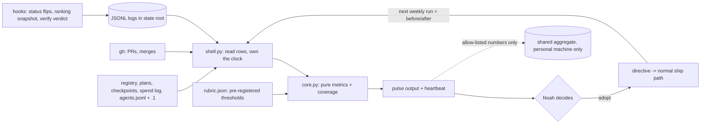
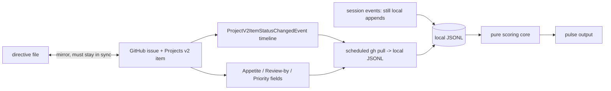
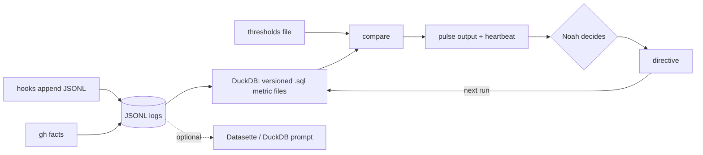
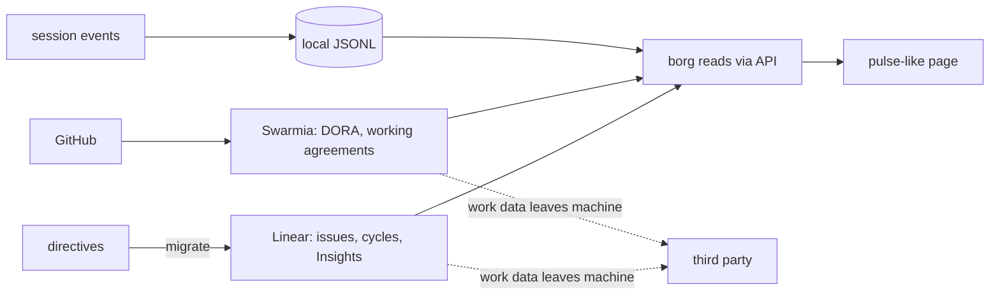
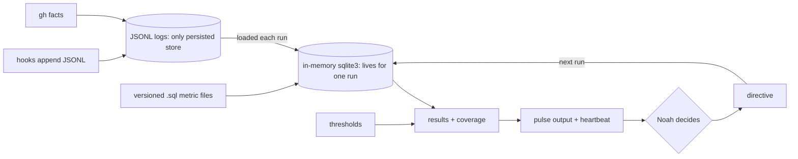
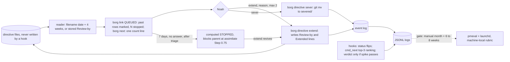

Generated: 2026-10-04

Kept verbatim as sent to the round-3 reviewer; not narrowed to 72 columns.

# D5 review packet: borg project-management capabilities (build, adopt or outsource, plus a self-learning loop)

You are the blind reviewer. Try to REFUTE the chosen option across three lenses: Ideator (is there a materially better option the set missed entirely?), Critic (does the chosen option have a fatal flaw?), Auditor (is it supported by evidence, or by assertion?). You are given the problem, the full option set (six options, A to F) and the chosen option's name only. Return a verdict (uphold, revise or overturn) and your strongest objection verbatim.

## Problem statement

**Problem (Noah, 2026-10-04).** Recommend how to shore up borg's project-management capabilities. For each gap, decide whether to BUILD it into borg, ADOPT an external library or tool, or OUTSOURCE it to an external service. Also make the phase-1 scoring re-runnable as a multi-machine self-learning loop. The scoring has two axes: design (what borg is coded to do, scored 0 to 3 per pillar) and practice (how well it performs the jobs, measured from stored data).

**Borg's job.** Prioritize competing demands across repos, projects and objectives; keep velocity on prioritized work; deliver the highest-value items at the highest-value time; avoid burnout, decision fatigue and context-reconstruction cost; context-switch with the right information at the right time; move between planning and executing seamlessly. (How borg communicates, meaning display, is a separate project and is out of scope except where a capability needs it.)

**Constraints.**
- One developer, two machines (a personal one and a work one). Work-machine data must never leave the work machine. The borg-collective repo is public and was history-scrubbed once for employer references.
- CLI-first; "simple" means fewest moving parts, not fewest lines. The Python core is stdlib-only today (`pyproject.toml` declares no dependencies).
- The user has ADHD; tools must enforce boundaries and lower cognitive load.
- Work items are markdown "directive" files under `docs/plans/`, plus per-project checkpoints and a JSON registry. Agents edit the repo that holds the scorer.
- A prior project (cairn) showed that capture which asks an agent to volunteer produced almost nothing; capture must derive from artifacts agents already produce, or be a hook-level append.
- Goodhart's law applies: a measure that becomes a target stops measuring. The scorer and the scored overlap, because agents work in the repos the scorer reads.
- Prefer existing tools over custom code when they fit; do not scope-cut actually useful features.

**Gaps (from phase 1, numbered here for the option tables).**

| # | Gap | Phase-1 recommendations |
|---|---|---|
| G1 | No value or ordering rule beyond session status; no ranking snapshot | 3, 4 |
| G2 | No appetite (time budget), review date or default stop on any directive | 2 |
| G3 | No status-history events, so WIP, time-in-state and capacity cannot be reconstructed | 6 |
| G4 | Derived state and delivery numbers not computed (open-directive age, lead time, ship-to-sever ratio, PR merge latency, `fix`-PR share, shipped-but-unrecorded plans) | 1, 9 |
| G5 | `borg-verify` verdicts not logged, so the gate is unproven | 7 |
| G6 | No debrief fed by repo facts and no action-closure tracking (0 of 60 shipped plans carry a retro) | 5 |
| G7 | Sustainability and ADHD guardrails are unobserved prose; boundary overrides not logged | 11 |
| G8 | Token-spend capture is unreliable (10 records in September against 56 merged PRs), so cost per shipped unit cannot be quoted | 8 |
| G9 | No re-runnable, multi-machine, self-learning scorecard; scorecard must stay out of agents' reach | 10, 12, 13 |

**Phase-1 baseline (LOCAL MEASUREMENT, 2026-10-03).** 28 open directives, 23 older than 30 days, median age 41 days; 60 shipped and 8 severed; 233 merged PRs, median merge latency 0.77 hours; 28 percent of merged PR titles say `fix`; lead time median 2 days for the 39 of 60 shipped plans that record both dates; 0 of 60 shipped plans carry a retro; the memory-read gate's last verdict is FAIL (0.050 reads per session against a pre-registered threshold of under 0.2). Axis A total 14 of 24, plus or minus 2. The agent log rotates (a live file and `agents.jsonl.1`), and reading only the live file undercounted by about a factor of fifty.

**Decisions the user still owes (any recommendation must say which it needs).** (1) Whether work-machine aggregates enter the public repo. (2) Which new capture ships first. (3) Whether to fix spend capture first or drop cost-per-unit from v1. (4) Whether appetite and a circuit breaker are wanted.

## Option blocks (verbatim)

### Option A: Build-native, capture first

- **What it is:** Borg builds everything itself, small. Three append-only logs start recording what is lost today (session status flips, ranking snapshots, `borg-verify` verdicts), directives gain two fields (appetite and review-by), and one pure module (`borg_core/pmeval`) turns the logs plus data borg already has into the scorecard. The only outside tool is `gh`, which borg already shells to. Metrics are plain Python reductions over lists of rows.
- **How it works:** Hooks append one JSON line per event to the state root (`~/.local/state/borg/`). `borg pulse run` reads the registry, plan files, checkpoints, `gh`, `token-spend.jsonl`, `agents.jsonl` plus its rotated sibling, and the new logs; the pure core computes each metric with a coverage fraction; results are compared against thresholds fixed in a checked-in `rubric.json`. A weekly launchd job repeats the run and writes a heartbeat. Regressions are printed as constraint candidates; a human turns one into a directive, and the next run is the before/after.
- **Pros / Cons:**
  - Pro: fewest moving parts; no new dependency (`pyproject.toml` declares none today); every metric derives from artifacts agents already produce; one file layout for both machines.
  - Pro: the work machine runs the identical code and its output never has to leave it.
  - Con: every metric is hand-written Python, so a join across two logs (status history against ranking snapshots) costs more code than SQL would.
  - Con: no dashboard; the scorecard is a terminal page and a JSON file.
- **Key tradeoffs:** Concedes ad-hoc exploration ergonomics (no SQL prompt over the logs unless Noah installs one himself). Concedes any benchmark against other teams. Concedes the planning surface: directives stay markdown files, so no board view and no mobile access.
- **Feasibility:** High. Every module follows a split the repo already ships (`planstate`, `census`, `evals`, `link/picture.py`), and the launchd pattern is the `memory-gate` one.
- **Estimate:** about 9 to 11 sessions across four phases (captures 2, core and six derived metrics 3, loop closure 3, debrief step and cleanup 2 to 3). Planning input, not a commitment.
- **Visual:**

- **Per-gap calls:**

| Gap | Call | What |
|---|---|---|
| G1 value rule + ranking snapshot | Build | Written rule in the rubric; one-line snapshot append at `borg next` |
| G2 appetite + review-by + stop | Build | Two directive fields; pulse lists items past review-by |
| G3 status history | Build | Append in the existing SessionStart/Stop/Notification hooks |
| G4 derived delivery and state numbers | Build, adopt `gh` as fact source | Six numbers from files and `gh` |
| G5 verify-verdict log | Build | One append from `borg-verify` |
| G6 debrief + action closure | Build | Step in `borg-assimilate` fed by git and `gh` facts |
| G7 sustainability signals | Build | Boundary-override log; alternating-weeks protocol for the guardrails |
| G8 spend capture / cost per unit | Build, later | Coverage metric in v1; capture repair after diagnosis |
| G9 re-runnable loop | Build, adopt launchd | `pmeval`, `borg pulse`, validator, weekly agent |

- **Loop architecture:** Measure (launchd, weekly, out of session) then compare to pre-registered thresholds then print constraint candidates then human decides then ship then next run re-measures. Raw rows stay in the machine's state root. The only shared artifact is a closed-schema numeric aggregate written by a fail-closed validator, comparison is by machine label and rubric version, and nothing is merged across machines.
- **What it does NOT do:** No dashboard, no board, no cross-team benchmark, no external planning surface, no SQL prompt, no cost-per-shipped-unit number in v1, nothing about the time of day work is best done, and no automatic change to any threshold, target or directive.
- **Minimum viable version:** *The smallest version that delivers the core value is: the status-history append, `Appetite:` and `Review-by:` fields on directives, and `borg pulse run` printing the six derived numbers with coverage beside each, reproducing the phase-1 hand numbers from a frozen fixture. Manual run only, no launchd, no publish. Each metric's filter is pinned and written down before the fixture is asserted (see R6).*

### Option B: GitHub as the planning surface

- **What it is:** Each directive is mirrored as a GitHub issue on a Projects v2 board. Appetite, review-by and priority become Projects custom fields (date, number, iteration), and status history comes from GitHub's own `ProjectV2ItemStatusChangedEvent` timeline items. Borg reads the board through `gh project` and GraphQL and computes flow and delivery numbers from it.
- **How it works:** `borg add` or plan promotion creates an issue and a board item; the Status, Appetite and Review-by fields are edited on GitHub or through `gh project item-edit`. A scheduled `gh` pull writes the board snapshot and timeline events into local JSONL; the same pure scoring core (as in Option A) reads those rows. Session-level events (active, idle, waiting, nanoprobe runs, verdicts) still need local appends because GitHub cannot see them.
- **Pros / Cons:**
  - Pro: board, charts and mobile access come free; status history for issue-backed items is recorded by GitHub, not by borg.
  - Pro: `gh` is already a borg dependency, so integration effort is low.
  - Con: a second system of record beside directive files, checkpoints and the registry; the two can disagree, the same drift risk phase 1 flagged for directive files. (A prior internal audit dated 2026-08-20, not re-run in phase 1, found 36 of 76 directives on the non-backlog open board, 47 percent, already shipped but unrecorded. That measured directive files, not a mirrored GitHub board, so it is evidence that status drift exists, not a measurement of what a mirror would add.)
  - Con: private-project data on the work machine sits in GitHub's tenant, which is an employer-policy question this research could not settle.
- **Key tradeoffs:** Concedes files-as-directives as the single truth. Concedes a clean public-repo story, because board data is hosted. Concedes offline operation. Gains a visual surface that the other options skip.
- **Feasibility:** Medium. The schema names are confirmed by introspection, but the event's payload, retention and behavior for automation-driven changes were never exercised, and Projects plan limits are unverified (Track A).
- **Estimate:** about 6 to 8 sessions for the mirror, field setup and sync, plus a standing cost of keeping two stores consistent.
- **Visual:**

- **Per-gap calls:**

| Gap | Call | What |
|---|---|---|
| G1 value rule + ranking snapshot | Adopt (fields), Build (snapshot) | Priority number field; snapshot still local |
| G2 appetite + review-by + stop | Adopt | Projects date and number fields, plus built-in workflow automation |
| G3 status history | Adopt for issue-backed items, Build for sessions | GitHub timeline events; local appends for session flips |
| G4 derived delivery and state numbers | Adopt `gh` and GraphQL | PR, release and Deployment data |
| G5 verify-verdict log | Build | No tool exists |
| G6 debrief + action closure | Build | No tool exists |
| G7 sustainability signals | Build | No tool exists |
| G8 spend capture | Build, later | Unrelated to GitHub |
| G9 re-runnable loop | Build | Same core and validator as A |

- **Loop architecture:** Same five-step loop as Option A, but the Measure step begins with a GitHub pull. The compare, propose and human-decides steps are identical. Privacy is weaker: the board is the system of record and lives off-machine.
- **What it does NOT do:** Does not see session or agent events, does not cover projects that live outside GitHub, does not remove the need for the local pure core, does not give per-field history for anything but Status, and does not by itself satisfy the work-data-never-leaves rule.
- **Minimum viable version:** *The smallest version that delivers the core value is: two Projects fields (Appetite, Review-by) on the borg-collective board, a read-only `gh project item-list` pull into the pulse output flagging items past review-by, and no mirroring of the other 27 projects.*

### Option C: Local metrics stack on DuckDB

- **What it is:** The captures from Option A are kept, but the scoring layer is a set of versioned SQL files executed by DuckDB directly over the JSONL logs (`read_json` and `read_ndjson` need no ingestion step). Datasette or a Grafana panel is optional for browsing. The rubric is the SQL files plus a thresholds file.
- **How it works:** Hooks append JSONL as in Option A. `borg pulse run` shells to the DuckDB CLI or Python wheel, runs each metric's `.sql` file against the state-root logs, and writes results. The same compare, human-decides and re-measure cycle follows. Exploration is a DuckDB prompt over the live files.
- **Pros / Cons:**
  - Pro: joins and windows across logs are one query; Noah can ask a new question without writing Python.
  - Pro: the metric definition is a reviewable text file, close to the dbt "one definition" principle.
  - Con: a new runtime dependency on both machines (not installed here today; `pyproject.toml` has no dependencies block), with packaging and version drift to own, including on the work machine and CI.
  - Con: the benefit is unproven at this volume: a probe on borg's agent log (17,411 rows, both files) returned identical counts from Python and from an in-memory SQL query in about 40 ms each.
- **Key tradeoffs:** Concedes "no new dependency" and the repo's stdlib-only posture. Concedes a simpler install on a locked-down work machine. Gains query ergonomics that only pay off when metrics need joins.
- **Feasibility:** Medium to High. The tool is healthy (MIT, v1.5.6 released 2026-09-28 per Track A's GitHub API read), but the borg-side packaging and the pure-core purity rule (SQL execution is I/O) need a decision.
- **Estimate:** about 10 to 12 sessions (Option A's captures and loop plus the DuckDB shell, SQL files and install story).
- **Visual:**

- **Per-gap calls:**

| Gap | Call | What |
|---|---|---|
| G1 value rule + ranking snapshot | Build | As A |
| G2 appetite + review-by + stop | Build | As A |
| G3 status history | Build | As A |
| G4 derived delivery and state numbers | Adopt DuckDB for compute, `gh` for facts | SQL over JSONL |
| G5 verify-verdict log | Build | As A |
| G6 debrief + action closure | Build | As A |
| G7 sustainability signals | Build | As A |
| G8 spend capture | Build, later | As A |
| G9 re-runnable loop | Adopt DuckDB, Build the rest | SQL files, validator, launchd |

- **Loop architecture:** Same loop as Option A with DuckDB as the compute engine. Raw rows stay local; the shared aggregate is still a closed-schema numeric file. A second runtime must exist on every machine that runs the loop.
- **What it does NOT do:** Does not remove any capture work, does not add a planning surface, does not run without the DuckDB runtime installed, and does not benchmark against anyone. It also does not make the metrics better, only differently written.
- **Minimum viable version:** *The smallest version that delivers the core value is: the status-history append plus three `.sql` files (open-directive age, merge latency, fix share) run by the DuckDB CLI on the personal machine, with no launchd and no publish.*

### Option D: Outsource planning and metrics to SaaS

- **What it is:** Move the system of record for work items to Linear (cycles, priority, Insights) and the delivery metrics to a hosted engineering-metrics product (Swarmia's free tier for up to 9 developers, or its Standard tier at $45 per developer per month). Borg shrinks toward a session launcher and context-injector over those services.
- **How it works:** Directives become Linear issues; cycles carry the time-box; Swarmia ingests GitHub and computes DORA-style numbers and working agreements. Borg reads Linear through its API or a community CLI and keeps only what the services cannot see (session events) as local logs.
- **Pros / Cons:**
  - Pro: dashboards, history and benchmarks exist on day one with almost no code.
  - Pro: no loop to maintain for the delivery numbers.
  - Con: work data leaves the work machine for a third party, which violates the stated rule unless the employer approves.
  - Con: both products are priced and shaped for teams; neither sees agent or session events; Linear cycles are fixed-length iterations, not per-item appetite.
- **Key tradeoffs:** Concedes the privacy constraint on the work machine, files-as-directives, and any scoring of borg's own design (Axis A). Gains the least engineering effort of any option.
- **Feasibility:** Low to Medium. Linear's API, history and webhook docs could not be fetched (host unreachable), so history and cycle-time claims are UNVERIFIED (Track A); Swarmia is SaaS-only with no self-host verified.
- **Estimate:** about 3 to 4 sessions of setup and integration, plus recurring cost and a one-time migration of 28 open directives.
- **Visual:**

- **Per-gap calls:**

| Gap | Call | What |
|---|---|---|
| G1 value rule + ranking snapshot | Outsource | Linear priority and ordering; snapshot via API (history UNVERIFIED) |
| G2 appetite + review-by + stop | Outsource, partial | Linear cycles (fixed length, not appetite per item) |
| G3 status history | Outsource for issues, Build for sessions | Linear history UNVERIFIED |
| G4 derived delivery and state numbers | Outsource | Swarmia |
| G5 verify-verdict log | Build | No tool exists |
| G6 debrief + action closure | Build | No tool exists |
| G7 sustainability signals | Build | No tool exists |
| G8 spend capture | Build, later | Unrelated |
| G9 re-runnable loop | Outsource the dashboards, Build the rest | No multi-machine self-learning loop on offer |

- **Loop architecture:** The vendor dashboards are the measure step; compare and human-decides happen by looking. There is no pre-registered threshold file and no re-runnable scorecard of borg itself, so the self-learning loop is mostly absent. Privacy rests on employer approval, not on a design.
- **What it does NOT do:** Does not keep work data on the work machine, does not see agent or session events, does not score borg's own design, does not provide appetite per item or a circuit breaker, and does not produce a re-runnable multi-machine scorecard.
- **Minimum viable version:** *The smallest version that delivers the core value is: Swarmia's free tier connected to the personal-machine repos only, read alongside the existing `borg link` page for a month, with nothing migrated.*

### Option E: Build-native core with SQL metrics in an in-memory stdlib database

- **What it is:** Option A's captures, loop and privacy contract, with one change in how metrics are written. Each metric is a versioned `.sql` file executed with Python's standard `sqlite3` module against an in-memory database that is filled from the JSONL logs at the start of every run and discarded at the end. DuckDB's benefit (SQL over JSONL, definitions as reviewable text) arrives without a new dependency, because `sqlite3` ships with Python.
- **How it works:** The shell reads the logs (including the rotated `agents.jsonl.1`) and loads each into a one-column `raw` table; metric SQL uses `json_extract`. The persisted store is still only the append-only JSONL, so there is no schema to migrate. The rubric's version hashes the SQL files and thresholds together. Everything else, including compare, propose-as-candidates, the human gate, launchd, the validator and the guards, is Option A.
- **Pros / Cons:**
  - Pro: joins across logs are queries, and a metric's definition is one diffable file that both machines run byte-identically.
  - Pro: no new runtime dependency and no persisted schema.
  - Con: adds a loader and a SQL layer that Option A does not need at 8 to 10 simple metrics; the clean-architecture lint treats `sqlite3` as outside the Domain allow-list, so the core/shell split needs a deliberate exception or the SQL runs in the shell.
  - Con: JSON1 support was confirmed only on this Mac (SQLite 3.53.4); the CI runner and the work machine are untested.
- **Key tradeoffs:** Concedes the simplest possible code path (a Python loop) for a definition format whose advantage is unproven below the join threshold. Concedes DuckDB's speed and file-glob ergonomics at much larger volume.
- **Feasibility:** High, with one open item: verify JSON1 on the CI runner and the work machine before depending on it.
- **Estimate:** about 10 to 12 sessions (Option A plus the loader, SQL files and a differential test per metric).
- **Separation move:** time. The database exists only for the duration of one run, so the persisted store never changes shape and no migration surface exists; the dependency pole is met by a resource already present in the interpreter, which is the Ideal Final Result move rather than a separation.
- **Visual:**

- **Per-gap calls:**

| Gap | Call | What |
|---|---|---|
| G1 value rule + ranking snapshot | Build | As A |
| G2 appetite + review-by + stop | Build | As A |
| G3 status history | Build | As A |
| G4 derived delivery and state numbers | Build with stdlib `sqlite3`, adopt `gh` | SQL files over loaded rows |
| G5 verify-verdict log | Build | As A |
| G6 debrief + action closure | Build | As A |
| G7 sustainability signals | Build | As A |
| G8 spend capture | Build, later | As A |
| G9 re-runnable loop | Build, adopt launchd and stdlib `sqlite3` | As A with SQL metrics |

- **Loop architecture:** Identical to Option A except the metric engine is SQL in a throwaway database. Privacy contract, validator, guards and human gates are unchanged.
- **What it does NOT do:** Does not add a persisted database, a dashboard or a planning surface, does not scale like DuckDB to very large logs, does not remove capture work, and does not resolve whether SQL definitions beat Python ones: the probe only showed equivalence and cost at current volume.
- **Minimum viable version:** *The smallest version that delivers the core value is: Option A's minimum, with the three metrics that join two logs (time-in-state against ranking position, fix share against plan, verify verdict against ship) written as SQL files and the rest left as Python.*

### Option F: Enforce first, measure second

- **What it is:** Borg ships the stop rule as code before it ships any scorecard. Every directive has a Review-by date that the reader computes (filename date plus 4 weeks by default; a `Review-by:` header line is stored only when someone extends). `borg link` QUEUED marks directives past Review-by and counts the stopped ones, `borg next` stays non-interactive and prints one count line, and two NEW commands, `borg directive sever` and `borg directive extend`, act on them. A directive more than 7 days past Review-by lapses to a computed STOPPED state by default, once the triage has happened. One triage session clears the 23 directives older than 30 days. The logs follow as append-only writes, and the scorecard (`pmeval`, launchd, publishing) is built only after a manual month and 6 to 8 weeks of log.
- **How it works:** A new small reader (`borg_core/directives`, a pure core given today's date plus a thin file-reading shell; `planstate` parses acceptance criteria, not directive headers, so it is not the home) computes `filed` from the filename, `review_by` (stored `- Review-by:` header line, else filed plus 28 days), `extensions` (count of `- Extended:` header lines) and `state` (ok, past, stopped). No hook stamps anything and no existing file is migrated or modified, so there is no write into files agents are editing, no mtime churn, and it works for files written by Cortex or by Bash. `borg link`'s `read_directives` rows gain those four keys (additive, `DOCUMENT_VERSION` stays 2, goldens regenerated on purpose). `borg directive list [--lapsed]`, `borg directive sever <slug> --why "..."` (`git mv` to `docs/plans/severed/`, a why comment, an event append) and `borg directive extend <slug> --reason "..."` (writes `- Review-by:` and `- Extended:` lines, capped at 2, appends an event) live under a new `directive)` arm; the existing `borg sever` is `cmd_down` and is untouched. A STOPPED child blocks its parent at `borg-assimilate` Step 0.75 and is never auto-promoted at Step 4c. A reviewer-verdict capture in the existing `SubagentStop` hook is a spike, not a commitment: no run has shown the message parses. Hooks append status flips, and `cmd_next` appends its real top-3 ranking. After a manual `borg pulse run` has been used for a month, the scheduled loop is built exactly as in Option A, with scorer state, rubric and metric tags machine-local and denied to agents.
- **Pros / Cons:**
  - Pro: the first four deliverables change decisions this week and none needs a log to exist; the 23 stale directives stop being stale after one sitting.
  - Pro: the load-bearing field is derived, not volunteered and not written: the reader computes Review-by from the filename, and only a human command stores a line, so the cairn failure mode does not apply and no agent-edited file is touched.
  - Pro: later phases are gated by written conditions, so committing measurement infrastructure to the calendar before the stop rule has shown any effect is avoided by construction (DORA's pitfall "Focusing on measurement at the expense of improvement" is a supporting caution, not a rule against this).
  - Con: costs about 3 to 5 sessions more than Option A in total, and the enforcement surfaces change a `--json` row shape and the QUEUED section of `borg link` (golden-file pinned: the spine and goldens must be regenerated on purpose) plus one output line in `borg next`.
  - Con: a default date has no information in it, so the extend-by-reflex risk is real until the extend rate has a baseline (mitigated by a cap of 2 extensions, a typed reason and a visible count); lapse can also hide work that mattered, and a STOPPED child blocks its parent's assimilation.
  - Con: value ranking stays manual, and two of Noah's jobs (highest-value time, plan-to-execute hand-off) remain unsolved.
- **Key tradeoffs:** Concedes an early scorecard: for the first two to three months there is no automated answer to "is it working", only the extend rate and the hand-readable logs. Concedes the silent hotkey path: `Ctrl+Space >` runs `borg next --switch` without a page, so the lapsed list is visible only in `borg link`, and `borg next` shows one count line. Concedes a pure value order (the written order is by Review-by, then filename).
- **Feasibility:** Medium to High for the enforcing slice. `planstate` does not parse directive headers (it parses acceptance criteria), so a new small reader is needed; `borg sever` is `cmd_down`, not a directive command, so sever and extend are new builds; and `borg link`'s directive rows carry only `slug` and `title`, so the lapsed surface is a wire change under golden files. What holds: every directive filename starts with its filed date (checked for all 28), `cmd_next` and the dispatch have free names for a `directive` arm, and the pure-core and impure-shell split is shipped. Medium for the behavioral claim that surfacing expired items changes what Noah does; no source here tests it.
- **Estimate:** about 14 to 16 sessions if every gate opens; the committed part (enforcing slice, triage, hook appends) is about 6.5 to 7, one of them Noah's. Planning input, not a commitment.
- **Visual:**

- **Per-gap calls:**

| Gap | Call | What |
|---|---|---|
| G1 value rule + ranking snapshot | Build; value ranking stays manual | QUEUED order is Review-by then filename (not snapshotted); `cmd_next`'s real top-3 ranking is snapshotted at each invocation |
| G2 review-by + stop | Build, enforced | Reader-computed Review-by, lapse as a computed default stop, `borg directive extend` and `sever` (new commands) |
| G3 status history | Build | Hook appends |
| G4 derived delivery and state numbers | Build, adopt `gh` | Manual `borg pulse` after metric definitions are pinned |
| G5 verify-verdict log | Build, spike first | Capture from the existing `SubagentStop` hook is untested; the stored summary is truncated to 500 characters |
| G6 debrief + action closure | Build, later | As A, phase 5 |
| G7 sustainability signals | Build, later | As A, phase 5 |
| G8 spend capture | Build, later | Coverage metric only |
| G9 re-runnable loop | Build, adopt launchd, gated | As A, after the gates |

- **Loop architecture:** Two loops. The fast one is Review-by: lapse surfaces a directive, Noah extends or severs with a command, the event is logged. The slow one is Option A's (measure, compare to pre-registered thresholds, print at most one candidate, human decides, re-measure), started only after the gates, with the rubric and the metric tags machine-local so no metric name appears in an agent-visible directive.
- **What it does NOT do:** No value ranking, nothing about the highest-value time, nothing new for the plan-to-execute hand-off, no dashboard or board, no early scorecard, and no push surface for the scorer.
- **Minimum viable version:** *The smallest version that delivers the core value is: the Review-by reader (all 28 directives get a date with no file touched), the lapsed rows and stopped count in `borg link`, the one-line count in `borg next`, `borg directive sever` and `extend`, and Noah's one triage session over the 23 stale directives.*

## Chosen option

Option F: Enforce first, measure second
