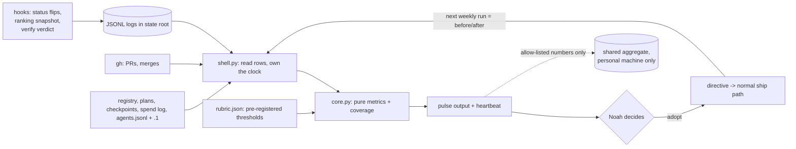
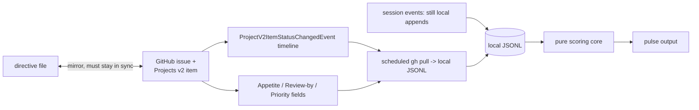
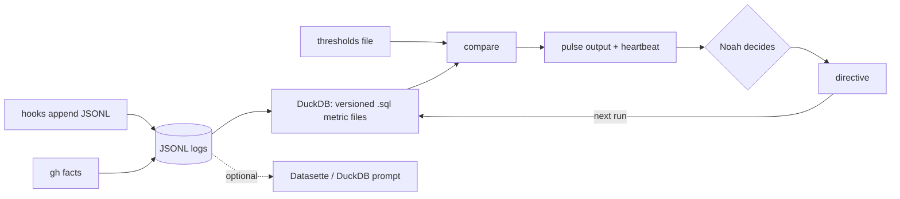
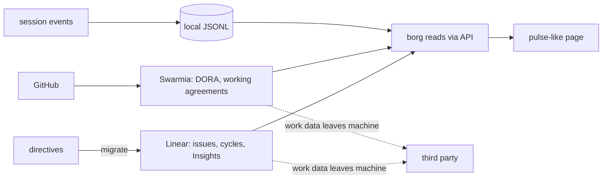
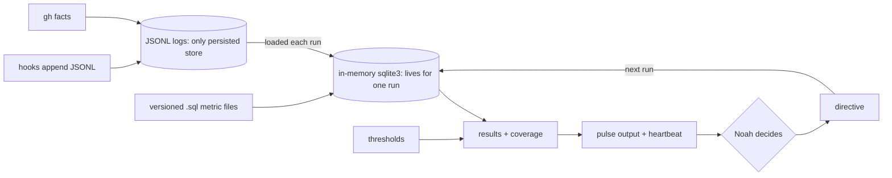
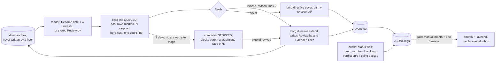

Generated: 2026-10-04

# How to shore up borg's project management: build, adopt or outsource, and a loop that re-scores itself

**Mode:** decision-design (D1, D3, D3.5, D4, D6; D5 rounds 1 and 2 each returned revise and are recorded under Council + Dissent; D3/D4 re-run twice; D5 round 3, the final blind review, also returned revise). **Author:** Claude (research), for Noah. **Phase-1 evidence:** [analysis.md](../2026-10-03-project-management-pillars/analysis.md).

AI-scoring: 80/100 (self-scored by the drafting agent, not by an independent rater; article mode on the ELI10, Recommendation and Council prose, with the option blocks and tables treated as design-doc structure; see the last line of this file for the checks run).

## Glossary

Terms are also defined where they first matter. This block is for skimmers.

- **Pillar**: one of eight load-bearing parts of project management used in phase 1 (value, planning, execution, delivery, monitoring, risk and quality, sustainability, learning).
- **Axis A (design)**: does borg's code or prose contain the pillar, scored 0 to 3. **Axis B (practice)**: what borg's own stored data shows about whether it works.
- **Directive**: a work item filed as a markdown plan under `docs/plans/directives/`.
- **Appetite**: a time budget fixed before design, from Shape Up (Basecamp's six-week-cycle method). **Circuit breaker**: an unfinished item stops by default instead of getting an extension.
- **WIP (work in progress)**: items started and not finished. **Lead time**: days from filing to shipping.
- **DORA (DevOps Research and Assessment)**: a Google research group; its "four keys" are delivery-speed and stability metrics.
- **Goodhart's law**: when a measure becomes a target it stops measuring what you cared about.
- **JSONL**: a text file with one JSON object per line; borg's logs (`agents.jsonl`, `usage-samples.jsonl`, `memory-hits.log`) use it. **State root**: `~/.local/state/borg/`, where machine-local logs live.
- **DuckDB**: an embedded analytics database that can run SQL directly over JSON files. **sqlite3**: the small SQL database that ships inside Python's standard library.
- **launchd**: the macOS scheduler; borg installs six agents with it. **Heartbeat**: a record a scheduled job writes every run so silence is detectable.
- **Rubric**: the file of metric thresholds, written before the first reading (pre-registered). In the revised pick it lives machine-local, not in the public repo.
- **Review-by**: the date a directive must be re-bet or stopped. The reader computes it as the filename's date plus 4 weeks; a `- Review-by:` header line is written into a file only when someone runs `borg directive extend`. Nothing is stamped at filing, so no hook writes into a file an agent is editing.
- **Lapse (default stop)**: a computed display state. A directive more than 7 days past its Review-by, once lapse is switched on, shows as STOPPED instead of in the QUEUED rows. No file is moved or deleted, and one command revives it.
- **Triage**: the one-time pass where Noah decides sever or extend for each of the 23 directives older than 30 days.
- **Enforcing slice**: the first phase of the revised pick: the Review-by reader, the new `borg directive` commands, the lapsed surface in `borg link` (a one-line count in `borg next`), and the triage.
- **Aggregate**: a closed-schema file of numbers only (no names, titles or paths) that may be compared across machines. **Coverage**: the fraction of rows a metric could actually compute from.
- **Nanoprobe**: a short-lived Claude Code subagent that does one task. **`gh`**: GitHub's command-line tool, already a borg dependency.
- **Pulse (`borg pulse`)**: the proposed verb that runs the scorecard (name from Track B; not yet built).
- **D1 to D6**: the steps of the decision-design method (catalog, research tracks, options, council, blind review, document).

## ELI10

Think of borg as a ship's navigator. It has a decent compass, which is `borg next` pointing at whichever project needs attention, and it has a good chart, which is `borg link` showing where every project sits. What it does not have is a logbook. Nobody wrote down when a session changed from idle to active, which project was ranked first on a given morning, or whether the independent reviewer has ever said FAIL, so when Noah asks "are we actually getting better at this?" the honest answer is to go count things by hand, which is what phase 1 did.

So the revised plan is to put a brake in the ship before building the instruments. As of 2026-10-03, 23 of the 28 open directives were more than a month old and nothing ends them. The first job is a "look again by" date that the reader works out from each directive's filename (filing date plus four weeks, so nothing is written into any file), a page that shows what is past that date, one command each to stop or extend a directive, and one sitting where Noah clears the old pile. Only after that do the logbook entries go in (a few one-line entries in existing hooks and in `borg next`), and only after a month of reading the numbers by hand does a weekly job and a published scorecard get built. The scorecard, its rules and its tags stay on the machine where agents cannot edit them.

Almost nothing here is bought from outside. The tools that exist for this (team dashboards, hosted trackers, a database server) are built for crews of fifty, would send the work machine's records to someone else, or add a second chart that would slowly disagree with the first. One piece of outside gear is worth keeping on the shelf: Python already carries a small SQL database, so if the questions get harder than a short loop can answer, borg can use it without installing anything. Two of Noah's jobs are still not solved by anything here: delivering the highest-value item at the highest-value time, and the hand-off from planning to executing. They are named as open gaps below.

## Recommendation

NOT design-reviewed — three blind-review rounds each returned **revise** (none overturned); the run hit its 3-round ceiling and stops here for Noah's decision. The round-3 verdict, objection and conditions are under §Council + Dissent.

**Since this was written (2026-10-07, against main b34e7e0).** Four merges overtake parts of this document; the body below keeps its 2026-10-04 text except corrections marked 2026-10-07.

- **#266** ran the hand triage (`docs/plans/directives/assets/2026-10-04-directive-triage.md`). Main now has 24 dated directives, 18 of them older than 30 days, so "23 of 28" (here and in Phase 0) is a 2026-10-03 snapshot. The report also records the memory gate's 2026-10-04 PASS at 0.600 (11 of 12 reads from one project; its line 76), which supersedes the FAIL at 0.050 cited under the Phase-1 baseline, P8 and `track-b`.
- **#267** retired `borg sever`: it now always refuses (`borg.zsh:3614-3617`; `CLAUDE.md:119` lists it as retired). The "Prior Work" doc bug and the Feasibility note describe the old `cmd_down` dispatch, and the bug it fixed (`sever` was an alias of `cmd_down`, which tears everything down and ignores its arguments, while CLAUDE.md told people to run it to retire a directive) is gone.
- **#274** ships the Phase 1 `cmd_next` ranking snapshot as `next-recs.jsonl` (`borg_core/nextpick/shell.py:15`), with the same `top3` and `switch` fields (`borg_core/nextpick/core.py:87-102`), so Phase 1's snapshot item is built.
- **#275** makes bare `borg next` on a TTY an interactive chooser (`borg.zsh:791`), so Phase 0 item 4's "`borg next` stays non-interactive" now holds only for `--switch`, `--pick` and non-TTY runs.

The core premise is unchanged: nothing retires or ages a directive, and status history is still unbuilt.

**Pick Option F, enforce first and measure second.** Every directive gets a Review-by date that the reader computes from its filename (filed date plus 4 weeks; a `Review-by:` line is stored in the file only when Noah extends), the page Noah chooses work from surfaces what is past it, a directive more than 7 days past it lapses to a computed STOPPED state once the triage has happened, and Noah triages the 23 stale directives once. Two new commands, `borg directive sever` and `borg directive extend`, act on it. The existing `borg sever` is untouched (overtaken by #267 on 2026-10-04: `sever` now refuses, `borg.zsh:3614-3617`; it used to be dispatched with `down` to `cmd_down`, whose help line is "Tear down everything: containers, windows, session", so it never retired a directive; see Prior Work for the doc bug that said it did). The logs (status history, verify verdicts, directive sever and extend events, a snapshot of `cmd_next`'s real project ranking) follow as append-only writes. Option A's scorecard (`borg_core/pmeval`, `borg pulse`, launchd, publishing) is kept, but as **gated later phases, not committed ones**: it starts only after the enforcing slice and the logs exist, runs by hand for a month first, and each later release has a written gate. The council considered the alternative "Option A with F's enforcing slice as its phase 1" and chose F because the difference is exactly the gating: A commits 9 to 11 sessions of measurement infrastructure to the calendar before the stop rule has shown any effect. The DORA metrics guide supports caution here, in softer words than earlier drafts of this document claimed: its pitfall "Focusing on measurement at the expense of improvement" says "Building integrations to multiple systems to get precise data about your software delivery performance might not be worth the initial investment" (https://dora.dev/guides/dora-metrics/, fetched 2026-10-04). That is a warning about integration cost, not a rule against building measurement before value is shown; the earlier paraphrase "do not invest in measurement infrastructure before demonstrating value" is not the guide's wording and is withdrawn, so the gating rests on the round-1 reviewer's argument and my judgment, with DORA as a supporting caution. The A scope constraint carries over: metrics are plain Python reductions, and Option E's in-memory `sqlite3` loader is adopted only when a pre-declared trigger fires (a metric needs a join across two logs, or its reduction passes about 50 lines). Nothing is outsourced. The only adopted pieces are ones already in the stack: `gh` as the fact source for PR data and launchd as the scheduler.

**Per-gap calls for the pick.**

- **G1 value rule + ranking snapshot** — Build, and say plainly: value ranking stays Noah's manual call in v1
  - Why, in one line: QUEUED rows print in a written order: past-Review-by first, then nearest Review-by, then filename. Because the default Review-by is filename date plus 4 weeks, that order equals filed-date order for every un-extended directive, so it is not a value order, and it is not snapshotted (a snapshot of it would be near-constant and could not test "did the top item ship first"). No WSJF, ICE or RICE: the only outcome base rate in the corpus is about one in three (card `t2-kohavi-online-experimentation-microsoft`) and no source shows a scored order beats a plain one (analysis §4.2). What is snapshotted instead is `cmd_next`'s real ranking; see "The snapshot decision" below.
- **G2 review-by + stop** (Call: Build, enforced) — The reader computes Review-by (filename date plus 4 weeks) and `Review-by:` is written only by `borg directive extend`; lapse is a computed default stop with a one-command revive; extensions are capped (below). `Appetite:` is dropped from v1: an empty placeholder enforces nothing and invites a model to fill it with an invented number. Evidence: see "Evidence fit" below.
- **G3 status history** (Call: Build) — Pure append in the SessionStart, Stop and Notification hooks. No external tool can see session flips (Track A).
- **G4 derived state and delivery numbers** (Call: Build, adopt `gh`) — Six numbers from files and `gh`, after each definition is pinned (see R6). DevLake, Swarmia, LinearB, Four Keys and the OTel receiver are rejected for team scale, privacy, or being archived or alpha (Track A).
- **G5 verify-verdict log** — Build, but a spike first: the capture is untested
  - Why, in one line: The existing `SubagentStop` hook (`borg-nanoprobe-log.sh`) would also record a `borg-reviewer` verdict. Nothing has shown the message is parseable, and the stored data says it mostly is not: of 200 `borg-reviewer` rows in `agents.jsonl` plus `agents.jsonl.1` (checked 2026-10-04), the stored `summary` is capped at 500 characters, only 31 mention "verdict" and 6 contain a literal PASS or FAIL, and many of those rows are reviews that are not `borg-verify` runs. So the spike is: parse the hook's full last message (or the transcript) rather than the truncated summary, and measure the parse rate on real runs before building the log. An unparseable message is logged as `unparsed`, never dropped.
- **G6 debrief + action closure** (Call: Build, later) — A `borg-assimilate` step fed by git and `gh` facts. Facilitated debriefs show about d = .67 across 46 samples (card `t4-tannenbaum-cerasoli-debriefs-meta-analysis`).
- **G7 sustainability signals** (Call: Build, later) — A boundary-override log, plus a two-weeks-on, two-weeks-off protocol for the break prompt. ActivityWatch and Timewarrior are rejected: manual or invasive tracking conflicts with the low-capture design.
- **G8 spend capture** (Call: Build, later) — Not in v1: drop cost-per-unit and ship only a coverage metric (spend records per merged PR) so the hole stays visible.
- **G9 re-runnable loop** (Call: Build, adopt launchd, gated) — `borg_core/pmeval` (pure core, impure shell), `borg pulse`, fail-closed validator, weekly agent, heartbeat. Scorer state, rubric and metric tags are machine-local and denied to agents. DuckDB, Grafana and DevLake rejected.

**Phased build order (what ships first).** Enforcement before capture before measurement: the first deliverables change what Noah decides this week, and nothing after Phase 1 is committed until its gate passes.

- **0: enforcing slice + triage** (Sessions: 3 build + 1 Noah) — (1) A new small reader, `borg_core/directives` (pure core that takes today's date as an argument, thin shell that reads files). `planstate` does not do this job: it parses acceptance criteria (`parse_criteria`), not directive headers, so an earlier draft's claim that it already parses directive headers was wrong. The reader derives `filed` from the filename, `review_by` as the stored `- Review-by:` header line else filed plus 28 days, `extensions` as the count of `- Extended:` header lines, and `state` as ok, past or stopped. Header lines are anchored on the leading `- ` and read only above the first `## ` heading. (2) The wire change in `borg link`: `read_directives` rows (today only `slug` and `title`) gain `filed`, `review_by`, `extensions` and `state`; additive, so `DOCUMENT_VERSION` stays 2; QUEUED prints past rows marked and at most 3 lines then "N more"; STOPPED rows leave the QUEUED rows and a count line "N stopped, revive with `borg directive extend`" always prints under it ("0 stopped" when none, because the page has no branch on emptiness); goldens and spine tests are regenerated on purpose, and the `--brief` projection reads the same scoped rows so its QUEUED count matches the page. (3) New commands under a new `directive)` arm in `borg.zsh` (no such arm exists; I checked the dispatch): `borg directive list [--lapsed]` (oldest first, with age and extension count), `borg directive sever <slug> --why "..."` (`git mv` into `docs/plans/severed/`, a one-line why comment, an event append) and `borg directive extend <slug> --reason "..." [--days N]` (writes `- Review-by:` and a `- Extended: <date> <reason>` line into the header; default 14 days, at most 28; revives a STOPPED directive; refuses a third extension). (4) `borg next` stays non-interactive: for the project it picks it prints one line, "N directives past Review-by (M stopped), see borg link"; the lapsed list lives in `borg link`; `--switch` stays silent. (5) (corrected 2026-10-07) The STOPPED rules for `borg-assimilate`: Step 0.75 blocks, and Step 4c is wired to the existing helper in `lib/promote-next.sh` (`_borg_promote_next_candidates`, `_borg_promote_next_pointer`, `_borg_promote_next_decide`, sourced at Step 0.75, `SKILL.md:59`) and taught STOPPED, so it never promotes one; see below. (6) Noah's triage session over the 23 stale directives (the 2026-10-03 count) from `borg directive list --lapsed`, oldest first, with the phase-1 numbers. (7) Contract step: lapse-to-STOPPED switched on only after the triage, by a dated constant in the reader
  - Exit check: The reader is a pure function pinned by table tests with an injected date; no hook and not the reader ever modifies a directive file (a test asserts byte-identical files after a `borg link` run); `sever` leaves the file in `severed/` plus one event row; `extend` refuses the third; every golden change is deliberate; 0 of the 23 stale directives remain undecided; a missing-state-directory case emits no stray stderr (the known redirect-open leak)
- **1: hook appends** (Sessions: 2 to 2.5) — Status history (three hooks); the `cmd_next` ranking snapshot (one fail-open append per invocation, including the silent `--switch` path); the `borg-reviewer` verdict capture only if the spike passes (the directive sever and extend events are already written by the Phase 0 commands)
  - Exit check: Each log gains rows from a real session; the extend rate (extends divided by Review-by hits) and each directive's extension count are readable by hand, so a rubber-stamp reflex is visible; the spike reports a parse rate on real reviewer runs before any verdict log is built
- **2: manual pulse** — Pin each metric's filter first (one session), then `borg_core/pmeval` core and shell, `borg pulse run` and `show`, six derived metrics with coverage, Axis A predicates; the scorer-path guard (below) lands before the rubric exists. Manual only, for a month of wall-clock
  - Sessions: 3 (+ near-zero for the month)
  - Exit check: The differential test reproduces the phase-1 hand numbers from a frozen fixture only after each definition is pinned and written down; the run exits non-zero unless `metrics_computed > 0` and every metric reports coverage; shell test fails if only the live agent log is passed
- **3: close the loop (gate: the manual month happened, and 6 to 8 weeks of Phase-1 log exist)** (Sessions: 3) — Pre-registered thresholds (machine-local), `--compare`, heartbeat, weekly launchd agent via `install.sh`
  - Exit check: An end-to-end launchd run on both machines before the first scheduled build is trusted (green bats alone has failed three times in this family)
- **4: publish (last; gate: Phase 3 ran clean twice)** (Sessions: 1) — Validator and publish for the personal label only; work machine runs local-only
  - Exit check: A dirty fixture is rejected and a clean one accepted
- **5: learning** (Sessions: 2 to 3) — Debrief step in assimilate with action closure, first constraint candidates printed (no files written), the ADHD alternating-weeks protocol, spend-capture diagnosis, sqlite trigger check
  - Exit check: At least one directive ships whose metric tag (kept machine-local) has a before/after pair
- **6: day-90 re-run** (Sessions: 0.5) — Re-run against the thresholds written in Phase 3
  - Exit check: Verdict recorded against the pre-registered nulls, the way `borg-memory-gate` does

Total about 14 to 16 sessions if every gate opens; the committed part is Phases 0 and 1, about 6.5 to 7 sessions (5.5 to 6 build, 1 Noah). That is three to five sessions more than Option A's 9 to 11 because of the enforcing slice and the pinning session, and it buys the only decision-changing deliverables up front. Round 2 moved work around rather than removing it: the stamp hook and the 28-file migration are gone, while a new reader, a new command arm, a wire change under golden files and wiring Step 4c to the existing helper in `lib/promote-next.sh`, taught STOPPED, are in. (Note, 2026-10-07: the session estimate above assumed a new helper; that helper already exists, so the estimate was not re-derived here and is left as written.) A drafter for directive proposals (Track B's `propose.py`) is deliberately not in v1: it ships only after two scheduled runs exist, and then with a cap of three open proposals.

**STOPPED and `borg-assimilate` (decided, with reasons).** (1) **Step 0.75, un-resolved child directives: a STOPPED child DOES block its parent's assimilation.** Step 0.75's contract is that a child is resolved only by a human act, shipping it or moving it to `docs/plans/severed/`, because otherwise the child's `*Parent plan:*` lineage dangles once the parent is archived. STOPPED is a default that fires when no human answered, so letting it discharge that gate would let silence resolve a human decision. It also needs no code: `_borg_child_directives` scans `docs/plans/directives/`, a STOPPED file is still there, so the existing helper already blocks. The cost is real: a date nobody chose can hold a parent back until Noah runs one command. So the block message lists STOPPED children first, each with its `borg directive sever <slug> --why "..."` or `extend` line, and lapse stays off until after the triage so the first day cannot strand a parent. (2) **Step 4c, chained auto-promotion: a STOPPED directive is never auto-promoted**, not as the single candidate, not as one of several, and not as a `*Next:*` target (a pointer to a STOPPED directive is not followed; one line says so and names extend and sever, then the scan falls through to the remaining candidates). Step 4c is prose, which is the model-discretionary band, and "never promote a stopped directive" is a MUST, so the scan is the existing helper `_borg_promote_next_candidates` in `lib/promote-next.sh`, taught to ask the reader; if the reader fails it exits 2 ("could not check") and never prints "no candidates". A human typing `borg start <slug>` on a STOPPED directive gets a warning and proceeds (a speed bump, not a block) and that does not count as an extension.

**The snapshot decision (phase-1 rec 3).** **Decision: drop the QUEUED-order snapshot and snapshot `cmd_next`'s real ranking instead.** The QUEUED order is near-constant under a uniform default (it equals filed-date order for every un-extended directive), so it cannot test whether the top item shipped first. `cmd_next` is where a real ranking lives: it scores projects (pinned +200, waiting +100, active +50, idle +10, no activity -50, tmux window +5). Phase 1 asked for a snapshot of that, and the first F draft silently swapped it for a filename sort. Phase 1 appends one fail-open JSONL row per invocation (top 3 projects with rank, score and status, and whether it ran under `--switch`) to `~/.local/state/borg/`, machine-local like every other raw log; `cmd_next`'s jq emits the top 3 instead of `first`, with unchanged output. Why keep it rather than drop it: it cannot be backfilled (the same reason status history is in Phase 1), it is about ten lines, and it is the only version of the snapshot that records something the CLI actually decides. What it can and cannot show: it can show whether the project `borg next` named first got work (an assimilated plan or a merged PR in that project within 7 days) more often than ranks 2 and 3, and whether the hotkey pick was followed. It cannot test a value ranking, because the score is a function of session status: the top project is mostly the one already active, so a hit rate would be partly tautological. The readout therefore compares rank 1 against ranks 2 and 3, and if there is no gap by the Phase 3 gate the log is dropped. Value ranking stays an open gap.

**Extend by reflex.** The cap and the friction are in the commands, and the count is on the page. (a) At most 2 extensions per directive; a third `extend` is refused, and the only exits are `borg directive sever` or a deliberate hand edit of the header (the cap is one constant). (b) Each extension needs a typed reason, defaults to 14 days (shorter than the 28-day default, so a reflex comes back sooner), is capped at 28 days, and the second one prints the first reason. (c) The extension count is stored in the file as `- Extended:` lines, so it travels with git and does not depend on the machine-local event log, and every row in `borg link` shows it (`ext 1/2`). Triage extensions count toward the cap, which means a directive Noah keeps at triage has one extension left. (d) The extend and sever events are also appended to a machine-local log from Phase 0, so the extend rate (extends divided by Review-by hits) is readable by hand. Residual, stated: the stored lines are plain text an agent could write, so the event log, not the file, is the record of human decisions; `borg directive list` flags a directive whose file lines and event rows disagree. A cap of 2 is a judgment, not a finding.

**Evidence fit.** The strongest evidence behind a default stop is card `t2-sleesman-escalation-meta-analysis` (166 samples), and it is about escalation of commitment on projects people have already started and sunk cost into. The reviewer's point that the 23 stale directives are mostly unstarted is plausible but I did not measure it: phase 1 did not split started from unstarted, and my crude proxy (commit messages that mention the directive's slug: 8 of 28 have none, 20 have at least one) cannot separate them, because the filing commit counts as a mention. For unstarted items the relevant practice is backlog bankruptcy or the Shape Up no-backlog rule, and the evidence for that is weaker: phase 1 rates it Weak (method text and field reports; the ProductPlan backlog-bankruptcy post was scored reject and a Hacker News thread cut) and found no outcome study of backlog age or size (analysis §3.7 and its source cards). So default-stop rests on (i) strong evidence of the hazard for started work, which applies to a minority of the 23, (ii) weak practice evidence for unstarted work, and (iii) a cost argument, that 23 stale items are a visible read cost each time the backlog is opened. It is a design stance and is labelled one. The triage list should show per directive whether a branch, PR or checkpoint mentions it, which turns the proxy into a count.

**Keeping the scorer out of agents' reach.** (a) The rubric, the scorer's results and the metric-to-directive tags live in `~/.config/borg/pmeval/` and `~/.local/state/borg/pmeval/`, not in the repo, so a pull request cannot change a threshold. (b) `bash-guard.sh` denies Bash commands touching those two paths, and a `permissions.deny` rule covers Read, Edit and Write on them. (c) The step "a human turns a constraint candidate into a directive" writes the directive in plain words with no metric name; the link from directive to metric is a machine-local tag, so the metric is never an agent-visible target. (d) The scorecard has no push surface: it prints only when Noah runs `borg pulse`. The lapsed list in `borg link` and the count line in `borg next` are agent-visible on purpose; it is directive hygiene, not the scorer. **Residual risk, stated:** the scorer's code and metric definitions still live in a repo agents edit (R2), so the heartbeat records the code's git sha and changes to `pmeval` go through `borg-verify`; and a deny rule is only as strong as the settings file holding it, which an agent with Edit rights to settings, or a bind-mounted `~/.claude` in a devcontainer, could weaken. I did not test the devcontainer case.

**Minimum viable version.** Phase 0 alone: the reader (so all 28 directives have a Review-by without any file being touched), the lapsed rows and stopped count in `borg link`, the one-line count in `borg next`, `borg directive sever` and `extend`, and the triage done. About 4 sessions, one of them Noah's. Nothing in it needs a log to exist.

**Open gaps, named and not solved.**

- **Delivering the highest-value item at the highest-value time.** No option covers it, and phase 1 found no evidence base for either half. F's only related lever is the due-date order. It stays open.
- **The plan to execute hand-off.** Nothing here changes it beyond what checkpoints and `borg-plan-promote.sh` already do. Per the brief, #257 (communication) may address the hand-off; I did not read #257, so treat this as an open question to check there, not a covered gap. Update 2026-10-07: #257 names it moment M4 (its `recommendation.md` in `docs/research/2026-10-03-cheat-sheet-design/` on its branch, Glossary, "The six moments") and then drops it from its MVP (same file, Recommendation, "Plan to do, dropped from the MVP"), so the hand-off is currently unowned between #257 and #262; flagged for Noah.
- **Value ranking itself.** Stays manual in v1 (G1). The evidence does not support an automated value score, and the due-date order is not a substitute for one.

**Noah's open decisions, with a recommended answer for each.**

1. **Do work-machine aggregates enter the public repo?** No. The public repo gets the schema and personal-label aggregates only (and, in the revised pick, not the rubric). The work machine runs the same code and keeps its results in its own state root; Noah hand-carries a file to the personal machine for `--compare` if he wants one. Reason: with one person per machine there is no re-identification benefit to publishing, git history is permanent, and this repo already needed one scrub. This is a judgment, not a finding.
2. **First new capture?** Changed by round 1: the first thing to ship is enforcement (the Review-by reader and the lapsed list), because it needs no log to be useful. The first log is the status-history append: it cannot be backfilled, it unblocks WIP, time-in-state, parallel-session counts and capacity (analysis §3.4, §3.8, §3.11), and it derives from events that already happen.
3. **Fix spend capture first or drop cost-per-unit?** Drop it from v1. September had 10 spend records against 56 merged PRs and one day holds 316 records (analysis §1 rec 8, §3.4), so a cost number now would measure the logger. Ship the coverage metric and diagnose the cause in Phase 5.
4. **Appetite and circuit breaker?** Circuit breaker: yes, as Review-by plus lapse. Lapse is a computed default stop after a 7-day grace, revived by `borg directive extend`, with extensions capped at 2. It is a display state, not a block on work, which matches the project's rule that boundaries are speed bumps (with one stated exception: a STOPPED child blocks its parent's assimilation, see above). Appetite: not in v1. The empty `Appetite:` placeholder is dropped; a per-item time budget is revisited only if Noah wants one. The evidence is strong for why people need a breaker (card `t2-sleesman-escalation-meta-analysis`, for started work) and weak that the practice helps (analysis §3.7).
5. **New, from round 1: the Review-by default.** Recommended: filed date plus 4 weeks, computed by the reader from the filename, so changing the one constant changes every directive's date at once with no migration. That is a judgment, not a finding (Shape Up's six-week cycle is the nearest anchor, and a shorter default surfaces more). It means most of the 23 old directives are already past it on day one, which is why the triage session comes before lapse is switched on.

**The strongest dissent, and how this pick answers it.** After round 3 the strongest dissent (Technical Realist, backed by the User Advocate; R13) is that making a STOPPED child block its parent's assimilation turns a display default into a shipping gate decided by a date nobody chose: a directive filed under a plan that is genuinely in flight can lapse only because five weeks passed, and then stop the parent from archiving. I kept blocking over non-blocking, for the reasons given under "STOPPED and `borg-assimilate`" (silence must not resolve a human gate, and a non-blocking rule would dangle lineage), and I concede the cost. The flip condition is written in advance: if in the first two months a block fires on a child Noah had no intention of acting on, the rule changes to non-blocking with a loud warning, one constant. The earlier dissent, R9 (a default date carries no information, so extend becomes a reflex and the breaker a rubber stamp), is answered by the cap of 2, the typed reason, the visible `ext n/2` on every row and the logged extend rate; if after two months almost every Review-by hit is extended, the stop rule has failed its own test and Phase 3 onward should not be released. The round-1 and round-2 reviewers' objections are recorded verbatim under Council + Dissent, and each is answered by a concrete change.

## Options

### Problem as given to every option

**Problem (Noah, 2026-10-04).** Recommend how to shore up borg's project-management capabilities. For each gap, decide whether to BUILD it into borg, ADOPT an external library or tool, or OUTSOURCE it to an external service. Also make the phase-1 scoring re-runnable as a multi-machine self-learning loop. The scoring has two axes: design (what borg is coded to do, scored 0 to 3 per pillar) and practice (how well it performs the jobs, measured from stored data).

**Borg's job.** Prioritize competing demands across repos, projects and objectives; keep velocity on prioritized work; deliver the highest-value items at the highest-value time; avoid burnout, decision fatigue and context-reconstruction cost; context-switch with the right information at the right time; move between planning and executing seamlessly. (How borg communicates, meaning display, is a separate project and is out of scope except where a capability needs it.)

**Constraints.**
- One developer, two machines (a personal one and a work one). Work-machine data must never leave the work machine. The borg-collective repo is public and was history-scrubbed once for employer references.
- CLI-first; "simple" means fewest moving parts, not fewest lines. The Python core is stdlib-only today (`pyproject.toml` declares no dependencies).
- The user has ADHD; tools must enforce boundaries and lower cognitive load.
- Work items are markdown "directive" files under `docs/plans/`, plus per-project checkpoints and a JSON registry. Agents edit the repo that holds the scorer.
- A prior project (cairn) showed that capture which asks an agent to volunteer produced almost nothing; capture must derive from artifacts agents already produce, or be a hook-level append.
- Goodhart's law applies: a measure that becomes a target stops measuring. The scorer and the scored overlap, because agents work in the repos the scorer reads.
- Prefer existing tools over custom code when they fit; do not scope-cut actually useful features.

**Gaps (from phase 1, numbered here for the option tables).**

- **G1** (Phase-1 recommendations: 3, 4) — No value or ordering rule beyond session status; no ranking snapshot
- **G2** (Phase-1 recommendations: 2) — No appetite (time budget), review date or default stop on any directive
- **G3** (Phase-1 recommendations: 6) — No status-history events, so WIP, time-in-state and capacity cannot be reconstructed
- **G4** (Phase-1 recommendations: 1, 9) — Derived state and delivery numbers not computed (open-directive age, lead time, ship-to-sever ratio, PR merge latency, `fix`-PR share, shipped-but-unrecorded plans)
- **G5** (Phase-1 recommendations: 7) — `borg-verify` verdicts not logged, so the gate is unproven
- **G6** (Phase-1 recommendations: 5) — No debrief fed by repo facts and no action-closure tracking (0 of 60 shipped plans carry a retro)
- **G7** (Phase-1 recommendations: 11) — Sustainability and ADHD guardrails are unobserved prose; boundary overrides not logged
- **G8** (Phase-1 recommendations: 8) — Token-spend capture is unreliable (10 records in September against 56 merged PRs), so cost per shipped unit cannot be quoted
- **G9** (Phase-1 recommendations: 10, 12, 13) — No re-runnable, multi-machine, self-learning scorecard; scorecard must stay out of agents' reach

**Phase-1 baseline (LOCAL MEASUREMENT, 2026-10-03).** 28 open directives, 23 older than 30 days, median age 41 days; 60 shipped and 8 severed; 233 merged PRs, median merge latency 0.77 hours; 28 percent of merged PR titles say `fix`; lead time median 2 days for the 39 of 60 shipped plans that record both dates; 0 of 60 shipped plans carry a retro; the memory-read gate's last verdict was FAIL, checked 2026-10-02 (0.050 reads per session against a pre-registered threshold of under 0.2; superseded: #266's triage report records a 2026-10-04 PASS at 0.600). Axis A total 14 of 24, plus or minus 2. The agent log rotates (a live file and `agents.jsonl.1`), and reading only the live file undercounted by about a factor of fifty.

**Decisions the user still owes (any recommendation must say which it needs).** (1) Whether work-machine aggregates enter the public repo. (2) Which new capture ships first. (3) Whether to fix spend capture first or drop cost-per-unit from v1. (4) Whether appetite and a circuit breaker are wanted.

### The six options

### Option A: Build-native, capture first

- **What it is:** Borg builds everything itself, small. Three append-only logs start recording what is lost today (session status flips, ranking snapshots, `borg-verify` verdicts), directives gain two fields (appetite and review-by), and one pure module (`borg_core/pmeval`) turns the logs plus data borg already has into the scorecard. The only outside tool is `gh`, which borg already shells to. Metrics are plain Python reductions over lists of rows.
- **How it works:** Hooks append one JSON line per event to the state root (`~/.local/state/borg/`). `borg pulse run` reads the registry, plan files, checkpoints, `gh`, `token-spend.jsonl`, `agents.jsonl` plus its rotated sibling, and the new logs; the pure core computes each metric with a coverage fraction; results are compared against thresholds fixed in a checked-in `rubric.json`. A weekly launchd job repeats the run and writes a heartbeat. Regressions are printed as constraint candidates; a human turns one into a directive, and the next run is the before/after.
- **Pros / Cons:**
  - Pro: fewest moving parts; no new dependency (`pyproject.toml` declares none today); every metric derives from artifacts agents already produce; one file layout for both machines.
  - Pro: the work machine runs the identical code and its output never has to leave it.
  - Con: every metric is hand-written Python, so a join across two logs (status history against ranking snapshots) costs more code than SQL would.
  - Con: no dashboard; the scorecard is a terminal page and a JSON file.
- **Key tradeoffs:** Concedes ad-hoc exploration ergonomics (no SQL prompt over the logs unless Noah installs one himself). Concedes any benchmark against other teams. Concedes the planning surface: directives stay markdown files, so no board view and no mobile access.
- **Feasibility:** High. Every module follows a split the repo already ships (`planstate`, `census`, `evals`, `link/picture.py`), and the launchd pattern is the `memory-gate` one.
- **Estimate:** about 9 to 11 sessions across four phases (captures 2, core and six derived metrics 3, loop closure 3, debrief step and cleanup 2 to 3). Planning input, not a commitment.
- **Visual:**

- **Per-gap calls:**

- **G1 value rule + ranking snapshot** (Call: Build) — Written rule in the rubric; one-line snapshot append at `borg next`
- **G2 appetite + review-by + stop** (Call: Build) — Two directive fields; pulse lists items past review-by
- **G3 status history** (Call: Build) — Append in the existing SessionStart/Stop/Notification hooks
- **G4 derived delivery and state numbers** — Build, adopt `gh` as fact source
  - What: Six numbers from files and `gh`
- **G5 verify-verdict log** (Call: Build) — One append from `borg-verify`
- **G6 debrief + action closure** (Call: Build) — Step in `borg-assimilate` fed by git and `gh` facts
- **G7 sustainability signals** (Call: Build) — Boundary-override log; alternating-weeks protocol for the guardrails
- **G8 spend capture / cost per unit** (Call: Build, later) — Coverage metric in v1; capture repair after diagnosis
- **G9 re-runnable loop** (Call: Build, adopt launchd) — `pmeval`, `borg pulse`, validator, weekly agent

- **Loop architecture:** Measure (launchd, weekly, out of session) then compare to pre-registered thresholds then print constraint candidates then human decides then ship then next run re-measures. Raw rows stay in the machine's state root. The only shared artifact is a closed-schema numeric aggregate written by a fail-closed validator, comparison is by machine label and rubric version, and nothing is merged across machines.
- **What it does NOT do:** No dashboard, no board, no cross-team benchmark, no external planning surface, no SQL prompt, no cost-per-shipped-unit number in v1, nothing about the time of day work is best done, and no automatic change to any threshold, target or directive.
- **Minimum viable version:** *The smallest version that delivers the core value is: the status-history append, `Appetite:` and `Review-by:` fields on directives, and `borg pulse run` printing the six derived numbers with coverage beside each, reproducing the phase-1 hand numbers from a frozen fixture. Manual run only, no launchd, no publish. Each metric's filter is pinned and written down before the fixture is asserted (see R6).*

### Option B: GitHub as the planning surface

- **What it is:** Each directive is mirrored as a GitHub issue on a Projects v2 board. Appetite, review-by and priority become Projects custom fields (date, number, iteration), and status history comes from GitHub's own `ProjectV2ItemStatusChangedEvent` timeline items. Borg reads the board through `gh project` and GraphQL and computes flow and delivery numbers from it.
- **How it works:** `borg add` or plan promotion creates an issue and a board item; the Status, Appetite and Review-by fields are edited on GitHub or through `gh project item-edit`. A scheduled `gh` pull writes the board snapshot and timeline events into local JSONL; the same pure scoring core (as in Option A) reads those rows. Session-level events (active, idle, waiting, nanoprobe runs, verdicts) still need local appends because GitHub cannot see them.
- **Pros / Cons:**
  - Pro: board, charts and mobile access come free; status history for issue-backed items is recorded by GitHub, not by borg.
  - Pro: `gh` is already a borg dependency, so integration effort is low.
  - Con: a second system of record beside directive files, checkpoints and the registry; the two can disagree, the same drift risk phase 1 flagged for directive files. (A prior internal audit dated 2026-08-20, not re-run in phase 1, found 36 of 76 directives on the non-backlog open board, 47 percent, already shipped but unrecorded. That measured directive files, not a mirrored GitHub board, so it is evidence that status drift exists, not a measurement of what a mirror would add.)
  - Con: private-project data on the work machine sits in GitHub's tenant, which is an employer-policy question this research could not settle.
- **Key tradeoffs:** Concedes files-as-directives as the single truth. Concedes a clean public-repo story, because board data is hosted. Concedes offline operation. Gains a visual surface that the other options skip.
- **Feasibility:** Medium. The schema names are confirmed by introspection, but the event's payload, retention and behavior for automation-driven changes were never exercised, and Projects plan limits are unverified (Track A).
- **Estimate:** about 6 to 8 sessions for the mirror, field setup and sync, plus a standing cost of keeping two stores consistent.
- **Visual:**

- **Per-gap calls:**

- **G1 value rule + ranking snapshot** — Adopt (fields), Build (snapshot)
  - What: Priority number field; snapshot still local
- **G2 appetite + review-by + stop** (Call: Adopt) — Projects date and number fields, plus built-in workflow automation
- **G3 status history** — Adopt for issue-backed items, Build for sessions
  - What: GitHub timeline events; local appends for session flips
- **G4 derived delivery and state numbers** (Call: Adopt `gh` and GraphQL) — PR, release and Deployment data
- **G5 verify-verdict log** (Call: Build; What: No tool exists)
- **G6 debrief + action closure** (Call: Build; What: No tool exists)
- **G7 sustainability signals** (Call: Build; What: No tool exists)
- **G8 spend capture** (Call: Build, later; What: Unrelated to GitHub)
- **G9 re-runnable loop** (Call: Build; What: Same core and validator as A)

- **Loop architecture:** Same five-step loop as Option A, but the Measure step begins with a GitHub pull. The compare, propose and human-decides steps are identical. Privacy is weaker: the board is the system of record and lives off-machine.
- **What it does NOT do:** Does not see session or agent events, does not cover projects that live outside GitHub, does not remove the need for the local pure core, does not give per-field history for anything but Status, and does not by itself satisfy the work-data-never-leaves rule.
- **Minimum viable version:** *The smallest version that delivers the core value is: two Projects fields (Appetite, Review-by) on the borg-collective board, a read-only `gh project item-list` pull into the pulse output flagging items past review-by, and no mirroring of the other 27 projects.*

### Option C: Local metrics stack on DuckDB

- **What it is:** The captures from Option A are kept, but the scoring layer is a set of versioned SQL files executed by DuckDB directly over the JSONL logs (`read_json` and `read_ndjson` need no ingestion step). Datasette or a Grafana panel is optional for browsing. The rubric is the SQL files plus a thresholds file.
- **How it works:** Hooks append JSONL as in Option A. `borg pulse run` shells to the DuckDB CLI or Python wheel, runs each metric's `.sql` file against the state-root logs, and writes results. The same compare, human-decides and re-measure cycle follows. Exploration is a DuckDB prompt over the live files.
- **Pros / Cons:**
  - Pro: joins and windows across logs are one query; Noah can ask a new question without writing Python.
  - Pro: the metric definition is a reviewable text file, close to the dbt "one definition" principle.
  - Con: a new runtime dependency on both machines (not installed here today; `pyproject.toml` has no dependencies block), with packaging and version drift to own, including on the work machine and CI.
  - Con: the benefit is unproven at this volume: a probe on borg's agent log (17,411 rows, both files) returned identical counts from Python and from an in-memory SQL query in about 40 ms each.
- **Key tradeoffs:** Concedes "no new dependency" and the repo's stdlib-only posture. Concedes a simpler install on a locked-down work machine. Gains query ergonomics that only pay off when metrics need joins.
- **Feasibility:** Medium to High. The tool is healthy (MIT, v1.5.6 released 2026-09-28 per Track A's GitHub API read), but the borg-side packaging and the pure-core purity rule (SQL execution is I/O) need a decision.
- **Estimate:** about 10 to 12 sessions (Option A's captures and loop plus the DuckDB shell, SQL files and install story).
- **Visual:**

- **Per-gap calls:**

- **G1 value rule + ranking snapshot** (Call: Build; What: As A)
- **G2 appetite + review-by + stop** (Call: Build; What: As A)
- **G3 status history** (Call: Build; What: As A)
- **G4 derived delivery and state numbers** (What: SQL over JSONL) — Adopt DuckDB for compute, `gh` for facts
- **G5 verify-verdict log** (Call: Build; What: As A)
- **G6 debrief + action closure** (Call: Build; What: As A)
- **G7 sustainability signals** (Call: Build; What: As A)
- **G8 spend capture** (Call: Build, later; What: As A)
- **G9 re-runnable loop** (Call: Adopt DuckDB, Build the rest) — SQL files, validator, launchd

- **Loop architecture:** Same loop as Option A with DuckDB as the compute engine. Raw rows stay local; the shared aggregate is still a closed-schema numeric file. A second runtime must exist on every machine that runs the loop.
- **What it does NOT do:** Does not remove any capture work, does not add a planning surface, does not run without the DuckDB runtime installed, and does not benchmark against anyone. It also does not make the metrics better, only differently written.
- **Minimum viable version:** *The smallest version that delivers the core value is: the status-history append plus three `.sql` files (open-directive age, merge latency, fix share) run by the DuckDB CLI on the personal machine, with no launchd and no publish.*

### Option D: Outsource planning and metrics to SaaS

- **What it is:** Move the system of record for work items to Linear (cycles, priority, Insights) and the delivery metrics to a hosted engineering-metrics product (Swarmia's free tier for up to 9 developers, or its Standard tier at $45 per developer per month). Borg shrinks toward a session launcher and context-injector over those services.
- **How it works:** Directives become Linear issues; cycles carry the time-box; Swarmia ingests GitHub and computes DORA-style numbers and working agreements. Borg reads Linear through its API or a community CLI and keeps only what the services cannot see (session events) as local logs.
- **Pros / Cons:**
  - Pro: dashboards, history and benchmarks exist on day one with almost no code.
  - Pro: no loop to maintain for the delivery numbers.
  - Con: work data leaves the work machine for a third party, which violates the stated rule unless the employer approves.
  - Con: both products are priced and shaped for teams; neither sees agent or session events; Linear cycles are fixed-length iterations, not per-item appetite.
- **Key tradeoffs:** Concedes the privacy constraint on the work machine, files-as-directives, and any scoring of borg's own design (Axis A). Gains the least engineering effort of any option.
- **Feasibility:** Low to Medium. Linear's API, history and webhook docs could not be fetched (host unreachable), so history and cycle-time claims are UNVERIFIED (Track A); Swarmia is SaaS-only with no self-host verified.
- **Estimate:** about 3 to 4 sessions of setup and integration, plus recurring cost and a one-time migration of 28 open directives.
- **Visual:**

- **Per-gap calls:**

- **G1 value rule + ranking snapshot** (Call: Outsource) — Linear priority and ordering; snapshot via API (history UNVERIFIED)
- **G2 appetite + review-by + stop** (Call: Outsource, partial) — Linear cycles (fixed length, not appetite per item)
- **G3 status history** (What: Linear history UNVERIFIED) — Outsource for issues, Build for sessions
- **G4 derived delivery and state numbers** (Call: Outsource; What: Swarmia)
- **G5 verify-verdict log** (Call: Build; What: No tool exists)
- **G6 debrief + action closure** (Call: Build; What: No tool exists)
- **G7 sustainability signals** (Call: Build; What: No tool exists)
- **G8 spend capture** (Call: Build, later; What: Unrelated)
- **G9 re-runnable loop** — Outsource the dashboards, Build the rest
  - What: No multi-machine self-learning loop on offer

- **Loop architecture:** The vendor dashboards are the measure step; compare and human-decides happen by looking. There is no pre-registered threshold file and no re-runnable scorecard of borg itself, so the self-learning loop is mostly absent. Privacy rests on employer approval, not on a design.
- **What it does NOT do:** Does not keep work data on the work machine, does not see agent or session events, does not score borg's own design, does not provide appetite per item or a circuit breaker, and does not produce a re-runnable multi-machine scorecard.
- **Minimum viable version:** *The smallest version that delivers the core value is: Swarmia's free tier connected to the personal-machine repos only, read alongside the existing `borg link` page for a month, with nothing migrated.*

### Option E: Build-native core with SQL metrics in an in-memory stdlib database

- **What it is:** Option A's captures, loop and privacy contract, with one change in how metrics are written. Each metric is a versioned `.sql` file executed with Python's standard `sqlite3` module against an in-memory database that is filled from the JSONL logs at the start of every run and discarded at the end. DuckDB's benefit (SQL over JSONL, definitions as reviewable text) arrives without a new dependency, because `sqlite3` ships with Python.
- **How it works:** The shell reads the logs (including the rotated `agents.jsonl.1`) and loads each into a one-column `raw` table; metric SQL uses `json_extract`. The persisted store is still only the append-only JSONL, so there is no schema to migrate. The rubric's version hashes the SQL files and thresholds together. Everything else, including compare, propose-as-candidates, the human gate, launchd, the validator and the guards, is Option A.
- **Pros / Cons:**
  - Pro: joins across logs are queries, and a metric's definition is one diffable file that both machines run byte-identically.
  - Pro: no new runtime dependency and no persisted schema.
  - Con: adds a loader and a SQL layer that Option A does not need at 8 to 10 simple metrics; the clean-architecture lint treats `sqlite3` as outside the Domain allow-list, so the core/shell split needs a deliberate exception or the SQL runs in the shell.
  - Con: JSON1 support was confirmed only on this Mac (SQLite 3.53.4); the CI runner and the work machine are untested.
- **Key tradeoffs:** Concedes the simplest possible code path (a Python loop) for a definition format whose advantage is unproven below the join threshold. Concedes DuckDB's speed and file-glob ergonomics at much larger volume.
- **Feasibility:** High, with one open item: verify JSON1 on the CI runner and the work machine before depending on it.
- **Estimate:** about 10 to 12 sessions (Option A plus the loader, SQL files and a differential test per metric).
- **Separation move:** time. The database exists only for the duration of one run, so the persisted store never changes shape and no migration surface exists; the dependency pole is met by a resource already present in the interpreter, which is the Ideal Final Result move rather than a separation.
- **Visual:**

- **Per-gap calls:**

- **G1 value rule + ranking snapshot** (Call: Build; What: As A)
- **G2 appetite + review-by + stop** (Call: Build; What: As A)
- **G3 status history** (Call: Build; What: As A)
- **G4 derived delivery and state numbers** (What: SQL files over loaded rows) — Build with stdlib `sqlite3`, adopt `gh`
- **G5 verify-verdict log** (Call: Build; What: As A)
- **G6 debrief + action closure** (Call: Build; What: As A)
- **G7 sustainability signals** (Call: Build; What: As A)
- **G8 spend capture** (Call: Build, later; What: As A)
- **G9 re-runnable loop** (What: As A with SQL metrics) — Build, adopt launchd and stdlib `sqlite3`

- **Loop architecture:** Identical to Option A except the metric engine is SQL in a throwaway database. Privacy contract, validator, guards and human gates are unchanged.
- **What it does NOT do:** Does not add a persisted database, a dashboard or a planning surface, does not scale like DuckDB to very large logs, does not remove capture work, and does not resolve whether SQL definitions beat Python ones: the probe only showed equivalence and cost at current volume.
- **Minimum viable version:** *The smallest version that delivers the core value is: Option A's minimum, with the three metrics that join two logs (time-in-state against ranking position, fix share against plan, verify verdict against ship) written as SQL files and the rest left as Python.*

### Option F: Enforce first, measure second

- **What it is:** Borg ships the stop rule as code before it ships any scorecard. Every directive has a Review-by date that the reader computes (filename date plus 4 weeks by default; a `Review-by:` header line is stored only when someone extends). `borg link` QUEUED marks directives past Review-by and counts the stopped ones, `borg next` stays non-interactive and prints one count line, and two NEW commands, `borg directive sever` and `borg directive extend`, act on them. A directive more than 7 days past Review-by lapses to a computed STOPPED state by default, once the triage has happened. One triage session clears the 23 directives older than 30 days. The logs follow as append-only writes, and the scorecard (`pmeval`, launchd, publishing) is built only after a manual month and 6 to 8 weeks of log.
- **How it works:** A new small reader (`borg_core/directives`, a pure core given today's date plus a thin file-reading shell; `planstate` parses acceptance criteria, not directive headers, so it is not the home) computes `filed` from the filename, `review_by` (stored `- Review-by:` header line, else filed plus 28 days), `extensions` (count of `- Extended:` header lines) and `state` (ok, past, stopped). No hook stamps anything and no existing file is migrated or modified, so there is no write into files agents are editing, no mtime churn, and it works for files written by Cortex or by Bash. `borg link`'s `read_directives` rows gain those four keys (additive, `DOCUMENT_VERSION` stays 2, goldens regenerated on purpose). `borg directive list [--lapsed]`, `borg directive sever <slug> --why "..."` (`git mv` to `docs/plans/severed/`, a why comment, an event append) and `borg directive extend <slug> --reason "..."` (writes `- Review-by:` and `- Extended:` lines, capped at 2, appends an event) live under a new `directive)` arm; the existing `borg sever` is `cmd_down` and is untouched (overtaken by #267 on 2026-10-04: `sever` now refuses, `borg.zsh:3614-3617`). A STOPPED child blocks its parent at `borg-assimilate` Step 0.75 and is never auto-promoted at Step 4c. A reviewer-verdict capture in the existing `SubagentStop` hook is a spike, not a commitment: no run has shown the message parses. Hooks append status flips, and `cmd_next` appends its real top-3 ranking. After a manual `borg pulse run` has been used for a month, the scheduled loop is built exactly as in Option A, with scorer state, rubric and metric tags machine-local and denied to agents.
- **Pros / Cons:**
  - Pro: the first four deliverables change decisions this week and none needs a log to exist; the 23 stale directives stop being stale after one sitting.
  - Pro: the load-bearing field is derived, not volunteered and not written: the reader computes Review-by from the filename, and only a human command stores a line, so the cairn failure mode does not apply and no agent-edited file is touched.
  - Pro: later phases are gated by written conditions, so committing measurement infrastructure to the calendar before the stop rule has shown any effect is avoided by construction (DORA's pitfall of "Focusing on measurement at the expense of improvement" is a supporting caution, not a rule against this; see the Recommendation).
  - Con: costs about 3 to 5 sessions more than Option A in total, and the enforcement surfaces change a `--json` row shape and the QUEUED section of `borg link` (golden-file pinned: the spine and goldens must be regenerated on purpose) plus one output line in `borg next`.
  - Con: a default date has no information in it, so the extend-by-reflex risk is real until the extend rate has a baseline (mitigated by a cap of 2 extensions, a typed reason and a visible count); lapse can also hide work that mattered, and a STOPPED child blocks its parent's assimilation (R9, R13).
  - Con: value ranking stays manual, and two of Noah's jobs (highest-value time, plan-to-execute hand-off) remain unsolved.
- **Key tradeoffs:** Concedes an early scorecard: for the first two to three months there is no automated answer to "is it working", only the extend rate and the hand-readable logs. Concedes the silent hotkey path: `Ctrl+Space >` runs `borg next --switch` without a page, so the lapsed list is visible only in `borg link`, and `borg next` shows one count line. Concedes a pure value order (the written order is by Review-by, then filename).
- **Feasibility:** Medium to High for the enforcing slice. Corrected in round 3: `planstate` does not parse directive headers (it parses acceptance criteria), so a new small reader is needed; `borg sever` is `cmd_down`, not a directive command, so sever and extend are new builds; and `borg link`'s directive rows carry only `slug` and `title`, so the lapsed surface is a wire change under golden files. What holds: every directive filename starts with its filed date (checked for all 28), `cmd_next` and the dispatch have free names for a `directive` arm, and the pure-core and impure-shell split is shipped. Medium for the behavioral claim that surfacing expired items changes what Noah does; no source here tests it.
- **Estimate:** about 14 to 16 sessions if every gate opens; the committed part (enforcing slice, triage, hook appends) is about 6.5 to 7, one of them Noah's. Planning input, not a commitment.
- **Visual:**

- **Per-gap calls:**

- **G1 value rule + ranking snapshot** — Build; value ranking stays manual
  - What: QUEUED order is Review-by then filename (not snapshotted); `cmd_next`'s real top-3 ranking is snapshotted at each invocation
- **G2 review-by + stop** (Call: Build, enforced) — Reader-computed Review-by, lapse as a computed default stop, `borg directive extend` and `sever` (new commands)
- **G3 status history** (Call: Build; What: Hook appends)
- **G4 derived delivery and state numbers** (Call: Build, adopt `gh`) — Manual `borg pulse` after metric definitions are pinned
- **G5 verify-verdict log** (Call: Build, spike first) — Capture from the existing `SubagentStop` hook is untested; the stored summary is truncated to 500 characters
- **G6 debrief + action closure** (Call: Build, later; What: As A, phase 5)
- **G7 sustainability signals** (Call: Build, later; What: As A, phase 5)
- **G8 spend capture** (Call: Build, later; What: Coverage metric only)
- **G9 re-runnable loop** (Call: Build, adopt launchd, gated; What: As A, after the gates)

- **Loop architecture:** Two loops. The fast one is Review-by: lapse surfaces a directive, Noah extends or severs with a command, the event is logged. The slow one is Option A's (measure, compare to pre-registered thresholds, print at most one candidate, human decides, re-measure), started only after the gates, with the rubric and the metric tags machine-local so no metric name appears in an agent-visible directive.
- **What it does NOT do:** No value ranking, nothing about the highest-value time, nothing new for the plan-to-execute hand-off, no dashboard or board, no early scorecard, and no push surface for the scorer.
- **Minimum viable version:** *The smallest version that delivers the core value is: the Review-by reader (all 28 directives get a date with no file touched), the lapsed rows and stopped count in `borg link`, the one-line count in `borg next`, `borg directive sever` and `extend`, and Noah's one triage session over the 23 stale directives.*

### D3.5: Contradiction forge

Four real tensions surfaced (three between the tracks, one added in the round-1 revision), and a separation move is named for each.

1. **DuckDB (Track A) against JSONL plus stdlib only (Track B).** This is a genuine tension, but a narrow one. The Ideal Final Result: SQL-defined, diffable metrics over the existing logs, appearing without a new dependency, using resources already present. Python ships `sqlite3`, so Option E holds both poles: a metric is a versioned `.sql` file, and nothing new is installed. Separation move: **time** (the database lives for one run, so the persisted store stays JSONL and has no migration surface). Probe, run 2026-10-04 on this Mac against the real logs: loading `agents.jsonl.1` plus `agents.jsonl` (17,411 rows) into an in-memory `sqlite3` (SQLite 3.53.4, `json_extract` available) and computing row count, rows carrying `zero_commit` (9,885), true `zero_commit` (3,721) and a by-type count returned the same numbers as the Python reduction, in about 0.04 seconds each. Validity check: the probe measures the dependency pole (nothing installed) and the feasibility of the SQL pole (the definitions run); it does not measure whether SQL definitions are better than Python ones for 8 to 10 metrics, so the benefit pole carries **NO PRIMARY EVIDENCE** and the council treats it as unproven. Also untested: JSON1 on the CI runner and on the work machine. Row-count note: phase 1 (2026-10-03) counted 17,250 rows (16,907 in the rotated `agents.jsonl.1` plus 343 in the live file); this probe counted 17,411 (16,907 plus 504). The rotated file is fixed and the live file grows by roughly 150 to 200 rows a day (540 lines when this revision was made, 17,447 in all), so the 161-row gap is one day of appends, not a discrepancy. Any frozen-fixture test must therefore snapshot both files at one instant.
2. **Privacy (work data never leaves) against comparability across machines.** Already resolved in Track B's contract, and every build option inherits it. Separation move: **space/level** (raw rows stay in the machine's state root; only a closed-schema numeric aggregate is ever shared; comparison is by label and rubric version, never by merging). Not a trade-off in disguise: nothing is weakened on either side, but note that comparability is bought by a validator whose bugs are permanent in git history, which is why decision 1 recommends the work machine not publish at all. Options B and D cannot hold the privacy pole by design.
3. **Automated proposals against Goodhart and self-gaming.** Track B's resolution holds both poles by two moves: **space** (the evaluator is an out-of-session launchd job whose rubric and results sit outside project working trees, with agent writes denied by a gate, and live scores are not shown to agents in-session) and **condition** (automation only drafts or reads; a human edits every threshold and adopts every proposal). Residual risk is logged as R2: the scorer's code lives in a repo agents edit. The probe-free reasoning here rests on mechanism-level evidence only (cards `t4-bevan-hood-targets-gaming`, `t2-manheim-goodhart-variants`), because phase 1 found no field study of Goodhart effects on software-team metrics (analysis §4.3).

Contrast check, so the separation is not a re-skinned trade-off: a "propose but ask for confirmation" step would still put the scorer in the agent's write path, so the design uses an out-of-session job rather than a confirmation prompt.

4. **Default stop against decision fatigue (added in round 1).** A circuit breaker that waits for Noah to answer is a to-do item, and 23 expired directives at once is a wall. The Ideal Final Result: the stop happens with zero decisions, yet any single directive can be saved with one. Separation move: **condition** (the default applies only when no human response arrives; a human response, `borg directive extend` with a reason, always overrides it). Three guards keep it from being a trade-off in disguise: the lapse is a computed display state, so no file is moved or deleted; it is switched on only after the triage, so the first day does not strand 23 items; and extensions are capped at 2 so the override cannot become a reflex. Display is capped at 3 expired lines plus a count. One place the default has teeth beyond display: a STOPPED child blocks its parent's assimilation (round 3), because silence must not resolve a human gate. The evidence for the practice is weak (analysis §3.7), so this is a design stance. Cross-PR note, 2026-10-07: #257's `analysis.md:43` says to stop citing decision fatigue or willpower depletion as the reason for any limit, while this default stop cites it; the two documents disagree and the call is flagged for Noah.

## Council + Dissent

Each persona speaks once and cites options by letter and findings by source. Dissent is logged as a named risk before the Recommender speaks.

### Council round 1 (pre-review draft; superseded by the revision below)

The five paragraphs below produced the first pick (Option A). They are kept for the record; the pick was revised after D5 round 1.

**Product Strategist.** The problem has two halves with different shapes: a capability half (rank, stop, switch, time-box) and a measurement half (is any of it working). Phase 1 found the capability half mostly absent for value and stopping (Axis A of 1 for P1; 23 of 28 open directives older than 30 days with no way to end one) and the measurement half mostly missing for everything. I KILL Option D for a reason other than effort: it sends work-machine records to a third party, which breaks the stated rule, and both products are team-priced (Swarmia free to 9 developers but SaaS-only; LinearB with a 50-developer minimum; Track A). I KILL Option B as the planning surface: a mirrored board makes a second system of record, and the cairn lesson was that asking someone to maintain a store produced one real row in five months. I DISAGREE with the emerging choice of A on one point, logged as **R1 (measurement before value)**: six of the nine gaps are capture or measurement, and none of the options touches two of Noah's stated jobs, "highest-value item at the highest-value time" and "move between planning and executing seamlessly". Phase 1 offers no evidence on either (the nearest, switch cues, is a hypothesis in analysis §3.4), so I accept leaving them out but want them named as non-goals rather than implied.

**Technical Realist.** Options A and E are buildable on splits the repo already ships (`planstate`, `census`, `evals`, `link/picture.py`). What breaks first is silent blindness: this agent family has reported health while measuring nothing three times (the usage-watch memory note), and phase 1 already hit the rotated log undercounting by about fifty times. While checking Option E I also found the metric definitions are not yet pinned: counting agents typed `borg-nanoprobe` gives 144 zero-commit of 1,122 today, adding the plugin-namespaced `borg-collective:borg-nanoprobe` gives 234 of 1,488, and phase 1 reported 228 of 968; I did not resolve why. A differential test against hand numbers fails on a definition, not on code, so each metric needs a pinned filter before it is tested. I DISAGREE with any claim that the evaluator is out of agents' reach, logged as **R2 (scorer in an agent-editable repo)**: deny rules and an out-of-session job stop casual tampering, but an agent can still change `core.py` or `rubric.json` in a pull request, so the heartbeat must record the rubric's git sha and rubric changes must go through `borg-verify`. For Option E specifically, `sqlite3` is outside the clean-architecture Domain allow-list, and JSON1 on the CI runner and the work machine is unverified. The launchd catch-up semantics Track B cites come from search summaries and must be verified on the target macOS.

**User Advocate.** The user is one person with ADHD, high context-reconstruction cost and a documented decision-fatigue problem. I DISAGREE with the emerging choice on a ground other than effort, logged as **R3 (the scorecard becomes another thing to read)**: a weekly report that pushes eight numbers is a new decision-fatigue source, and the DORA guide's pitfall list includes "Focusing on measurement at the expense of improvement" (Track B, finding 1, which paraphrased it as "do not invest in measurement infrastructure before demonstrating value"; that paraphrase is not the guide's wording, see the Recommendation for the accurate quote). Constraints for any pick: at most one constraint candidate per run, nothing pushed, pulled on demand at first, no live pillar scores shown in-session (a cost: weaker in-session feedback, which Track B asks Noah to accept explicitly). I also note the benefit most likely to reach Noah soon is the stop rule, because 23 stale directives are a visible cost every time the backlog is read. Options B's board and D's dashboards would help visually, but visual communication belongs to the separate #257 project, so I weigh them only on capability.

**Pragmatist.** The 80/20 cut is Phase 0 and Phase 1 of Option A: four small captures, two fields, six numbers. Everything after is worth doing only if the first reading is opened and acted on. I DISAGREE with Option E, logged as **R4 (premature substrate)**: at 8 to 10 metrics Python is the proven shape (every phase-1 reduction was a short pass; the probe returned identical numbers in the same 0.04 seconds), SQL adds a loader and a lint exception for a benefit with no primary evidence, and Track B's own revisit trigger (a reduction over about 50 lines, or windowed joins) has not fired. I would also cut the proposal drafter, the publish path and launchd from v1 until two manual runs exist, and I am wary of Option C for the same reason plus a dependency on the work machine. Estimates: A 9 to 11 sessions, E 10 to 12, C 10 to 12, B 6 to 8 plus upkeep of two stores, D 3 to 4 plus cost.

**Recommender.** Weighing all four: D fails the privacy constraint by design and B fails the single-truth constraint, so neither is lost on effort. C and E both add a layer whose benefit is unproven at current volume, and C adds a dependency the repo does not have. A is not chosen merely because it is cheapest; it is chosen because it is the only option that satisfies every stated constraint with nothing unproven in the critical path. I pick **Option A with a scope constraint**: Python reductions now, Option E's in-memory `sqlite3` loader only when the trigger fires, which resolves D3.5 tension 1 without paying for it early (the core takes a list of rows, so swapping the engine is a shell-level change). On the strongest dissent, R3 plus R1 from the User Advocate and Product Strategist: I concede the order was wrong in the drafts. The build order now ships the stop rule, ranking snapshot and logs before the scorecard, caps output at one constraint candidate per run, makes the first month pull-only, and defers the proposal drafter. I do not concede that measurement should be dropped: the first phase-1 finding was that nobody could say whether the verify gate ever fails or whether top-ranked items ship first, and those answers need the logs. R1's two uncovered jobs stay as named non-goals. R2 and R4 are accepted as stated risks with the mitigations below.

### D5 blind review — round 1

**Verdict: revise** (round 1 of a hard maximum of 3). Reviewer: `borg-reviewer`, blind to the council's reasoning; it saw the problem, the option set and the name of the chosen option (A).

**Strongest objection (verbatim):**

> Option A is mostly an instrumentation program. It does not change what borg decides, and the evidence ranks the decision-changing parts highest. Phase 1's own conclusion is that borg "has almost nothing that says whether to start it, stop it, or learn from it." Its cheapest repair is "derived numbers plus a stop date on every directive." A downgrades the stop date to "pulse lists items past review-by". That is a line in a weekly terminal page, not a default stop. It also leaves the ranker alone. G1 is "a written rule in the rubric plus a one-line snapshot at `borg next`." In `borg.zsh`, `cmd_next` scores projects by pinned, waiting, active and idle status, and the Ctrl+Space hotkey runs it silently with `--switch`. The snapshot therefore records an attention ranking, not a value ranking, and it never ranks directives. A later run cannot test "did the top item ship first" from a project-level attention snapshot. Appetite and review-by are new fields that the `borg-plan` prose skill must volunteer. That is the model-discretionary capture the cairn lesson warns against. All 28 existing directives start at 0% coverage, and no one is scheduled to backfill them. The loop's human step ("a human turns a constraint candidate into a directive") feeds metric names into the directives that agents then execute. That makes the metric an agent-visible target, which contradicts Track B's rule to keep the scorecard out of agents' reach. The package spends 9–11 sessions on measurement infrastructure. Track B's own cited DORA pitfall is "don't invest in measurement infrastructure before demonstrating value." Track B also advises v1 measure only what is computable today and run `borg pulse` manually for a month first. Meanwhile the 23 stale directives stay stale, and the decisions that would change Noah's week (sever or extend, rank by value, hand-off from planning to executing) wait behind weeks of log accumulation.

**Other reviewer points, as relayed (not verbatim):**

- Missing Option F, "Enforce first, measure second": `Appetite:` and `Review-by:` frontmatter, with `borg link` QUEUED and `borg next` surfacing expired items with a one-keystroke sever or extend (the circuit breaker as steel).
- Do a one-off triage of the 23 stale directives now using the phase-1 numbers; ship G3 status history and G5 verify log as pure hook appends; defer pmeval, launchd and publishing until 6 to 8 weeks of log exist, and gate the first scheduled build on a manual month plus an end-to-end launchd run; gate any verdict on `metrics_computed > 0`.
- The "reproduce the hand numbers" fixture pins an unstable definition (lead-time counts moved 32, 39, 41 by regex), so pin each metric's definition first. I confirmed the 39 in phase 1 (analysis §3.4); I did not reproduce the 32 and 41.
- The no-agent-access guard (a bash-guard deny on pmeval paths) is missing from A; a checked-in `rubric.json` in an agent-edited repo is a residual risk; there is no push surface that is not agent-visible.
- No option covers "deliver at the highest-value time" or the plan-to-execute hand-off; name them as open gaps.
- Option B's "47 percent already shipped but unrecorded" is unverified as stated; the `agents.jsonl` 17,250 against 17,411 row gap needs a one-line explanation.
- What would change the verdict: add to A's phase 1 an enforcing slice (`borg next` and `borg link` act on `Review-by:`, surfacing expired items with sever or extend), triage the 23 stale directives once, and gate the first scheduled pmeval build on a manual month and an end-to-end launchd run.

**How the flags were checked (2026-10-04).** The 47 percent comes from the 2026-08-20 completion audit, restated in phase 1 as a prior audit not re-run (analysis §3.5, the "Prior internal audit, not re-run now" line): 36 of 76 directives on the non-backlog open board, a statement about directive files, not about a GitHub board, so Option B's wording was wrong and is fixed. The row gap is explained under D3.5 (one day of appends to the live file). The `cmd_next` and hotkey claims match the project's own documentation (`borg next` is attention-ordered, `Ctrl+Space >` runs `borg next --switch`); I did not re-read `borg.zsh` in this revision.

### Council revision (D3/D4 re-run after round 1; its stamp-hook, migration, `planstate` and `borg sever` claims are superseded by round 3 below)

Round 1 changed the option set (Option F added) and the pick. Each persona speaks once on the six-option set. Dissent is logged as a named risk before the Recommender speaks.

**Product Strategist.** The reviewer is right that the first draft optimized the half of the problem that the evidence ranks lower. Phase 1 scored value and stopping lowest and cheapest to repair; F is the first option whose opening move is the repair. I KILL "A with the scorecard as a committed phase list" as a pick: a calendar that commits measurement phases before the stop rule has demonstrated anything is the DORA pitfall Track B cites. I DISAGREE with F on one point, logged as **R10 (value ranking stays manual)**: F orders QUEUED by due date, which is a deadline order, not a value order, and no option addresses "highest-value time" or the plan-to-execute hand-off. I accept that, because analysis §4.2 finds no evidence a scored order beats a plain one and the only outcome base rate in the corpus is about one in three (card `t2-kohavi-online-experimentation-microsoft`), but both jobs and manual value ranking are named as open gaps rather than implied covered.

**Technical Realist.** F is buildable on shipped pieces: `planstate` parses directive headers, `statemigrate` is the migration home, every directive filename starts with its filed date, and the `SubagentStop` hook already logs agent completions. What breaks first: (1) `borg link` and `borg next` are golden-file pinned, so the lapsed list needs the spine tests extended on purpose, and the silent hotkey path (`borg next --switch`) cannot host a prompt, so the surface is `borg link` and interactive `borg next` only (**R12**). (2) The stamp hook must be idempotent, must exit 0 on any failure, and must emit its notices as JSON `systemMessage`, the lesson of PRs #258 and #259. (3) The reviewer verdict parse has no pinned format; an unparseable message is logged `unparsed`, not dropped. (4) R2 is partly closed (rubric, results and tags move machine-local, deny rules on both paths) and partly open (the scorer's code and the metric definitions stay in an agent-edited repo; a deny rule is only as strong as the settings file holding it). (5) Pin each metric's filter before testing it: nanoprobe-type counts still disagree (144 of 1,122; 234 of 1,488; phase 1's 228 of 968) and I did not resolve why.

**User Advocate.** The enforcing slice is the first part of this program that Noah would feel: 23 stale directives are a visible cost every time the backlog is read. I DISAGREE with the pick on the mechanism, logged as **R9 (default date, extend reflex, silent loss)**: a date stamped by default carries no information, so the cheapest response is to extend it, and the circuit breaker becomes a rubber stamp; and a lapsed directive that drops out of QUEUED can hide work that mattered. Constraints for any pick: show at most 3 expired lines plus a count, never lapse anything before the triage has happened, require a typed reason on every extension, always print a "N stopped" count under QUEUED, and push nothing from the scorer. The weekly scorecard stays pull-only and manual for a month (R3).

**Pragmatist.** The 80/20 cut is Phase 0 and nothing else: stamp, list, extend, triage. Everything after is worth doing only if Phase 0 is used. I DISAGREE with the total, logged as **R11 (the gates may never open)**: Noah asked for a re-runnable multi-machine loop, and gating it behind a month of manual use and 6 to 8 weeks of log pushes it back by roughly two to three months, and the gates are judgments I wrote. F also costs about 3 to 4 sessions more than A in total. I accept the delay only because Phase 0 and 1 are small and the loop's inputs do not exist until they run. Option E stays rejected (R4): Python reductions until the join trigger fires.

**Recommender.** The choice is between F and "A with F's enforcing slice as its phase 1". They differ in one respect: whether Phases 2 to 4 of the scorecard are committed or gated. F is not chosen for being cheap (it is dearer than A); it is chosen because the reviewer's strongest point survives my attempt to answer it with ordering alone: committing the calendar to instrumentation is the thing the evidence argues against, and a gate written down in advance is the only honest way to keep the loop without pre-paying for it. On the strongest dissent, R9 from the User Advocate: I concede the risk is real and cannot be settled by argument, because no source tests default-date stop rules for a solo developer (analysis §3.7 calls the practice weak). The design answers it three ways: extensions cost a typed reason, extend and sever events are logged from Phase 1 so the extend rate becomes a number, and lapse is switched on only after the triage. If the extend rate is near 100 percent after two months, that is a failed test and the scorecard phases should not be released. R10 and R11 are accepted as stated: value ranking and the two jobs are open gaps, and the loop is later, not dropped. R2 is accepted with a smaller residual than before. The order of the first four deliverables follows the reviewer's "what would change my verdict" and adds one derivation rule: nothing load-bearing may depend on an agent volunteering a field.

### D5 blind review — round 2

**Verdict: revise** (round 2 of a hard maximum of 3). Reviewer: blind to the council's reasoning; it saw the problem, the option set and the name of the chosen option (F).

**Strongest objection (verbatim):**

> F's enforcement slice is specified against a system that does not exist, and its riskiest component is unnecessary. (1) `borg sever` is not a directive-retirement command. `borg.zsh` dispatches `sever|down` to `cmd_down`, and its own help line says "Tear down everything: containers, windows, session". Retiring a directive is a hand `git mv` to `docs/plans/severed/` (skills/borg-assimilate/SKILL.md). So "sever already exists and gains an event append" is wrong, and the one-keystroke sever/extend is a new build. The claim was inherited from CLAUDE.md, which the code contradicts. (2) `cmd_next` is a non-interactive project picker. It prints at most 3 directive titles for one project and has no prompt, so "interactive `borg next`" with a keystroke does not exist. The `borg link` directive rows carry only `slug` and `title` (`read_directives`), so the lapsed list also means a wire change under golden files. (3) QUEUED is ordered by filename (filed date), not "due date". Under a uniform default Review-by = filed + 4 weeks, due-date order equals filed-date order for every un-extended directive. The "daily QUEUED-order snapshot" is therefore near-constant and cannot test whether the top item shipped first, which was the purpose of phase-1 rec 3 (a snapshot at each `borg next`). F silently dropped the real ranking (`cmd_next`'s project score) and snapshots a filename sort instead. (4) The stamping hook is not needed: F itself says every filename starts with its filed date, and I verified that for all 28 directives. A derived default (filename date + 4 weeks, computed in the reader, with `Review-by:` stored only when someone extends) needs no hook, no write into files agents are editing, no migration of 28 files and no mtime churn. It also works in Cortex and for Bash-written files, which a PostToolUse hook does not.

**The four conditions, as relayed by the orchestrator (applied in round 3):** (a) replace the stamp hook and migration with a reader-computed default Review-by, storing `Review-by:` only on extend, and drop the empty `Appetite:` placeholder; (b) specify directive sever and extend as NEW commands with non-colliding names, including the `git mv` and an event append, spell out the `borg link` wire change and golden files, and state that `borg next` stays non-interactive; (c) state STOPPED's interaction with `borg-assimilate` Step 0.75 and Step 4c; (d) either snapshot `cmd_next`'s real project ranking or drop the QUEUED snapshot, and justify. Also raised: extend-by-reflex, evidence fit (the 23 stale items are mostly unstarted), the DORA paraphrase, the false claim that `planstate` parses directive headers, and the untested reviewer-verdict capture.

**How the points were checked (2026-10-04, in the `pm-phase2` worktree).** (1) Confirmed: `borg.zsh` has the arm `sever|down)  cmd_down ;;` and the help line "Tear down everything: containers, windows, session"; `cmd_down` begins "Severing link to the Collective..." and tears down tmux windows. CLAUDE.md's command table says `borg sever` is "Retire/archive a directive or project without deleting it", which the code contradicts (flagged in Prior Work). Retiring a directive is the `git mv` to `docs/plans/severed/` that `skills/borg-assimilate/SKILL.md` Step 0.75 describes. (2) Confirmed: `cmd_next` picks one project by a jq score and has no prompt; `link.shell.read_directives` returns `{"slug", "title"}` only. (3) Confirmed: `cmd_next` scores pinned +200, waiting +100, active +50, idle +10, no activity -50, tmux window +5; the first F draft's snapshot was a different thing. (4) Confirmed: all 28 directive filenames start with a date. Also confirmed: `planstate` exposes `parse_criteria` and annotation validators, not a directive header reader; and the `borg-reviewer` summary stored in `agents.jsonl` is capped at 500 characters (200 reviewer rows: 31 mention "verdict", 6 contain PASS or FAIL).

### Council revision 2 (D3/D4 re-run after round 2)

Round 2 changed how F's enforcing slice is built, not what F is for. Each persona speaks once. Dissent is logged as a named risk before the Recommender speaks.

**Product Strategist.** The reviewer is right on all four points and none of them changes the pick's purpose: the stop rule is still the only first move the phase-1 evidence ranks as decision-changing. I KILL the stamp hook and the 28-file migration: a hook that writes into files agents are editing, that misses Cortex and Bash-written files, and that rewrites 28 files to store a value derivable from the filename, is cost with no information in it. I DISAGREE with the snapshot I am now keeping, logged as **R10 (refined)**: the `cmd_next` ranking is an attention order, so a snapshot of it can show whether the hotkey pick is followed and whether rank 1 gets work, but never whether the highest-value item ships first. Value ranking stays an open gap and the readout is dropped if rank 1 does not beat ranks 2 and 3.

**Technical Realist.** What breaks first is the interaction nobody specified. I DISAGREE with STOPPED blocking a parent's assimilation and with STOPPED not blocking it, because both are bad and one must be chosen; logged as **R13 (a date nobody chose can gate shipping)**. I would accept the block only because the alternative dangles `*Parent plan:*` lineage, which Step 0.75 exists to prevent, and because lapse is off until after the triage. I also DISAGREE with the verdict capture as written, **R15 (untested)**: the stored reviewer `summary` is capped at 500 characters and only 31 of 200 reviewer rows mention a verdict, 6 a literal PASS or FAIL, so the capture is a spike that must parse the full last message. The wire change (R12) is larger than the first draft said: four new keys on a `--json` row, regenerated goldens, and the `--brief` projection's QUEUED count must follow the page. Step 4c is prose, so "never promote a stopped directive" needs an executable helper or it is a request, not a gate.

**User Advocate.** The reflex risk stays the main danger to the person using this, and a default date still carries no information. I DISAGREE that a typed reason is enough friction, logged as **R9 (refined)**: a cap of 2 extensions, a shorter extension than the default, the count on every row and the first reason shown on the second extend are the minimum. I also note the evidence mismatch the reviewer raised, **R16 (evidence fit)**: the strong evidence is about started work and the 23 stale items are probably mostly unstarted, so the claim that the practice is supported must be weaker than it was. `borg next` staying non-interactive is the right call for the hotkey user: one count line, nothing to answer.

**Pragmatist.** The 80/20 cut is still Phase 0, but Phase 0 stopped being the cheap one. I DISAGREE with its size, **R14 (Phase 0 grew)**: a reader, a command arm with two verbs plus a list, a wire change under goldens, an assimilate helper and a `cmd_next` change is 3 build sessions plus Noah's, not 2. What I would cut if it overruns: `borg directive list` (the lapsed rows in `borg link` show the same thing, though the triage wants oldest-first) and the `borg start` warning. I do not cut the cap, the event append or the 4c helper, because each is what keeps a stated guarantee true.

**Recommender.** The pick stays F, built the way the reviewer specified: a derived Review-by with nothing stamped, new `borg directive` commands that do not collide with `borg sever`, `borg next` left non-interactive, and a wire change stated as one. I choose that a STOPPED child blocks its parent (silence must not resolve a human gate; the existing helper already blocks; flip condition written in advance), that a STOPPED directive is never auto-promoted (via an executable helper), and that the `cmd_next` ranking is snapshotted while the QUEUED snapshot is dropped (cannot be backfilled, about ten lines, and records what the CLI actually decides; labelled an attention log). On the strongest dissent, R13: conceded as a real cost, accepted with the flip condition. R9, R10, R12, R14, R15 and R16 are accepted as stated; R15 is converted to a spike rather than a build. Sessions rise to about 6.5 to 7 committed.

### D5 blind review — round 3 (final; ceiling reached)

Verdict: revise. Not overturned.

Strongest objection (verbatim):

> F's headline enforcement is partly unspecified and partly false against the code. Its two new commands and its ranking snapshot rest on premises the repo contradicts. (a) `borg directive sever` is documented as the way to retire a directive, but today `sever|down) cmd_down` tears down every tmux window, the shared Postgres and the Supabase stack, and it ignores its arguments. The wrong word, `borg sever <slug>`, is therefore a destructive footgun, and F only says the old command is "untouched". (b) A triage verb whose only exit is `git mv` to `severed/` mislabels shipped work. The repo's own `2026-08-20-directive-state-deriver.md` measured 47% of "open" directives as already shipped. `2026-08-12-chained-auto-promotion.md` is visibly shipped, since Step 4c exists in the skill. Sending those to `severed/` with a "why" comment lies in the record and poisons the ship-to-sever ratio that G4 later computes. (c) `cmd_next` has no top-3. Its jq ends in `first // empty` and picks one project by a pure function of session status, so "snapshot cmd_next's real top-3" describes code that does not exist. Fixing it means changing the scoring path that the silent `Ctrl+Space >` hotkey runs. (d) "Lapse to STOPPED once the triage has happened" names a state the stateless reader cannot see. It is per-repo, and every other registered repo's directives lapse the same way, with no marker defined. Until that is specified, the enforcement either fires on 16 or more directives on day one or never fires.

Reviewer's conditions to uphold (NOT applied — ceiling reached): rename the verb (e.g. `borg directive retire`) and split the triage outcome into archive-shipped (to `assimilated/`) and sever (to `severed/`); define the "triage happened" marker as a per-repo enforce-from date; drop the top-3 claim or specify the `cmd_next` change; make the Python reader the single source of the rule (Step 4c exclusion and the `borg next` count call it; undated files and README handled explicitly). Reviewer's Ideator: a cheaper missing option is "triage first, code second" — clear the 23 stale directives once by hand using the existing directive-state-deriver rubric (archive-as-shipped vs sever), then log the re-accumulation rate for a month before building anything. Also: STOPPED-blocks-parent at Step 0.75 adds no behavior (Step 0.75 already blocks on any unresolved child); `extend` writing into git-tracked files on whatever branch is checked out loses the extension on a branch switch.

Orchestrator note: across three rounds the reviewers moved from "this is instrumentation" to "enforce first" to "triage first, code second". The cheapest step every round agreed on is a one-off, hand triage of the stale directives that separates shipped-but-unarchived work from work to sever. That is Noah's call and is not recorded as a verdict.

### Named risks (from mandatory dissent)

- **R1** — The program measures borg more than it changes decisions; "highest-value time" and plan-to-execute hand-off are unaddressed
  - Raised by: Product Strategist; D5 round 1
  - Mitigation: Revised: enforcement (reader-computed `Review-by`, lapsed list, triage) ships first and the scorecard is gated; both jobs are now named OPEN GAPS, not non-goals
  - Residual: Real: the two jobs stay unsolved; if two months show no behavior change, do not release Phases 3 onward
- **R2** — Scorer lives in a repo agents edit; adversarial Goodhart is live
  - Raised by: Technical Realist; D5 round 1
  - Mitigation: Revised: rubric, results and metric tags machine-local and denied (bash-guard plus `permissions.deny`); no metric names in directives; no push surface; code sha in heartbeat; `pmeval` changes via `borg-verify`
  - Residual: Smaller but real: scorer code and definitions stay in the repo; settings-file and devcontainer bind-mount weakening untested; no field study exists
- **R3** (Raised by: User Advocate; Residual: Depends on Noah's actual use) — The scorecard adds reading burden and decision fatigue
  - Mitigation: One candidate per run, nothing pushed, pull-only first month
- **R4** (Raised by: Pragmatist) — Option E (and C) add a substrate before it is needed
  - Mitigation: Trigger-gated sqlite loader; no DuckDB
  - Residual: Trigger judgment is mine, unsourced
- **R5** (Raised by: Technical Realist) — Silent blindness: exit 0 over empty or partial inputs
  - Mitigation: Coverage per metric, null not zero, heartbeat, `borg doctor` stale check, launchd end-to-end test, rotated-log test
  - Residual: Failed three times in this family before
- **R6** (Residual: Open until Phase 2) — Metric definitions are ambiguous (nanoprobe type filter; lead-time counts moved by regex) so hand numbers cannot be reproduced
  - Raised by: Technical Realist; D5 round 1
  - Mitigation: Pin and write down each filter before any fixture is asserted (Phase 2, first session); differential test on a frozen fixture snapshotted at one instant
- **R7** (Raised by: Recommender (synthesis)) — Pre-registered thresholds are guesses with n = 1 and no baseline
  - Mitigation: First reading is the baseline; thresholds are written before the second window opens and versioned
  - Residual: A threshold is a judgment, not a finding
- **R8** — Single-scorer bias in Axis A is frozen into predicates
  - Raised by: Track B (a source, not a council voice)
  - Mitigation: Periodic second-rater re-score of Axis A, owned by Noah
  - Residual: Phase 1 had one rater and no agreement figure
- **R9** — Default `Review-by:` date carries no information, so extend becomes a reflex; lapse can hide work that mattered
  - Raised by: User Advocate (revision, refined round 2)
  - Mitigation: Cap of 2 extensions (a third is refused), typed reason, 14-day default extension (max 28), 2nd extension shows the 1st reason, `ext n/2` on every row, extend and sever events logged from Phase 0, lapse switched on only after triage, `N stopped` count always printed, 3-line cap
  - Residual: Real until the extend rate has a baseline; no source tests the practice; the cap of 2 is a judgment; an agent could hand-write the header lines (event log is the human record)
- **R10** — Value ranking stays manual; the written order is Review-by then filename, not value
  - Raised by: Product Strategist (revision, refined round 2)
  - Mitigation: Named as an open gap; the QUEUED-order snapshot is dropped (near-constant); `cmd_next`'s real top-3 ranking is snapshotted from Phase 1 and read as an attention log (rank 1 versus ranks 2 and 3), dropped at the Phase 3 gate if no gap
  - Residual: Real; two of Noah's jobs unsolved; the snapshot cannot test value because the score is a function of session status
- **R11** (Raised by: Pragmatist (revision)) — The gates may delay the requested multi-machine loop by two to three months, or never open
  - Mitigation: Gates are written conditions, Noah can override; Phases 0 and 1 are small
  - Residual: The gate thresholds are my judgments
- **R12** — Wire change on golden-file-pinned `borg link` (four new keys on directive rows, QUEUED section lines) and one line in `borg next`; the silent hotkey path cannot show it
  - Raised by: Technical Realist (revision, refined round 2)
  - Mitigation: Additive keys, `DOCUMENT_VERSION` stays 2, goldens and spine tests regenerated on purpose, `--brief` projection uses the same scoped rows; `borg next` prints one count line and never prompts
  - Residual: Lapsed items are invisible to a user who only uses the hotkey
- **R13** — A STOPPED child blocks its parent's assimilation, so a date nobody chose can gate shipping
  - Raised by: Technical Realist, User Advocate (round 2 revision)
  - Mitigation: Lapse off until after the triage; the block message lists STOPPED children first with the one-line sever and extend commands; flip condition written in advance (if a block fires on a child Noah did not mean to act on in the first two months, switch to non-blocking plus a loud warning, one constant)
  - Residual: Real: one command of friction at ship time; the alternative dangles `*Parent plan:*` lineage
- **R14** — Phase 0 grew to about 3 build sessions plus Noah's; new reader, command arm, wire change, goldens, Step 4c helper
  - Raised by: Pragmatist (round 2 revision)
  - Mitigation: Overrun cuts named in advance: `borg directive list` and the `borg start` warning; the cap, the event append and the 4c helper are not cuttable
  - Residual: Estimate is a planning input, not a commitment
- **R15** — The `borg-reviewer` verdict capture is untested and the stored data suggests it mostly cannot work from the 500-character summary (31 of 200 rows mention a verdict, 6 a literal PASS or FAIL)
  - Raised by: Technical Realist (round 2 revision)
  - Mitigation: Marked a spike: parse the full last message or transcript and report a parse rate on real runs before any verdict log is built; `unparsed` rows are kept
  - Residual: Open until the spike runs; many reviewer runs are not `borg-verify` runs
- **R16** (Raised by: User Advocate, D5 round 2) — Evidence fit: the strong default-stop evidence is about started work; the 23 stale directives are probably mostly unstarted (not measured), where the support is weak practice evidence
  - Mitigation: Labelled a design stance; the triage list shows per directive whether a branch, PR or checkpoint mentions it so the split becomes a count
  - Residual: Real; no outcome study of backlog age or size exists (phase 1)
- **KILL** (Residual: n/a) — Option A with scorecard phases committed on the calendar (as the pick)
  - Raised by: Product Strategist (revision)
  - Mitigation: Not selected; kept as F's gated phases
- **KILL** (Raised by: Product Strategist; Mitigation: Not selected; Residual: n/a) — Option D: breaks the work-data rule; team-scale tools
- **KILL** (Raised by: Product Strategist; Residual: n/a) — Option B as planning surface: dual truth, voluntary upkeep
  - Mitigation: Not selected; optional mirror stays possible

## Track Findings

Full drafts: [Track A, external tools](drafts/track-a-external-landscape.md) and [Track B, self-learning loop](drafts/track-b-self-learning-loop.md). Phase-1 evidence: [analysis.md](../2026-10-03-project-management-pillars/analysis.md) and its [source cards](../2026-10-03-project-management-pillars/sources/). Claims below that rest on a phase-1 card name the card; I read the key-findings blocks of five cards directly (Kohavi, Sleesman, Tannenbaum and Cerasoli, Sjoberg, Bevan and Hood) and otherwise relied on the analysis's own mapping to cards.

**Track A (external landscape).**
- Almost every gap is a computation over events borg already owns; the outside world offers storage, query and visualization pieces, not finished PM intelligence that fits a local-first, solo, work-data-stays-local setup (Track A executive summary).
- Adoptable: `gh` and GitHub GraphQL as the PR and release fact source; `ProjectV2ItemStatusChangedEvent` exists in the schema for issue-backed items (inferred from introspection, payload untested); Projects v2 date and number fields as an optional appetite mirror.
- Team-shaped and rejected: Swarmia (free to 9 developers, then $45 per developer per month, SaaS), LinearB (50-developer minimum), Sleuth DORA (de-emphasized, no public pricing), DevLake (self-hosted database plus Grafana, latest tag beta), Four Keys (archived 2024-01-23), OTel githubreceiver (alpha), GrimoireLab (open-source community metrics).
- Local stack: DuckDB queries newline-delimited JSON in place (docs read by Track A), MIT, v1.5.6 on 2026-09-28; `sqlite3` is the zero-dependency alternative with weaker JSON ergonomics (Track A's inference, which the probe in D3.5 partly tests).
- No verified tool covers verdict logging, repo-fed debriefs, capacity signals or a re-runnable scorecard: those are build.
- **Weak or UNVERIFIED (treat as unconfirmed):** Linear's API, history and webhook docs (host unreachable); ActionableAgile and Nave facts (404s); Projects plan limits and private-repo terms; Plane's self-hosted analytics scope; Shape Up tooling (not surveyed); Taskwarrior urgency as a value model and DuckDB's embedded characterization (inference or general knowledge); star counts and last-push dates are activity proxies, not quality.

**Track B (self-learning loop).**
- The five-step loop (measure, compare to pre-registered thresholds, propose, human decides, ship and re-measure) follows DORA's human-gated improvement cycle (https://dora.dev/guides/dora-metrics/) and preregistration practice (https://www.cos.io/initiatives/prereg); metric definitions in one version-controlled place follow dbt MetricFlow's single-definition principle (https://docs.getdbt.com/docs/build/about-metricflow).
- Multi-machine contract: raw rows never leave the machine's state root; one closed-schema numeric record per run; a fail-closed validator is the only writer to the shared location; compare by label and rubric version, never merge. With one person per machine classic k-anonymity does not apply, so the control is the schema allowlist, not cell suppression.
- Automate detection, drafting and re-measurement; keep thresholds, targets, rubric changes and adoption human. Keep the evaluator an out-of-session launchd job, deny agent writes to its paths with a gate, and do not show live pillar scores to agents. The Goodhart evidence is mechanism-level (cards `t4-bevan-hood-targets-gaming`, `t2-manheim-goodhart-variants`, `t3-space-framework-forsgren-2021`, `t3-dora-four-keys-guide`); phase 1 found no field study of these effects in software teams (analysis §4.3).
- **Weak:** the Anthropic evals post and launchd catch-up behavior were read from search summaries, not full pages; the two-consecutive-runs rule, the 90-day retention and the n >= 5 floor are proposals, not sourced; no public precedent was found for a solo, multi-machine, privacy-split self-scoring loop, so the composition is untested.

**Phase-1 evidence this document leans on.** Scorecard 14 of 24, plus or minus 2 (analysis §3.10); rec ordering by effort (§1); the only outcome base rate for prioritization is about one in three (card `t2-kohavi-online-experimentation-microsoft`); escalation of commitment replicated across 166 samples (card `t2-sleesman-escalation-meta-analysis`); debriefs d = .67 across 46 samples, facilitated about three times unfacilitated though the moderator claim is soft (card `t4-tannenbaum-cerasoli-debriefs-meta-analysis`); the WIP-lead-time correlation is weaker than its abstract suggests (card `t3-sjoberg-wip-kanban-study`); targets work and get gamed (card `t4-bevan-hood-targets-gaming`).

**New in this document (round 1 additions marked).** The agent-log probe (17,411 rows, identical counts from Python and in-memory SQL, about 0.04 seconds, SQLite 3.53.4 on macOS) and the nanoprobe type-filter discrepancy (144 of 1,122; 234 of 1,488; phase-1's 228 of 968), both run 2026-10-04 against `~/.local/state/borg/agents.jsonl` and `agents.jsonl.1`. `pyproject.toml` declares no dependencies and `import duckdb` fails on this machine (checked 2026-10-04). Round-1 additions: the 17,250 against 17,411 row gap is one day of live-file appends (16,907 rotated plus 343, then plus 504; 17,447 at revision time); the 47 percent is the 2026-08-20 audit's 36 of 76 directives, a prior audit about directive files, not a measured effect of a board mirror; every directive filename starts with its filed date and all but one directive carry a `Filed:` header line, so a Review-by date is derivable by the reader with no backfill and no stamping (checked 2026-10-04 in the `pm-phase2` worktree; round 2 verified the filename date for all 28). Round-3 additions, checked 2026-10-04: `borg sever` dispatches to `cmd_down` (container, window and session teardown); `cmd_next` prints one project and has no prompt; `read_directives` rows carry only `slug` and `title`; `planstate` has no directive-header reader; the stored `borg-reviewer` summaries in `agents.jsonl` are capped at 500 characters (200 rows, 31 mention a verdict, 6 a literal PASS or FAIL); and the DORA pitfall is quoted accurately in the Recommendation (the earlier paraphrase, also in Track B's draft, was not the guide's wording).

## Prior Work

Prior work catalogued and quarantined; options above were generated from zero. Each entry: what it is, where it lives, what it gets right, what it gets wrong. Sources are borg's own files and phase-1 analysis §3.

**Doc bug found in round 3 (flag for a fix, not fixed here).** CLAUDE.md's command table says `borg sever` is "Retire/archive a directive or project without deleting it". The code contradicts it: `borg.zsh` dispatches `sever|down` to `cmd_down`, and `borg help` says "sever    Tear down everything: containers, windows, session". Retiring a directive today is a hand `git mv` to `docs/plans/severed/` (`skills/borg-assimilate/SKILL.md`, Step 0.75). Round 1's F draft inherited the CLAUDE.md claim ("`borg sever` already exists and gains an event append") and round 2 caught it. The same class of error CLAUDE.md already records for `watch`, `sync` and `drone status`: a command table line never run against the dispatch. The new `borg directive sever` does not collide with it, and the CLAUDE.md line should be corrected when the directive commands land. Also related: `planstate` does not parse directive headers (an earlier draft said it did). On main (b34e7e0), `docs/plans/directives/README.md` is read as a directive: `_markdown_files` (`borg_core/link/shell.py:294`) drops only dot-prefixed names, so `read_directives` (`shell.py:316`) returns it as a QUEUED row and `_borg_read_directives` (`borg.zsh:136`) counts it in `borg next`'s pending number; Step 4c excludes it only by accident, through the fenced `*Parent plan:` example at `README.md:27` that `_borg_promote_next_candidates` (`lib/promote-next.sh:22`) skips.

**Existing borg PM capabilities, by pillar.**

- **P1 value and prioritization** (corrected 2026-10-07). `borg next` ordering in `borg.zsh` and the `borg-next` skill (pinned, then waiting, active, idle, then last activity; `cmd_next` filters archived projects out); QUEUED section of `borg link`; Objective section in `borg-plan`. Right: cheap, always available, tells you what needs attention. Wrong: it is attention, not value; no cost-of-delay or stop rule; no snapshot to test it (Axis A 1).
- **P2 planning and scoping.** `borg-plan` (criteria each with a `Verify:` line, Scope Boundaries, Risks, Lock Rule), `borg-plan-promote.sh` (persists an approved plan), `borg_core/planstate` (derives criteria status from evidence). Right: criteria are checkable and status is derived, not declared. Wrong: no numeric appetite or estimate; `planstate` reads `Evidence` bullets, not the `Verify:` line (Axis A 2).
- **P3 execution.** `agents/borg-nanoprobe.md` (scope gate, own worktree), `agents/ROUTING.md`, `bash-guard.sh` and `borg-supabase-guard.sh` (hard blocks), `borg-dispatch-guard.sh` (default off), the `BORG_MAX_ACTIVE` capacity warning. Right: destructive commands are gated by code. Wrong: WIP limit is a printed warning counting sessions, not items; no item age (Axis A 2).
- **P4 delivery.** `borg-assimilate` gate sequence, `borg-verify`, `pre-commit-remind.sh`, `borg_core/reconcile`. Right: a written, binary done gate with prose-contract tests. Wrong: human-invoked, so shipped-but-unrecorded drift persists; no delivery frequency or lead-time number (Axis A 2).
- **P5 monitoring and feedback.** `borg link` (one renderer, seven-section spine, golden-file pinned), `borg-recon` and `borg_core/recon`, `bin/borg-pr-watch`, `bin/borg-notifyd`, `borg init` briefing. Right: the most engineered pillar; state is visible without manual reconstruction. Wrong: shows state, computes no flow (Axis A 2).
- **P6 risk and quality.** `borg-collective-review`, `borg-verify`, bats and pytest suites with clean-architecture lint. Right: independent checks exist. Wrong: no circuit breaker; verdicts not logged, so the gate is unproven (Axis A 2).
- **P7 sustainability.** `adhd-guardrails` (always-on prose), `_borg_boundary_check` in `borg.zsh`, the reaper. Right: a one-keystroke work and life confirmation is code. Wrong: guardrails unobserved; boundary overrides not logged (Axis A 2, one point a judgment call).
- **P8 learning.** `borg-link-up` and `borg-link-down.sh` (checkpoint flush and injection), the hand-curated Learned section, `borg-memory-read-log.sh`, `bin/memory-hits-report`, `bin/borg-memory-gate`. Right: P8.4 is met by code; the memory gate is a working pre-registered null (FAIL at 0.050 reads per session against under 0.2, checked 2026-10-02; PASS at 0.600 on 2026-10-04 per #266's triage report). Wrong: no debrief, no action closure (Axis A 1).
- **Supporting machinery.** `borg_core/evals` (eval coverage ledger; only three skills have any eval), `borg_core/census` (state reader census), `borg_core/watch` (PR snapshot diffing), `bin/borg-usage-watch` and the dispatch guard (usage guardian), `borg_core/retention.py` (log rotation), `borg_core/tidy`. Right: the pure-core, impure-shell, launchd-agent patterns the pick reuses. Wrong: usage-watch and the memory gate each shipped reporting health while measuring nothing, which is the failure mode the loop must guard against.
- **Prior research.** `docs/research/2026-08-20-project-completion-audit` (started work finishes 87 percent of the time; 36 of 76 directives, 47 percent, on the non-backlog open board were shipped but unrecorded), `2026-07-30-competitive-refresh`, `2026-07-28-dependency-graph-tool`. Right: measured, adversarial. Wrong: not re-run in phase 1 (flagged there as prior audit), and its 47 percent is a statement about directive files, not about any GitHub board.

**The obvious default.** Do nothing new and keep reading `borg link` plus hand audits like phase 1's. Right: zero cost, zero new surface. Wrong: every audit is a one-off done by hand, the unlogged events stay unrecoverable, and the 23 stale directives have no mechanism to end.

**The other obvious default.** Put everything on a GitHub Projects board or in Linear. Right: free visuals, history for issue-backed items. Wrong: dual truth with directive files and, for hosted tools, a work-data question (see Options B and D).

---

Scoring notes (self-scored, no independent rater): checks run after drafting were em dashes (one remains, inside the literal stamp line the brief mandates), the banned-word list, generic transitions, single-sentence-paragraph count (none), and hedging. Points lost for dense bullets and tables in the Options section, which the decision-design template requires, and for parallel structure across the five option blocks (also template-driven). Mode: article mode on ELI10, Recommendation and Council prose; scanning-mode reading would score higher. AI-scoring: 80/100. Round 3 re-ran the same checks on the edited prose; the reviewer's verbatim objections, the CLAUDE.md quotation and the DORA quotation are verbatim and keep their punctuation. Formatting follows the brief for this revision: paragraphs are not hard-wrapped.
